# Transaction

!!!Definition "Transaction"
    A  transaction is a unit of program execution that accesses and possibly updates various data items. To preserve the integrity of data, the database system must ensure:

    ACID properties:

    - **Atomicity** : 原子性，一个事务，要么全部执行，要么全部不执行。
    - **Consistency** : 一致性，事务执行前后，数据库的状态必须满足一致性约束。
    - **Isolation** : 隔离性，一个事务的执行，不受其他事务的干扰。对于任意一对事务$T_i$和$T_j$,要么$T_i$在$T_j$之前执行，要么$T_i$在$T_j$之后执行。
    - **Durability** : 持久性，一个事务一旦提交，其结果必须永久保存，即使系统崩溃，也不会丢失。

## Transaction State

事务有以下四个阶段

- **Active** : 事务正在执行。
- **Partially Committed** : 事务的最后一个操作已经执行，等待提交，此时要输出的结果数据可能还在内存buffer中。
- **Failed** : 事务执行失败。
- **Aborted** : 事务被撤销，数据库恢复到事务开始前的状态。事务被中止后有两个选择：
    - 重启事务：只有在没有内部逻辑错误的情况下才能进行
    - 终止事务：彻底放弃事务的执行
- **Committed** : 事务执行成功。

<figure markdown="span">
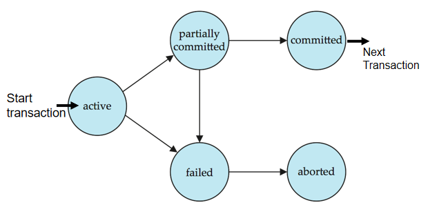{ width="500" }
<figcaption>Transaction State</figcaption>
</figure>

## Implementation of A & D

数据库系统的恢复管理组件(Recovery Manager, RM)实现了对原子性（Atomicity）和持久性（Durability）的支持。

### Shadow-Database Scheme

这是一种简单但效率不高的方案：

- 一个名为 `db_pointer` 的指针始终指向当前一致的数据库副本
- 所有更新都在新创建的数据库副本上进行
- 原始副本（即影子副本）保持不变，由 `db_pointer` 指向

**如果事务中止（Abort）**：

- 只需删除新副本即可

**如果事务提交（Commit）**：

1. 将新副本的所有内存页面写入磁盘（在Unix系统中，使用flush命令）
- 将 `db_pointer` 更改为指向新副本，使其成为当前副本
- 同时删除旧副本

这种方法确保了即使在系统崩溃的情况下，数据库也能保持一致状态，从而实现了原子性和持久性。

<figure markdown="span">
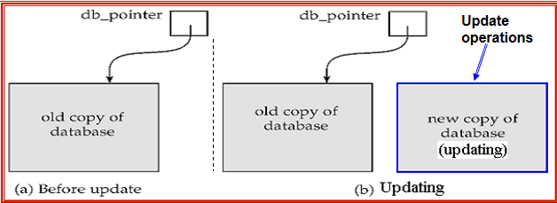{ width="500" }
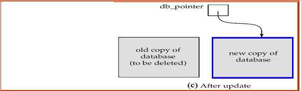{ width="500" }
</figure>

这种方法需要`db_pointer`的原子性，并且不能有并发，磁盘也不能fail；对于text editor，这种方案很常用，但是对于大型的数据库系统，这种方法的效率很低。

## Concurrent Executions

数据库系统允许多个事务并发运行。并发执行的优势包括：

- **提高处理器和磁盘利用率，增加事务吞吐量**：一个事务可以使用CPU，而另一个事务同时进行磁盘读写操作。
- **减少事务的平均响应时间**：短事务不需要在长事务后面等待。

**问题**：尽管每个单独的事务都是正确的，但并发可能会破坏一致性（如并发售票问题）。

**并发控制方案** - 实现隔离性的机制，即控制并发事务之间的交互，防止它们破坏数据库的一致性。
- 这是DBMS的重要工作

!!!Definition "Schedules"
    调度（Schedules）是指示并发事务的指令按照时间顺序执行的序列。

    对于一组事务的调度必须包含所有事务的所有指令。

    调度必须保持每个单独事务中指令出现的顺序。

<figure markdown="span">
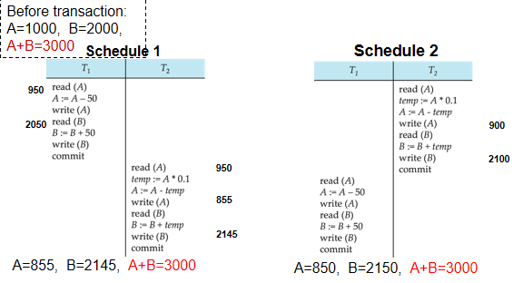{ width="500" }
<figcaption>Serial Schedule</figcaption>
</figure>

一些看起来不是串行调度和某些串行调度是等价的，一些就不行

<figure markdown="span">
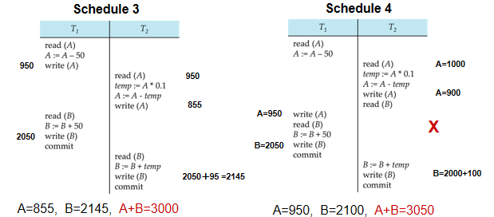{ width="500" }
<figcaption>Schedule Equivalence</figcaption>
</figure>

在这里，schedule4就不是串行等价的,使用这种调度执行两个事务之后，A+B的结果发生了改变；

## Serializability

**基本假设**：每个事务都能保持数据库的一致性。因此，一组事务的串行执行也能保持数据库的一致性。

**可串行化定义**：如果一个（可能是并发的）调度与某个串行调度等价，则称该调度是可串行化的。

根据调度等价的不同形式，可串行化分为两种主要类型：

1. **冲突可串行化（Conflict serializability）**
    - 基于操作之间的冲突关系
    - 如果通过交换非冲突操作的顺序，可以将并发调度转换为串行调度，则该调度是冲突可串行化的

- **视图可串行化（View serializability）**
    - 基于事务"看到"的数据库状态
    - 比冲突可串行化更宽松，但计算成本更高

首先，将事务操作简化，只考虑读写操作，忽略其他操作。

### Conflict Serializability

!!!Definition "冲突操作"
    指令 $I_i$ 和 $I_j$ 分别来自事务 $T_i$ 和 $T_j$，当且仅当满足以下条件时它们发生冲突：
    
    1. 它们来自不同的事务
    - 它们访问相同的数据项 Q
    - 至少有一个指令是写操作
    
    具体的冲突情况：
    
    1. $I_i = \text{read}(Q)$, $I_j = \text{read}(Q)$：不冲突
    - $I_i = \text{read}(Q)$, $I_j = \text{write}(Q)$：冲突
    - $I_i = \text{write}(Q)$, $I_j = \text{read}(Q)$：冲突
    - $I_i = \text{write}(Q)$, $I_j = \text{write}(Q)$：冲突

直观上，两个操作之间的冲突会强制它们之间存在一个（逻辑）时间顺序。如果 $I_i$ 和 $I_j$ 在调度中是连续的且它们不冲突，那么即使在调度中交换它们的位置，结果也会保持不变。即不冲突交换仍不冲突，冲突不可交换；

!!!Note "Conflict Serializability"
    如果一个调度 $S$ 可以通过一系列非冲突指令的交换转换为另一个调度 $S'$，则称这两个调度是冲突等价的。

    如果一个调度与某个串行调度冲突等价，则称该调度是冲突可串行化的。

<figure markdown="span">
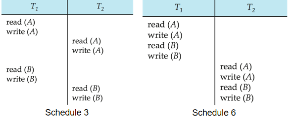{ width="500" }
<figcaption>Conflict Serializability</figcaption>
</figure>

这里Schedule3和Schedule4是冲突等价的，因为$T_2$的`Read(A)`和`Wirte(A)`与$T_1$的`Read(B)`和`Write(B)`不冲突，可以交换顺序；

<figure markdown="span">
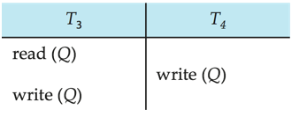{ width="500" }
<figcaption>Not Conflict Serializability</figcaption>
</figure>

这里就不是冲突等价的，因为不能再$T_3$读之前$T_4$写$Q$，也不能先$T_3$写$Q$再$T_4$写$Q$，所以这个Schedule既不等价于`<T3,T4>`，也不等价于`<T4,T3>`；

### View Serializability

!!!Definition "视图等价"
    如果两个调度 $S$ 和 $S'$ 满足以下条件，则它们是视图等价的：
    
    - **首读**：对于任何数据项 Q，如果事务 $T_i$ 在 $S$ 中第一个读取 Q 的初始值，那么 $T_i$ 也在 $S'$ 中第一个读取 Q 的初始值

    - **写读**：对于任何数据项 Q，如果事务 $T_i$ 在 $S$ 中读取 Q 的值，这个 Q 的值是被 $T_j$ 写过的，那么再 $S'$ 中 $T_i$ 必须读取 $Q$ 的值是被 $T_j$ 写过的值

    - **末写**：对于任何数据项 Q，如果事务 $T_i$ 在 $S$ 中最后写入 Q 的值，那么 $T_i$ 也在 $S'$ 中最后写入 Q 的值

!!!Note "View Serializability"
    如果一个调度 $S$ 可以通过一系列非冲突指令的交换转换为另一个调度 $S'$，则称这两个调度是冲突等价的。

    如果一个调度与某个串行调度冲突等价，则称该调度是冲突可串行化的。

<figure markdown="span">
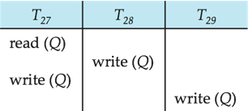{ width="500" }
<figcaption>View Serializability</figcaption>
</figure>

这里无法通过冲突等价到任何串行调度，但是通过视图等价可以等价为`<T27,T28,T29>`；

!!!idea
    视图可串行化（View Serializability）是比冲突可串行化（Conflict Serializability）更宽松的条件。所有冲突可串行化的调度都是视图可串行化的，但反之则不成立。

    !!!Note "盲写（Blind Write）"
        盲写是指事务对数据项进行写操作，但在此之前没有读取该数据项。即事务直接覆盖了数据项的值，而不关心其原始值。

    **重要结论**：每个视图可串行化但不是冲突可串行化的调度都包含盲写操作。

    在上面的例子中：

    - T28 和 T29 都是盲写，它们在写入之前没有进行任何读操作
    - T29 的写操作覆盖了T28 和T27 的写操作，但是这没有任何冲突，因为T27和T28的写入并没有被读取；

    这种情况下，如果没有盲写，那么视图可串行化的调度必定也是冲突可串行化的。

### Other Notions of Serializability

<figure markdown="span">
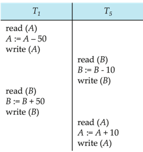{ width="500" }
<figcaption>Other Notions of Serializability</figcaption>
</figure>

这个调度既不是冲突可串行化的，也不是视图可串行化的，但是它却是与先T1后T5的串行调度等价的；

## Recoverability

!!!Definition "可恢复调度(Recoverable Schedule)"
    如果一个调度 \( S \) 满足以下条件，则称其为可恢复调度(Recoverable Schedule)：
    
    对于调度中的每个事务 \( T_i \)，如果 \( T_i \) 读取了一个由事务 \( T_j \) 写入的数据项，那么 \( T_i \) 的提交操作必须出现在 \( T_j \) 的提交操作之后。
    
    
<figure markdown="span">
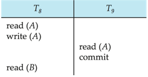{ width="500" }
<figcaption>Recoverable Schedule</figcaption>
</figure>

在给定的调度中，如果 \( T_9 \) 在读取后立即提交，而 \( T_8 \) 随后中止，那么 \( T_9 \) 可能已经读取并显示了一个不一致的数据库状态。因此，数据库必须确保调度是可恢复的，以避免这种不一致。

### Cascade Rollback

<figure markdown="span">
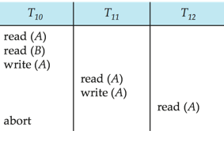{ width="500" }
<figcaption>Cascade Rollback</figcaption>
</figure>

级联回滚是指一个事务失败会导致一系列事务的回滚。在给定的调度中，如果 \( T_{10} \) 失败，那么 \( T_{11} \) 和 \( T_{12} \) 也必须回滚。这可能导致大量工作的撤销。

### Cascade-Free Schedule

无级联调度是指级联回滚不会发生。对于每对事务 \( T_i \) 和 \( T_j \)，如果 \( T_j \) 读取了由 \( T_i \) 写入的数据项，那么 \( T_i \) 的提交操作必须出现在 \( T_j \) 的读取操作之前。

每个无级联调度也是可恢复的。限制调度为无级联调度是理想的。

## Implementation of isolation

- 一种只允许一个事务一次执行的策略会生成串行调度，但这提供了较差的并发度。为了保证数据库的一致性，调度必须是冲突可串行化或视图可串行化的，并且是可恢复的，最好是无级联的。

- 并发控制方案需要在允许的并发量和产生的开销之间进行权衡。一些方案只允许生成冲突可串行化的调度，而其他方案则允许生成不是冲突可串行化的视图可串行化调度。

- 这种权衡是数据库系统设计中的一个核心考虑因素，因为它直接影响到系统的性能和数据一致性。高并发性能够提高系统吞吐量，但可能增加维护数据一致性的复杂性和开销。

## Transaction Definition in SQL

在SQL中，数据操作语言必须包含一个用于指定组成事务的一组操作的结构。

### SQL Transaction

在SQL中，事务是隐式开始的。当执行第一个SQL语句时，系统会自动开始一个新的事务。

### SQL Transaction End

SQL中的事务可以通过以下方式结束：

1. **提交工作（Commit work）**：
    - 提交当前事务并开始一个新的事务
    - 语法：`COMMIT;`

- **回滚工作（Rollback work）**：
    - 导致当前事务中止
    - 语法：`ROLLBACK;`

### Implicit Commit

In almost all database systems, the default behavior is that each SQL statement is implicitly committed after successful execution. This means that each statement is treated as a separate transaction.

### Closing Implicit Commit

Implicit commit can be closed using database instructions. For example:

- 在JDBC中，可以使用 `connection.setAutoCommit(false)` 来关闭自动提交功能
- 这样，多个SQL语句可以组成一个事务，直到显式调用 `COMMIT` 或 `ROLLBACK` 为止

## Testing for Serializability

### Precedence Graph

优先图是一个有向图，其中顶点表示事务。如果两个事务冲突，并且一个事务(T1)先于另一个事务(T2)访问冲突的数据项(Q)，则在图中从一个事务(T1)指向另一个事务(T2)画一条弧。

<figure markdown="span">
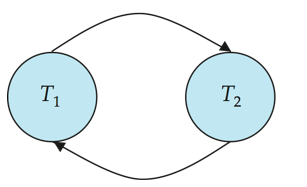{ width="500" }
<figcaption>Precedence Graph</figcaption>
</figure>

### Conflict Serializability Test

一个调度是冲突可串行化的，当且仅当其优先图是无环的。可以通过拓扑排序获得可串行化顺序。

### View Serializability Test

优先图测试不能直接用于视图可串行化。检查调度是否视图可串行化是NP完全问题，但可以使用一些充分条件的实用算法。

### Concurrent Control and Testing for Serializability

并发控制协议允许并发调度，但确保调度是冲突/视图可串行化的，并且是可恢复和无级联的。并发控制协议通常不会在创建过程中检查优先图，而是施加一种规则来避免非可串行化的调度。不同的并发控制协议在它们允许的并发量和产生的开销之间提供不同的权衡。测试可串行化有助于我们理解为什么并发控制协议是正确的。

