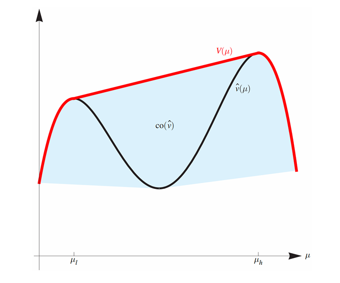
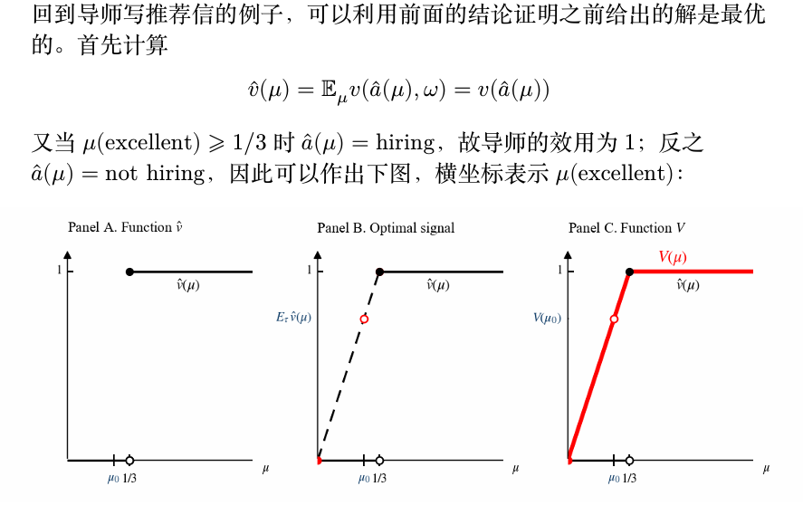

# 贝叶斯劝说

## 背景与例子

考虑导师写推荐信将学生推荐至企业的例子：

### 参与者设定
- **两个参与人：**
    - **导师（信号发送者）**
    - **企业（信号接收者）**

- **导师的任务：** 是向企业为每位学生写推荐信，通过推荐信的好坏向企业发送信号
- **企业的任务：** 是对一个学生，在接收到导师的推荐信（信号）后必须做出以下两种决策之一：
    - **雇用（hiring）**
    - **不雇用（not hiring）**
- **学生不是博弈参与方：** 因为学生只被动接受结果，没有自己的策略

### 学生类型
- **学生有两种类型：**
    - **优秀（excellent）**
    - **一般（average）**

- **学生的类型对导师而言是已知的，对企业则是不完全信息**
- **与不完全信息博弈中的假设一致：** 可以认为学生的类型是自然按一定的先验概率随机抽取的

### 先验分布
- **企业对学生类型有先验分布：**
    - $\mu_0$(average) = 0.75
    - $\mu_0$(excellent) = 0.25

- **这一先验概率分布也符合导师已知的实际学生类型分布**
- **因此如果随机抽取一个学生，则企业和导师对学生类型有共同的先验分布**

### 效用函数定义

- **导师的效用函数：**
  - 假设导师希望推荐出去的学生越多越好，因此企业只要雇用一个学生，则导师获得效用1，否则效用为0

- **企业的效用函数：**
  - 企业则希望招收到优秀的学生，因此在招收到优秀的学生时获得效用为1，招收普通学生时获得效用为-0.5

!!!note
    综上所述，目前定义了：

    - **两个参与人**
    - **企业的策略**
    - **两个参与人的效用函数**
    - **不完全信息的先验分布**

    因此接下来需要形式化定义导师的策略，即形式化"发信号"这一策略。

    形式地说，发信号就是通过好或坏的推荐信来向企业表明学生是优秀的或一般的。形式化地说，导师写推荐信的策略就是如下两个条件概率分布 $\pi(\cdot | \text{excellent})$ 和 $\pi(\cdot | \text{average})$（又称信号机制（signaling scheme））：
    
    - $\pi(e | \text{excellent}), \pi(a | \text{excellent})$
    - $\pi(e | \text{average}), \pi(a | \text{average})$
    
    其中 $e$ 和 $a$ 分别表示描述学生为优秀类型和一般类型的推荐信；
    - $\pi(A | B)$ 表示当学生属于 $B$ 类型时，导师在推荐信中给学生描述的类型为 $A$ 的概率；
    - 例如 $\pi(e | \text{average})$ 表示学生一般时导师在推荐信中将其描述为优秀学生的概率。

!!!tip 
    导师和企业之间存在长期关系，因此导师的策略是企业在看到推荐信之前就已知的，因为企业在与导师的长期关系中可以验证导师的策略。

!!!Example

    第一个信号的例子是，导师完全诚实地推荐学生，即为优秀的学生写好的推荐信，为一般的学生写一般的推荐信，故此时信号机制为

    - $\pi(e | \text{excellent}) = 1, \pi(a | \text{excellent}) = 0;$
    - $\pi(e | \text{average}) = 0, \pi(a | \text{average}) = 1.$

    - 企业知道导师的推荐信是诚实的，因此将接收所有推荐信中写优秀的学生，拒绝所有推荐信中写一般的学生：
        - 此时导师期望的同学雇出，故在每个学生上的期望效用为0.25；
        - 企业接收所有优秀同学，故在每个学生上的期望效用为0.25。

    第二个例子是导师总是推荐学生为优秀，即

    - $\pi(e | \text{excellent}) = 1, \pi(a | \text{excellent}) = 0;$
    - $\pi(e | \text{average}) = 1, \pi(a | \text{average}) = 0.$

    - 因此此时企业看到的全是好的推荐信，因此只能保持先验概率去判断学生的好坏：
        - 由于每个学生是优秀类型的概率只有 0.25，因此如果企业雇用任意一个学生，其期望效用为 $0.25 \times 1 - 0.75 \times 0.5 = -0.125$，因此企业不会雇用任何一个学生；
        - 此时导师和企业的期望效用均为 0。

    最优情况(导师效用最大化)为

    最优情况为导师在推荐信中对优秀学生诚实，而对一般学生有一定的美化，即信号机制为：

    - $\pi(e | \text{excellent}) = 1, \pi(a | \text{excellent}) = 0;$
    - $\pi(e | \text{average}) = \frac{2}{3}, \pi(a | \text{average}) = \frac{1}{3}.$

    !!!info "贝叶斯公式"
        \[
        P(A | B) = \frac{P(B | A)P(A)}{\sum_{x \in X} P(B | x)P(x)}
        \]

    通过贝叶斯公式可以计算出企业看到推荐信后对学生的后验概率分布$\mu_A(B)$,即看到类型$A$的推荐信后，认为学生是类型$B$的概率。   
    也就是$\mu(B | A)$

    所以

    \[
        \mu_e(excellent) = \dfrac{\pi(e | \text{excellent}) \mu_0(excellent)}{\pi(e | \text{excellent}) \mu_0(excellent) + \pi(e | \text{average}) \mu_0(average)} = \dfrac{1}{3}
    \]
    

    \[
        \mu_e(average) = 1-\mu_e(excellent) = \dfrac{2}{3}
    \]

    \[
        \mu_a(average) = \dfrac{\pi(a | \text{average}) \mu_0(average)}{\pi(a | \text{average}) \mu_0(average) + \pi(a | \text{excellent}) \mu_0(excellent)} = 1
    \]

    \[
        \mu_a(excellent) = 1-\mu_a(average) = 0
    \]

    还可以计算出企业看到好的推荐信和一般的推荐信的概率

    \[
        P(e) = \pi(e | \text{excellent}) \mu_0(excellent) + \pi(e | \text{average}) \mu_0(average) = 0.75
    \]

    \[
        P(a) = \pi(a | \text{excellent}) \mu_0(excellent) + \pi(a | \text{average}) \mu_0(average) = 0.25
    \]

    在这种情况下，当企业看到好的推荐信时，对学生的后验分布更新为$1/3$的概率是好学生，此时它的期望效用为

    \[
        \frac{1}{3} \times 1 + \frac{2}{3} \times -0.5 = 0
    \]

    与不雇佣期望效用一样，但是企业在这种情况下会选择雇佣，*假设在信号接收者策略无差异的情况下，信号接收者会选择有利于信
    号发送者的决策*

    当企业看到一般的推荐信时，对学生的后验分布更新为$1$的概率是不好学生，此时它的期望效用为0，选择不雇佣

    综合来说，企业的期望效用是0；

    对于导师而言，由于企业采取的策略是雇佣所有好的推荐信，不雇佣所有的一般推荐信，因此导师的期望效用为所有的好学生和$2/3$的一般学生的期望效用之和，即

    \[
        0.25 \times 1 + \frac{2}{3} \times 0.75 = 0.75
    \]

    或者还有一种计算方法，只要给出了好的推荐信，效用就是1，所以

    \[
        1*P(e) + 0*P(a) = 0.75
    \]

## 贝叶斯劝说

### 一般化的贝叶斯劝说模型

从导师写推荐信的例子中可以提炼出一般的贝叶斯劝说（**Bayesian persuasion** ）模型：

- **两个参与人：** 信号发送者（导师）和信号接收者（企业）；

- **他们对自然的真实状态** $\omega \in \Omega$（一个学生优秀/一般）**有相同的先验分布** $\mu_0 \in \text{int}(\Delta(\Omega))$，**信号发送者知道状态的实现值**（即具体每个学生是优秀还是一般的），**但信号接收者不知道：**
  - $\Delta(\Omega)$ 表示 $\Omega$ 上的概率分布；
  - $\text{int}$ 含义是内点，即先验分布保证每个状态的概率都是正的；

- **假定双方都是理性的，即追求效用最大化的，并且都是按照贝叶斯公式更新信念的；**

- **发送者的效用为** $v(a,\omega)$，**接收者的效用为** $u(a,\omega)$：
  - 导师的效用为 $v(\text{hiring}, \omega) = 1, v(\text{not hiring}, \omega) = 0$（与 $\omega$ 无关）；
  - 企业的效用为 $u(\text{hiring}, \text{average}) = -0.5$ 等。

### 博弈的行动顺序

博弈的行动顺序如下（**动态博弈需要说明顺序**）：

1. **发送者公开（承诺（commit））信号机制** $(S, \pi(s | \omega)), \forall s \in S, \omega \in \Omega$：
    - $S$ 称为信号实现空间，例如前面的例子中 $S = \{e, a\}$；
    - 故信号机制包含信号实现空间 $S$ 及其在所有现实状态下的条件分布；
    - 于是接收者可以利用贝叶斯公式计算出后验概率 $\mu_s(\omega)$；

2. **自然以分布** $\mu_0$ **选择** $\omega \in \Omega$（抽出一个学生是优秀/一般的）；

3. **类型为** $\omega$ **时发送者以概率** $\pi(s | \omega)$ **发送信号** $s \in S$；

4. **接收者收到信号** $s$ **并选择一个行动** $a \in A$（企业雇用/不雇用学生）：
   - $a$ 的选择应当最大化接收者的效用，即挑选一个行动使得在这个后验概率分布下期望效用最大，例如企业在看到优秀的推荐信后，选择雇佣学生
   
    \[
        a = \arg \max_{a \in A} \mathbb{E}_{\mu_s}[u(a, w)]
    \]
   
   如果有多个最大化效用的选择，假设其选择最大化发送者效用的行动（企业雇用和不雇用无差异时，选择雇用学生）。

5. **发送者获得效用** $v(a, \omega)$，**接收者获得效用** $u(a, \omega)$。

!!!info
    注意贝叶斯劝说的第一步就是信号发送者公开承诺信号机制：
        - 回忆导师写推荐信的例子，这样的情况可以发生在结果可验证的情况；
        - 例如企业可以在雇用后看出学生的能力，或者消费者在购买后能够判断产品的真实价值；
        - 因此贝叶斯劝说在这些场景下尤为重要；

    此外，贝叶斯劝说模型中，信号发送者优先行动，接收者在看到信号发
    送者的行动后行动，故最优化问题实际是一个双层优化问题；

    此时信号发送者和信号接收者的策略相对于对方的策略都是最优的，并且信号接收者的信念通过贝叶斯公式进行了更新，这一均衡被称为完美贝叶斯均衡（perfect Bayesian equilibrium）。

---

贝叶斯劝说主要希望研究以下三个问题

1. 发送者是否总是可以通过设计信号机制来影响接收者的行为，从而提升
自己的效用？如果不是，什么情况下可以？

- 发送者如何设计信号机制以达到最大化自己的效用？最大化效用时信号
以及接收者的行为的特点是什么样的？

- 接收者是否愿意接受发送者的信号机制？如果不是，什么情况下可以？

---

### 贝叶斯可行

为了解决前两个问题，首先要定义贝叶斯可行（**Bayesian plausible**）的概念，然后将设计最优信号机制的问题转化为更容易解决的问题。

#### 后验概率分布的性质

给定信号机制 $(S, \pi(s | \omega))$，任一信号实现 $s$ 都会导致一个后验概率分布 $\mu_s \in \Delta(\Omega)$，即对任意的 $s \in S, \omega \in \Omega$：

\[
\mu_s(\omega) = \frac{\pi(s | \omega)\mu_0(\omega)}{\sum_{\omega' \in \Omega} \pi(s | \omega')\mu_0(\omega')}
\]

由于每个 $s$ 都会导致一个后验概率分布，所以所有的 $s$ 将导致 $|S|$ 个后验概率分布，并且所有的后验概率分布本质上都是 $\Omega$ 上的分布。根据全概率公式，每个 $s$ 被发出的概率为：

\[
\mathbb{P}(s) = \sum_{\omega' \in \Omega} \pi(s | \omega')\mu_0(\omega')
\]

所有 $s$ 将导致一个后验概率分布的分布 $\tau \in \Delta(\Delta(\Omega))$，其中概率分布支撑为 $\text{Supp}(\tau) = \{\mu_s\}_{s \in S}$，支撑中每一个后验概率 $\mu \in \Delta(\Omega)$ 的概率为：

\[
\tau(\mu) = \sum_{s:\mu_s=\mu} \mathbb{P}(s) = \sum_{s:\mu_s=\mu} \sum_{\omega' \in \Omega} \pi(s | \omega')\mu_0(\omega')
\]

如果每个后验概率都不同，则支撑中每一个后验概率 $\mu \in \Delta(\Omega)$ 的概率为：

\[
\tau(\mu) = \mathbb{P}(s) = \sum_{\omega' \in \Omega} \pi(s | \omega')\mu_0(\omega')
\]

!!!Eaxmple
    例如，回忆导师写推荐信的例子，在最优机制下，信号机制导致的两个后验概率分布分别为：

    \[
       \mu_e(\text{excellent}) = 1/3, \mu_e(\text{average}) = 2/3
    \]

    和

    \[
       \mu_a(\text{excellent}) = 0, \mu_a(\text{average}) = 1
    \]

    这两个后验概率分布不相同，因此 $\text{Supp}(\tau) = \{\mu_e, \mu_a\}$，二者概率为：

    \[
       \mathbb{P}(e) = \pi(e | \text{excellent})\mu_0(\text{excellent}) + \pi(e | \text{average})\mu_0(\text{average}) = 0.75
    \]

    \[
       \mathbb{P}(a) = \pi(a | \text{excellent})\mu_0(\text{excellent}) + \pi(a | \text{average})\mu_0(\text{average}) = 0.25
    \]

    在这里，后验分布指的是知道信号后，对学生类型的判断($\mu_e, \mu_a$是学生类型的分布)。后验分布的分布指的是接收到不同信号的分布($\tau$是$\mu_e, \mu_a$的分布,即满足某一分布的概率是什么)。

#### 贝叶斯可行的定义

基于上述记号，可以给出贝叶斯可行的定义：

!!!definition
    称 $\tau$ 由信号导致，如果存在信号机制 $(S, \pi(s | \omega))$ 对应的后验概率分布的分布为 $\tau$。称一个后验概率分布的分布 $\tau$ 是贝叶斯可行的，如果
    
    \[
    \sum_{\text{Supp}(\tau)} \mu\tau(\mu) = \mu_0
    \]
    
    即后验概率的期望等于先验概率。

!!!Example
    这里不同的后验概率分布可以求和的原因在于，本质上不同的后验概率分布都是 $\Omega$ 上的概率分布。例如可以检查导师写推荐信的例子是否满足贝叶斯可行性：

    原先验概率分布为$\mu_0 = (\mu_0(\text{excellent}), \mu_0(\text{average})) = (0.25, 0.75)$，后验概率分布为$\mu_e = (1/3, 2/3)$和$\mu_a = (0, 1)$，后验概率分布的分布为$\tau = (\tau(\mu_e), \tau(\mu_a)) = (0.75, 0.25)$。

    因此有

    \[
        \mathbb{E}_{\tau}[\mu] = 0.75 \mu_e + 0.25 \mu_a = 0.75 \times (1/3, 2/3) + 0.25 \times (0, 1) = (0.25, 0.75) = \mu_0
    \]

    因此，导师写推荐信的例子中的信号机制是贝叶斯可行的。

下面这个定理给出了信号机制导致和贝叶斯可行之间的联系

!!!theorem
    一个后验概率分布的分布 $\tau \in \Delta(\Delta(\Omega))$ 是贝叶斯可行的当且仅当存在一个信号机制 $(S, \pi(s | \omega))$ 使得 $\tau$ 是由该信号机制导致的。
    
    即对该后验分布的分布求期望分布，该期望分布等于先验分布。

    !!!Success "证明"
        首先证明信号机制推出贝叶斯可行性

        \[
        \begin{align*}
        \sum_{\text{Supp}(\tau)} \mu(\omega)\tau(\mu) &= \sum_{s \in S} \mu_s(\omega)\mathbb{P}(s) \\
        &= \sum_{s \in S} \frac{\pi(s \mid \omega)\mu_0(\omega)}{\sum_{\omega' \in \Omega} \pi(s \mid \omega')\mu_0(\omega')}\mathbb{P}(s) \\
        &= \sum_{s \in S} \pi(s \mid \omega)\mu_0(\omega) = \mu_0(\omega)
        \end{align*}
        \]

        接下来，由贝叶斯可行性，我们可以构造一个信号机制 $(S, \pi(s | \omega))$ 

        由

        \[
            \mu_s(\omega) = \frac{\pi(s | \omega)\mu_0(\omega)}{\mathbb{P}(s)}
        \]

        可以得到

        \[
            \pi(s | \omega) = \frac{\mathbb{P}(s)\mu_s(\omega)}{\mu_0(\omega)} = \frac{\tau(\mu_s)\mu_s(\omega)}{\mu_0(\omega)}
        \]

        接下来验证对于所有的$s$求和等于1即可

        \[
            \sum_{s \in S} \pi(s | \omega) = \sum_{s \in S} \frac{\tau(\mu_s)\mu_s(\omega)}{\mu_0(\omega)} = \frac{\sum_{s \in S} \tau(\mu_s)\mu_s(\omega)}{\mu_0(\omega)} = \frac{\mu_0(\omega)}{\mu_0(\omega)} = 1
        \]

        最后一步是由于$\sum_{\text{Supp}(\tau)} \mu\tau(\mu) = \mu_0$。这是贝叶斯可行的定义。

!!!Summary
     因此，一个信号机制等价于一个贝叶斯可行的后验概率分布的分布；
     
     - 进而可以导致接收者行动的分布，因为一个后验概率分布就对应接收者的一个最优行动；
     
     - 显然，只要接收者行动分布一定，那么发送者的效用也是确定的；
     - 因此是否存在一个信号机制使得发送者达到效用 $v^*$，只需要考虑是否存在一个贝叶斯可行的后验概率分布的分布 $\tau$ 使得发送者效用达到 $v^*$；
     - 因此设计最优信号机制的问题可以转化为设计一个贝叶斯可行的后验概率分布的分布 $\tau$ 
     

## 最优机制问题

### 问题转化

问题转化后，我们需要解决的问题是设计一个贝叶斯可行的后验概率分布的分布 $\tau$ 使得发送者的效用最大化。首先将问题形式化：记后验概率为 $\mu$ 时，接收者的最优行动为 $\hat{a}(\mu)$，则发送者的期望效用为：

\[
\hat{v}(\mu) = \mathbb{E}_{\mu} v(\hat{a}(\mu), \omega)
\]

此处求期望是考虑到一般的情况下 $v$ 的表达式为 $v(a, \omega)$，因此需要针对 $\omega$ 求期望。而在导师写推荐信的例子中，因为 $v$ 与 $\omega$ 无关，故是可以省略的。基于此，可以定义最优信号机制问题：

\[
\max_{\tau} \mathbb{E}_{\tau} \hat{v}(\mu)
\]

\[
\text{s.t. } \sum_{\text{Supp}(\tau)} \mu\tau(\mu) = \mu_0
\]

!!!tip
    看起来这个形式化的式子比较复杂，但实际上还是很好理解的

    首先$\hat{v}(\mu)$一项表示对于一个后验概率(知道信号后对学生类型的判断)，接收者的最优行动(雇用/不雇用)，发送者在这一情况下的期望效用

    $\max_{\tau} \mathbb{E}_{\tau} \hat{v}(\mu)$表示我们希望在所有可能的后验概率分布的分布中，找到使得发送者的期望效用最大的那一种。

    $\text{s.t. } \sum_{\text{Supp}(\tau)} \mu\tau(\mu) = \mu_0$表示我们希望后验概率分布的分布是贝叶斯可行的。

### 显示原理

!!!theorem "显示原理"
    存在一个信号机制使得发送者的效用达到 $v^*$ 当且仅当存在一个直接（**straightforward**）信号机制使得发送者的效用达到 $v^*$。其中直接信号机制是指满足 $S \subseteq A$ 且接收者的最优行动等于信号实现的信号。

!!!example "导师推荐信中的直接信号机制"
    - 放在导师写推荐信的例子中，直接信号机制指信号实现空间 $S \subseteq \{\text{excellent}, \text{average}\}$ 且当接收者看到优秀的推荐信的信号时雇用，看到一般的推荐信的信号时不雇用的信号；
    - 事实上此前给出的最优信号机制的确满足直接信号机制的定义；
    - 总而言之，显示原理表明，最优信号机制设计所需的信号实现数目（后验概率数目）是不超过接收者行动数目的；

基于显示原理，原始的最优信号机制设计问题可以简化为：

\[
\max_{\tau} \sum_{\mu \in \text{Supp}(\tau)} \hat{v}(\mu) \tau(\mu)
\]

\[
\text{s.t. } \sum_{\mu \in \text{Supp}(\tau)} \mu \tau(\mu) = \mu_0
\]

其中 $\text{Supp}(\tau)$ 的大小不超过 $|A|$（接收者行动集合的大小）。

### 凹包络

!!!definition "凹包络"
    函数 $\hat{v}$ 的凹包络（concave closure）$V$ 定义为：

    \[
    V(\mu) = \sup\{z \mid (\mu, z) \in \text{co}(\hat{v})\}
    \]

    其中 $\text{co}(\hat{v})$ 表示函数 $\hat{v}$ 的图像的凹包。

    直观而言，一个函数的凹包络就是大于等于这个函数的最小凹函数。

    <figure markdown="span">
        { width="500" }
    </figure>

### 关键性质

函数 $\hat{v}$ 的凹包络是求解最优信号机制问题的关键：

- **存在性**：注意到如果 $(\mu_0, z) \in \text{co}(\hat{v})$，则必然存在后验概率分布的分布 $\tau$ 使得 $\mathbb{E}_\mu = \mu_0$ 且 $\mathbb{E}_\tau \hat{v}(\mu) = z$（因为期望也是凸组合）；

- **最优性**：$V(\mu_0)$ 则是所有这样的 $z$ 中的最大值；

因此 $V(\mu_0)$ 就是最优信号机制问题的解。总而言之我们可以得到下面的推论，从而回答了之前提出的所有问题：

!!!theorem "主要推论"
    最优信号机制问题的解存在，最大值为 $V(\mu_0)$。进一步地，发送者设计信号能提升自己的效用当且仅当 $V(\mu_0) > \hat{v}(\mu_0)$。

    
<figure markdown="span">
    { width="600" }
    <figcaption>运用结论解之前的例子</figcaption>
</figure>

只要企业的后验概率中好学生的概率占比大于$1/3$，则企业一定会雇佣，因为此时雇佣效用为

\[
    1 \times 1/3 - 0.5 \times 2/3 > 0
\]

比不雇佣好

这个凹包络前半部分的解析式为$V(\mu) = 3\mu$,

原例子中$V(0.25) = 0.75$，故导师最佳效用为$0.75$

并且此时两个后验分布设为两个端点，即在一个后验分布中认为所有学生都是一般，在另一个后验分布中认为$1/3$的学生是优秀，$2/3$的学生是普通

\[
    \mu_1 = (0, 1), \mu_2 = (1/3, 2/3)
\]

设后验分布的分布为$\tau = (\tau(\mu_1), \tau(\mu_2)) = (x, 1-x)$，则

\[
   x(0,1)+(1-x)(1/3,2/3) = ((1-x)/3, x/3+2/3) = (0.25, 0.75)
\]

解得$x = 0.25$，即$\mu_1$的概率为$0.25$，$\mu_2$的概率为$0.75$

进一步的，可以利用

\[
    \pi(s | \omega) = \frac{\mathbb{P}(s)\mu_s(\omega)}{\mu_0(\omega)} = \frac{\tau(\mu_s)\mu_s(\omega)}{\mu_0(\omega)}
\]

计算出对应的信号机制

\[
    \pi(1 | ex) = \frac{P(1)\mu_1(ex)}{\mu_0(ex)} = \frac{0.25 \times 0}{0.25} = 0
\]

\[
    \pi(1 | av) = \frac{P(1)\mu_1(av)}{\mu_0(av)} = \frac{0.25 \times 1}{0.75} = 1/3
\]

\[
    \pi(2 | ex) = \frac{P(2)\mu_2(ex)}{\mu_0(ex)} = \frac{0.75 \times 1/3}{0.25} = 1
\]

\[
    \pi(2 | av) = \frac{P(2)\mu_2(av)}{\mu_0(av)} = \frac{0.75 \times 2/3}{0.75} = 2/3
\]

这与之前的结果一致。所以$\mu_1$对应一般的推荐信，$\mu_2$对应优秀的推荐信，这个例子也说明信号的名称不重要。

### 对接收者的影响

最后解决第三个问题：信号接收者是否愿意接受发送者的信号机制？

!!!theorem "命题"
    在任意信号机制 $S, \pi(s | \omega)$ 下，接收者的效用都不会低于其在没有信号的情况下的效用。

#### 证明过程

任取信号机制 $S, \pi(s | \omega)$，当接收者看到 $s \in S$ 时，其效用为：

\[
\max_{a \in A} \mathbb{E}_{\mu_s}[u(a, w)] = \max_{a \in A} \sum_{\omega \in \Omega} \mu_s(\omega)u(a, \omega)
\]

\[
= \max_{a \in A} \sum_{\omega \in \Omega} \frac{\pi(s | \omega)\mu_0(\omega)}{\sum_{\omega' \in \Omega} \pi(s | \omega')\mu_0(\omega')} u(a, \omega)
\]

因此在信号机制 $S, \pi(s | \omega)$ 下，其期望效用为：

\[
\begin{align}
\sum_{s \in S} \mathbb{P}(s) \cdot \max_{a \in A} \mathbb{E}_{\mu_s}[u(a, w)] &= \sum_{s \in S} \left(\sum_{\omega' \in \Omega} \pi(s | \omega')\mu_0(\omega')\right) \cdot \max_{a \in A} \mathbb{E}_{\mu_s}[u(a, w)]\\
&= \sum_{s \in S} \max_{a \in A} \sum_{\omega \in \Omega} \pi(s | \omega)\mu_0(\omega)u(a, \omega)\\
&\geq \max_{a \in A} \sum_{s \in S} \sum_{\omega \in \Omega} \pi(s | \omega)\mu_0(\omega)u(a, \omega)\\
&= \max_{a \in A} \sum_{\omega \in \Omega} \left(\sum_{s \in S} \pi(s | \omega)\right) \mu_0(\omega)u(a, \omega)\\
&= \max_{a \in A} \sum_{\omega \in \Omega} \mu_0(\omega)u(a, \omega) = \max_{a \in A} \mathbb{E}_{\mu_0}[u(a, w)]
\end{align}
\]

