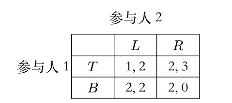

# LEC 3-4

## 社会福利

<figure markdown="span">
    
    <figcaption>社会福利</figcaption>
</figure>

## 策略式博弈表达

<figure markdown="span">
    
    <figcaption>策略式博弈</figcaption>
</figure>

!!!info "非合作博弈的分类"
    
    - 是否完全信息：即参与人之间是否互相知道对方的效用函数，是否知道博弈的全局信息；

    - 静态博弈或动态博弈，即参与人的行动是一次同时完成的，还是序贯进行的；在两个互相看不见的房子里进行石头剪刀布，不要求同时完成，但是行动的先后不会影响结果，因此是静态博弈；

    - **完全信息静态博弈 (Complete Information Static Game)**
        - **定义**: 所有参与者都了解彼此的支付函数（即知道每个人的目标），并同时做出决策。
        - **例子**: 囚徒困境 (Prisoner's Dilemma)。
    - **完全信息动态博弈 (Complete Information Dynamic Game)**
        - **定义**: 参与者的行动有先后顺序，后行动者可以观察到先行动者的行动。所有人都了解彼此的支付函数。
        - **例子**: 价格领袖模型。
    - **不完全信息静态博弈 (Incomplete Information Static Game)**
        - **定义**: 参与者同时做出决策，但至少有一个参与者不完全了解其他某个参与者的支付函数（即不确定对方的"类型"）。这类博弈也称为"贝叶斯博弈"。
        - **例子**: 各种形式的拍卖 (Auctions)。
    - **不完全信息动态博弈 (Incomplete Information Dynamic Game)**
        - **定义**: 参与者的行动有先后顺序，并且信息不完全。这类博弈通常涉及从行动中推断信息。
        - **例子**: 剪刀石头布。

## 伯川德竞争 (Bertrand Competition)

!!!definition "伯川德竞争"
    伯川德竞争是一种寡头市场模型，假设企业之间通过 **价格** 进行竞争。在这个模型中，企业生产同质产品，并且它们同时设定各自产品的价格。消费者将从价格最低的厂商购买。如果价格相同，消费者则平均分配到这些厂商。

    <figure markdown="span">
        
        <figcaption>伯川德竞争</figcaption>
    </figure>

**核心假设：**

-  **同质产品：** 市场上的所有产品在消费者看来是完全相同的，没有品牌忠诚度或质量差异。
-  **价格竞争：** 企业选择价格作为竞争变量，而非产量。
-  **同时定价：** 各企业同时做出定价决策，且相互独立。
-  **无进入壁垒：** (有时会假设)
-  **边际成本为常数：** 通常假设各企业的边际成本相同且为常数。

!!!Note "伯川德均衡（纳什均衡）"
    * **均衡结果：** 在伯川德竞争中，如果产品同质且边际成本相同，那么纳什均衡结果是所有企业的定价都等于其 **边际成本 (P = MC)**。
    * **"伯川德悖论"：** 即使市场只有两家企业（双头垄断），只要它们进行价格竞争且产品同质，最终价格也会被压低到边际成本水平，就像完全竞争市场一样，企业获得零经济利润。这被称为"伯川德悖论"，因为它表明即使只有少数几家企业，市场竞争也可能非常激烈。
    * 伯川德均衡不是占优均衡

---

## 古诺竞争 (Cournot Competition)

!!!definition "古诺竞争"
    古诺竞争是另一种寡头市场模型，假设企业之间通过 **产量** 进行竞争。在这个模型中，企业同时决定各自的产量，然后市场价格由总产量和市场需求曲线决定。

**核心假设：**

-  **同质产品：** 市场上的所有产品是同质的。
-  **产量竞争：** 企业选择产量作为竞争变量，而非价格。
-  **同时决策：** 各企业同时决定产量，且相互独立。
-  **市场需求曲线：** 市场价格是总产量的递减函数。
-  **边际成本为常数：** 通常假设各企业的边际成本相同且为常数。

!!!Note "古诺均衡（纳什均衡）"
    * **均衡结果：** 在古诺竞争的纳什均衡中，每个企业根据其他企业预期的产量来最大化自己的利润。最终均衡时的市场价格会介于垄断价格和边际成本之间，且高于边际成本。

* **企业数量的影响：**
    * 当企业数量 $J=1$ 时（垄断），古诺均衡退化为垄断产量和价格。
    * 当企业数量 $J$ 趋近于无穷大时，古诺均衡下的市场价格趋近于边际成本，总产量趋近于完全竞争下的总产量。这表明古诺模型是一个能够桥接垄断和完全竞争的统一框架。

---

## 占优策略均衡 (Dominant Strategy Equilibrium)

!!!definition "占优策略均衡"
    占优策略均衡是纳什均衡的一种特殊且更强的形式。如果一个博弈中，每个参与者都有一个 **占优策略**，那么这些占优策略组成的策略组合就是占优策略均衡。

<figure markdown="span">
     { width="50%" }
    <figcaption>占优策略</figcaption>
</figure>

* **占优策略 (Dominant Strategy)：** 一个策略如果无论其他参与者选择什么策略，它都能为该参与者带来最佳（或至少不差于任何其他策略）的收益，那么它就是该参与者的占优策略。
    * **严格占优策略 (Strictly Dominant Strategy)：** 如果无论其他参与者选择什么策略，它都能为该参与者带来 **严格更高** 的收益，那么它是严格占优策略。
    * **弱占优策略 (Weakly Dominant Strategy)：** 如果无论其他参与者选择什么策略，它都能为该参与者带来 **至少同样高** 的收益，并且在某些情况下能带来严格更高的收益，那么它是弱占优策略。

**特点：**

1.  **易于预测：** 如果存在占优策略均衡，那么博弈的最终结果很容易被预测，因为每个理性参与者都应该选择其占优策略。
2.  **与纳什均衡的关系：**
    * 如果一个博弈存在占优策略均衡，那么它一定是纳什均衡。
    * 如果一个博弈存在**严格占优策略均衡**，那么这个均衡是**唯一**的纳什均衡。
    * 然而，纳什均衡不一定要求存在占优策略，许多博弈有纳什均衡但没有占优策略均衡（例如剪刀石头布）。

!!!info "颤抖的手原则"
    在博弈论中，颤抖的手原则（Shaky Hand Principle）是指在某些情况下，参与者在博弈中可能会犯错误；
    <figure markdown="span">
        
        <figcaption>颤抖的手原则</figcaption>
    </figure>

    $B$ 弱占优 $T$

    考虑列参与人分别以 $x$ 和 $1-x$ 的概率选择 $L$ 和 $R$（$0<x<1$），那么行参与人会选择 $B$，因为 $T$ 的期望效用是 $x + 2(1-x) = 2-x$，而 $B$ 的期望效用是 $2$。

可以在表格中反复剔除劣策略找到博弈的解。

!!!example "囚徒困境"
    <figure markdown="span">
        
        <figcaption>囚徒困境</figcaption>
    </figure>
    这是一个经典的占优策略均衡的例子。无论对方坦白还是抵赖，对个人而言，坦白都是严格占优策略。因此，双方都坦白是严格占优策略均衡，也是唯一的纳什均衡。

!!!example "剪刀石头布"
    剪刀石头布（Rock-Paper-Scissors）这个游戏**有纳什均衡**，但它是一个**混合策略纳什均衡（Mixed Strategy Nash Equilibrium）**。

    在剪刀石头布中，**没有纯策略纳什均衡**。这意味着你无法找到一个单一的、确定的策略（比如"我只出剪刀"），使得在已知对方策略的情况下，你没有动机改变。

    让我们来分析一下：

    * 如果你总是出剪刀，那么你的对手就会知道这一点，并且总是出石头来赢你。
    * 如果你总是出石头，你的对手就会出布来赢你。
    * 如果你总是出布，你的对手就会出剪刀来赢你。

    所以，任何纯策略都不是纳什均衡，因为总是存在一个对手可以通过选择另一个策略来打败你的策略。

    **混合策略纳什均衡**

    在剪刀石头布中，唯一的纳什均衡是每个玩家都以 **1/3 的概率** 随机选择剪刀、石头和布。

    **为什么这是纳什均衡？**

    如果你的对手以 1/3 的概率随机出剪刀、石头和布：
    * 你出剪刀的期望收益是：(1/3) * (平局) + (1/3) * (输) + (1/3) * (赢) = 0 (假设赢+1，输-1，平0)
    * 你出石头的期望收益是：(1/3) * (赢) + (1/3) * (平局) + (1/3) * (输) = 0
    * 你出布的期望收益是：(1/3) * (输) + (1/3) * (赢) + (1/3) * (平局) = 0

    无论你选择哪个纯策略，你的期望收益都是0。因此，你没有动机偏离随机选择的策略，因为你无法通过单方面改变策略来获得更高的期望收益。同理，对手也没有动机偏离。

!!!Example "公地悲剧"
    有一块公共牧场（这就是"公地"）。村里的每个农民都可以自由地在这块牧场上放牧自己的奶牛。假设放牧的奶牛越多，牧场的草地资源就越紧张，每头奶牛能吃到的草就越少，因此每头奶牛产奶量（收益）就会下降。

    农民的个体理性决策：

    每个农民在决定是否多养一头奶牛时，都会进行如下思考：

    收益： 如果我多养一头奶牛，这头奶牛带来的产奶收益几乎全部归我所有。

    成本： 这头奶牛会额外消耗牧场的草，导致所有奶牛（包括我自己的和其他农民的）的产奶量略有下降。但这个下降的成本是分散到所有奶牛身上的，对我自己的那头新奶牛而言，它分摊的成本只是一小部分。而养这头牛的直接成本（比如买牛的钱）是我自己承担的。

    由于每增加一头奶牛所带来的收益（几乎全部归己）大于其边际成本（特别是对公共草地造成的外部性被分散了），所以每个农民都有激励去尽可能多地增加自己的奶牛数量，直到他认为增加一头奶牛的私人收益不再大于私人成本。

    集体的非理性结果（悲剧）：

    当所有农民都进行这种个体理性决策时，结果是：

    奶牛数量过多： 牧场上的奶牛总数远远超过了牧场的承载能力。

    草地退化： 牧场被过度放牧，草地资源枯竭，变得贫瘠。

    所有农民的损失： 最终，每头奶牛的产奶量都大幅下降，甚至无法维持生存。整个牧场遭到破坏，所有农民的收益都受到严重损害，甚至可能完全消失。这个公共资源被"悲剧性"地耗尽了。

---

## 纳什均衡 (Nash Equilibrium)

!!!definition "纳什均衡"
    纳什均衡是博弈论中最核心的均衡概念之一。一个策略组合如果满足以下条件，就是纳什均衡：在给定其他所有参与者策略的情况下，没有任何一个参与者可以通过单方面改变自己的策略来获得更高的收益。

    <figure markdown="span">
        
        <figcaption>纳什均衡</figcaption>
    </figure>

    对于一个策略组合 $s^* = (s_1^*, s_2^*, \dots, s_n^*)$，如果对于每个参与人 $i$ 和其所有可能的替代策略 $s_i'$，都有 $u_i(s_i^*, s_{-i}^*) \geqslant u_i(s_i', s_{-i}^*)$，那么 $s^*$ 就是一个纳什均衡。其中 $u_i$ 是参与人 $i$ 的支付函数，$s_{-i}^*$ 是除参与人 $i$ 之外所有其他参与人选择的策略。

-  **存在性：** 纳什均衡可能存在一个、多个或不存在（在纯策略纳什均衡中）。约翰·纳什证明了在有限参与者和有限策略的博弈中，至少存在一个混合策略纳什均衡。
-  **不一定是社会最优：** 纳什均衡的结果可能是效率低下的。例如，在囚徒困境中，双方都坦白是纳什均衡，但它不是社会总福利最大化的结果（社会最优是双方都抵赖）。
-  **理性假设：** 纳什均衡的推导基于所有参与者都是理性的，并且知道其他参与者也是理性的。

!!!Note "寻找纳什均衡的方法"
    如果有表格，则先固定看行，对于每一列，求出列参与者的最优策略，再看列，求出对于每一行列参与者的最优策略，则交叉点即为纳什均衡。

---

## 混合策略纳什均衡

!!!definition "混合策略"
    <figure markdown="span">
    
    </figure>

!!!definition "混合扩展"
    <figure markdown="span">
    
    </figure>

例子

!!!definition "混合策略纳什均衡"
    给定一个博弈的混合扩展 $\Gamma=(N,(\Sigma_i)_{i\in N},(\mathcal{U}_i)_{i\in N})$，一个混合策略向量 $\sigma^*=(\sigma^*_1,\ldots,\sigma^*_n)$ 是一个混合策略纳什均衡，若对每个参与人 $i$，有

    \[
        \mathcal{U}_i(\sigma^*) \geqslant \mathcal{U}_i(\sigma_i,\sigma^*_{-i}),\forall\sigma_i \in \Sigma
    \]

    等价条件

    令 $G=(N,(S_i)_{i\in N},(u_i)_{i\in N})$ 为一个策略型博弈，$\Gamma$ 为 $G$ 的混合扩展。
    一个混合策略向量 $\sigma^*$ 是 $\Gamma$ 的混合策略纳什均衡，当且仅当对于每个参
    与人 $i$ 和每一个纯策略 $s_i\in S_i$，有

    \[
    \mathcal{U}_i(\sigma^*) \geqslant \mathcal{U}_i(s_i,\sigma^*_{-i})
    \]

    只需要满足不偏移纯策略

    !!!proof
        正向推导只需要注意到纯策略也是特殊的混合策略即可。反过来，对于参与人 $i$ 的每个混合策略 $\sigma_i$，

        \[
            \mathcal{U}_i(\sigma_i,\sigma^*_{-i}) = \sum_{s_i\in S_i} \sigma_i(s_i)\mathcal{U}_i(s_i,\sigma^*_{-i}) \leqslant \sum_{s_i\in S_i} \sigma_i(s_i)\mathcal{U}_i(\sigma^*) = \mathcal{U}_i(\sigma^*)
        \]

!!!info "无差异原则"
    令 $\sigma^*$ 为一个混合策略纳什均衡，$s_i$ 和 $s_i'$ 为参与人 $i$ 的两个纯策略，若 $\sigma^*_i(s_i), \sigma^*_i(s_i') > 0$，则 $\mathcal{U}_i(s_i,\sigma^*_{-i}) = \mathcal{U}_i(s_i',\sigma^*_{-i})$。

    定理成立的原因很简单：如果 $\mathcal{U}_i(s_i,\sigma^*_{-i}) > \mathcal{U}_i(s_i',\sigma^*_{-i})$那么参与人 $i$ 应增加 $s_i$ 的概率

    !!!question
        被赋予正概率的集合称为混合策略的支撑集合；

        - 问题：被严格占优的策略有可能属于混合策略的支撑集合吗；不能。
        
        - 问题：为什么混合策略支撑集的策略无差异，不能只选择其中一个行动或任意选取概率分布；

        你之所以对自己的几个可选策略"无差异"，是由于你的对手采取了特定的策略组合。反过来，你也必须使用特定的概率组合，才能让你的对手也处于"无差异"状态，从而维持整个均衡的稳定。

!!!Example "性别大战"

    考虑如下性别大战：一对夫妻要安排他们周末的活动，可选择的活动有看
    足球赛（$F$）和听音乐会（$C$）。丈夫更喜欢看足球赛，而妻子更喜欢听音
    乐会。如果他们选择的活动不同，那么他们都不会高兴，如果他们选择的
    活动相同，那么他们都会高兴，只是高兴程度略有不同
    <figure markdown="span">
        
        <figcaption>性别大战</figcaption>
    </figure>
    首先展示如何使用最优反应法计算混合策略纳什均衡。记丈夫的混合策略为 $(x,1-x)$ (表示以 $x$ 的概率选择 $F$、$1-x$ 的概率选择 $C$)。妻子的混合策略为 $(y,1-y)$。对于丈夫的每个混合策略 $(x,1-x)$，妻子的最优反应集合为

    \[
    br_2(x) = \arg \max_{y\in[0,1]} u_2(x,y)
    \]

    \[
    = \{y \in [0,1] : u_2(x,y) \geq u_2(x,z), \forall z \in [0,1]\}
    \]

    而 $u_2(x,y) = xy \cdot 1 + (1-x)(1-y) \cdot 2 = 2 - 2x - 2y + 3xy$。将 $x$ 视为定值，对 $y$ 求导得到 $3x-2$，因此可以得到最优反应集合为(丈夫同理)：

    \[
    br_2(x) = \begin{cases}
    \{0\} & x \in [0,\frac{2}{3}] \\
    [0,1] & x = \frac{2}{3} \\
    \{1\} & x \in (\frac{2}{3},1]
    \end{cases}
    \]

    \[
    br_1(y) = \begin{cases}
    \{0\} & y \in [0,\frac{1}{3}] \\
    [0,1] & y = \frac{1}{3} \\
    \{1\} & y \in (\frac{1}{3},1]
    \end{cases}
    \]

    <figure markdown="span">
        
        <figcaption>图像</figcaption>
    </figure>

    画图得到三个交点，分别是 $(0,0)$，$(0,1)$，$(\frac{2}{3},\frac{1}{3})$。
    由混合策略纳什均衡下双方的对应的收益，可知混合策略下收益并没有达到最大，实际情况中往往是两者商量选择(F,F)或者(C,C)。

    也可以使用无差异原则，丈夫选择F和C的收益相同,妻子仍然以混合策略 $(y,1-y)$

    也就是说

    \[
        2y = 1-y
    \]

    y=$\frac{1}{3}$，同理可以得到x=$\frac{2}{3}$。
    

!!!info "纳什定理"
    纳什定理每一个策略型博弈$G$，如果参与人的个数有限，每个参与人的纯策略数目有限，那么 $G$ 至少有一个混合策略纳什均衡

## 完全信息动态博弈

!!!definition "扩展式博弈"
    博弈出现了参与人多轮交互，整体博弈被表达为了一棵树，这一类博弈被称为扩展式博弈（extensive-form game），其中
    
    - 根节点表示博弈的开始，每个叶节点都标志博弈的一个结束点；
    - 每个非叶节点上都需要标注这一步的行动者；
    - 每个叶节点上需要标注博弈在这一终点下的参与人效用

    扩展式博弈每个参与人的策略是一个向量，表示其在所有可能行动的节点上的行动。例如蜈蚣博弈中参与人 1 的策略可能是 $(C,C,C,S,\ldots,C,S)$；
    
    - 即使选定某一策略后博弈停止，也要将此后所有节点的策略都定义好。

    一个扩展式博弈的子博弈（subgame）由一个节点 $x$ 和所有该节点的后继节点组成；
    
    - 实际上就是 $x$ 为根的子树，记为 $\Gamma(x)$。

    !!!info "完美信息博弈"
        如果每个参与人在选择行动时，都知道他位于博弈树的哪个节点上，那么
        这个博弈就是完美信息博弈（game with perfect information），例如蜈蚣博弈，国际象棋等；

        如果博弈中存在信息不完全的情况，那么这个博弈就是不完全信息博弈（game with imperfect information），例如扑克牌游戏，股票市场等。

!!!definition "子博弈完美均衡"
    子博弈完美均衡（subgame perfect equilibrium）是指对于扩展式博弈中的任意子博弈 $\Gamma(x)$，局限在那个子博弈的策略向量 $\sigma^*$ 是 $\Gamma(x)$ 的纳什均衡。对每个参与人 $i$，每个策略 $\sigma_i$ 和子博弈 $\Gamma(x)$：

    \[
        u_i(\sigma^* | x) \geq u_i(\sigma_i,\sigma^*_{-i} | x)
    \]

    这一定义是很直观的，因为如果某个子博弈 $\Gamma(x)$ 上参与人存在有利可图的偏离，那么局面有达到也是一个有利可图的偏离。

    ???question
        当一个博弈存在不止一个均衡时，我们希望基于合理的选择标准选择一些均衡，而剔除另一些均衡，这样的一个选择叫做均衡精炼（equilibrium refinements）。

        子博弈完美均衡是否是纳什均衡的精炼？换言之，是否存在不是子博弈完美均衡的纳什均衡？

        是的，这个概念主要是为了排除"不可信的威胁"。比如，在一个博弈中，我威胁说"如果你不给我100块，我就会引爆一个会把我们俩都炸飞的炸弹"。这个威胁可能在博弈开始时能吓住你，构成一个纳什均衡。但如果博弈真的进行到了你没有给我钱的那个节点（子博弈），对我来说，引爆炸弹是一个极不理性的行为（因为我也会死）。因此，这个威胁是"不可信的"。SPE会排除这种依赖于不可信威胁的均衡。从下面的例子可以看到；

        ???answer
            <figure markdown="span">
            
            </figure>

            (A, C) 之所以能成为一个纳什均衡，是因为它背后隐藏着一个威胁：参与人II 对 I 说："你最好选A。如果你敢选B，我就会选C，到时候我们俩都得0。"
            如果参与人I相信这个威胁，他会这样想："我选A能得1。如果我选B，II会选C，我只能得0。所以为了我的利益，我最好还是选A。"
            这样一来，(A, C) 这个组合就稳定下来了，没有人愿意单方面偏离。
            
            但这个威胁是"不可信"的:

            因为如果I真的不信邪，选择了B，博弈就进行到了 x2 节点。此时，轮到II做决策，II会发现，选C自己得0，选D自己能得1。他作为一个理性的人，会立刻忘记自己之前的威胁，转而选择对自己最有利的D。
            
            理性的参与人I应该能预见到这一点，他会知道II的威胁只是虚张声势。所以I的正确决策应该是选择B，因为他知道一旦选了B，II必然会选D，从而自己能得到2，这比选A得到的1要好。

            例子中 $(A,C)$ 能作为均衡，或者说 $C$ 这一被 $D$ 占优的策略可以成为均衡，是因为 $(A,C)$ 到不了真正要选择 $C,D$ 的 $x_2$ 点。

            用 $P_\sigma(x)$ 表示当实施策略向量 $\sigma$ 时，博弈展开将造访节点 $x$ 的概率。有如下定理：
            
            {==
            定理：令 $\sigma^*$ 是扩展式博弈 $\Gamma$ 的纳什均衡，如果对所有 $x$ 都有 $P_{\sigma^*}(x)>0$，那么 $\sigma^*$ 是子博弈完美均衡。
            ==}

            - 这是子博弈完美均衡的充分条件，定理是显然的，因为如果 $\sigma^*$ 不是子博弈完美均衡，那么在某个子博弈 $\Gamma(x)$ 上存在有利可图的偏离，并且这个偏离产生的概率不为 0，因此也可以带来全局的有利可图的偏离；这与纳什均衡的定义矛盾。

            在上面的 (A, C) 这个纳什均衡下，博弈路径根本不会经过 x2 节点，所以 $P(x_2)=0$。因为永远走不到那一步，II所制定的那个不理性的策略（选C）就永远不会被检验，所以这个均衡在纳什均衡的框架下得以"幸存"。

            而子博弈完美均衡的要求更严格，它会审查所有可能的路径（包括那些在均衡路径上不会发生的），确保每一步决策都是理性的。因此，它能够剔除掉 (A, C) 这种依赖于空洞威胁的、不那么"完美"的均衡。

            - 推论：完全混合的纳什均衡是子博弈完美均衡

### 逆向归纳法

可以从最小的子博弈触发求解

<figure markdown="span">
{ width="60%" }
</figure>

该方法的应用保证了每一个子博弈都使用了均衡策略，并且每一步都能做出选择，由此可得：

!!!theory "定理"
    每个有限完美信息扩展式博弈都至少有一个子博弈完美纯策略均衡

然而逆向归纳法存在局限性：不是子博弈完美均衡的均衡可能更好：

<figure markdown="span">

</figure>

### 斯塔克尔伯格模型

!!!definition "斯塔克尔伯格模型 (Stackelberg Model)"
    经济学中子博弈完美均衡最基本的应用就是产量领导模型（或称斯塔克尔伯格模型），常用于描述有一家厂商处于支配地位或充当自然领导者的行业。例如 IBM 是具有支配地位的行业，通常观察到的其它小企业的行为模式是等待 IBM 宣布新产量然后调整自己的产量决策，此时 IBM 就是斯塔克尔伯格领导者，其它厂商是跟随者。

    设市场中有两个厂商：

    - **厂商 1 (领导者)** : 选择产量 $y_1$
    - **厂商 2 (跟随者)** : 选择产量 $y_2$
    - **市场价格** : $p(y_1 + y_2)$
    - **成本** : $c_1(y_1)$ 和 $c_2(y_2)$

#### 使用逆向归纳法求解

斯塔克尔伯格模型是一个动态博弈，其子博弈完美均衡可以用逆向归纳法求解。这个过程可以被形式化为一个双层优化问题 (bi-level optimization problem)。

- **第一步：求解跟随者的最优反应**
  我们从博弈的最后一步开始，即跟随者（厂商2）的决策。在领导者（厂商1）已经确定其产量 $y_1$ 的情况下，厂商2选择自己的产量 $y_2$ 来最大化其利润。厂商2的最优反应 $y_2^* = f_2(y_1)$ 是通过求解以下问题得到的：

\[
\max_{y_2} \pi_2(y_1, y_2) = p(y_1 + y_2)y_2 - c_2(y_2)
\]

  这个最优反应函数 $f_2(y_1)$ 描述了对于领导者的每一个可能的产量，跟随者会如何选择自己的产量。

- **第二步：求解领导者的最优决策**

领导者（厂商1）在做决策时，能够完全预见到跟随者会如何根据自己的决策做出反应。因此，领导者将跟随者的最优反应函数 $f_2(y_1)$ 视为已知，然后选择自己的产量 $y_1$ 来最大化自身利润。

领导者的利润最大化问题可以表述为：

\[
    \max_{y_1} \pi_1(y_1, f_2(y_1)) = p(y_1 + f_2(y_1))y_1 - c_1(y_1)
\]

  或者综合表达为：

\[
    \max_{y_1} \pi_1(y_1, y_2) = p(y_1 + y_2)y_1 - c_1(y_1)
\]

\[
    \text{s.t. } y_2 = \arg \max_{y_2} \pi_2(y_1, y_2)
\]

求解这个优化问题，就可以得到领导者的最优产量 $y_1^*$，以及随后跟随者的最优产量 $y_2^*=f_2(y_1^*)$。

先求解厂商 2 的最优反应函数 $y_2^* = f_2(y_1)$，然后将其代入厂商 1 的利润函数中，求解厂商 1 的最优产量 $y_1^*$

!!!example 
    设总产量为 $y_1+y_2$ 时的市场价格为 $2-y_1-y_2$，并且厂商 1 和 2 的生产一件产品的单位生产成本分别为 $c_1,c_2$，求在该假设下二者的子博弈完美均衡产量

    先写出厂商 1 和 2 的利润函数：

    \[
       \pi_1 = (2-y_1-y_2)y_1 - c_1y_1
    \]

    \[
       \pi_2 = (2-y_1-y_2)y_2 - c_2y_2
    \]

    然后先对给定 $y_1$ 的情况下求厂商 2 的最优反应，解得

    \[
       y_2 = \frac{2-y_1-c_2}{2}
    \]
    
    然后将 $y_2$ 代入厂商 1 的利润函数，求解得到最优的
    
    \[
       y_1^* = \frac{2+c_2-2c_1}{2}
    \]

    最后将 $y_1$ 代入 $y_2$ 的表达式，求解得到最优的
    
    \[
       y_2^* = \frac{2+2c_1-3c_2}{4}
    \]

    与古诺模型的区别是，古诺模型中没有彼此的先后关系，也就不能回代；
    

## 不完全信息博弈

考虑一个包括两个企业的行业博弈。假定这个行业有一个在位者（参与人1）和一个潜在的进入者（参与人 2）。参与人 1 决定是否建立一个新工厂，同时参与人 2 决定是否进入该行业。假定参与人 2 不知道参与人 1建厂的成本是 3 还是 0，但参与人 1 自己知道。

<figure markdown="span">

</figure>

假设参与人 2 对参与人 1 的类型有先验概率：认为参与人 1 成本为 3（成本高）的概率为 $p$，成本为 0（成本低）的概率为 $1-p$

- 首先检查是否存在劣策略，参与人1有占优策略，成本低的时候始终选择建厂，成本高的时候选择不建厂；

    根据参与人1的策略，参与人2进入的期望效用是参与人1成本高情况下(不建，进入)和成本低情况下(建，进入)的期望效用

\[
    p-(1-p) = 2p-1
\]

因此得到均衡，当 $p>\frac{1}{2}$ 时，对于参与人 2，选择进入优于不进入，故选择进入，$p<\frac{1}{2}$ 则选择不进入，$p=\frac{1}{2}$ 二者无差异。

---

如果将低成本时的建厂成本设定为 1.5，如下表，则参与人 1 只在高
成本时有占优策略（不建厂）。

<figure markdown="span">

</figure>

接下来只能使用无差异原则求解均衡。设参与人 1 低成本时建厂概率为 $x$，参与人 2 进入概率为 $y$。首先考虑是否存在纯策略均衡：

- $x=1,y=0$（对应纯策略组合（建厂，不进入）），对低成本的参与人 1 而言，$x=1$ 是 $y=0$ 的最优反应；对参与人 2，$x=1$ 时，$y=0$ 的效用为 0，$y=1$ 的效用为 $p-(1-p)=2p-1$，故 $y=0$ 是 $x=1$ 的最优反应当且仅当 $p\leq\frac{1}{2}$；

- 同理可以验证 $x=0,y=1$ 在任意的 $p$ 下都是均衡。

接下来考虑混合策略均衡，根据无差异条件：

• 低成本参与人 1 是否建厂无差异：

\[
1.5y + 3.5(1-y) = 2y + 3(1-y)
\]

解得 $y=\frac{1}{2}$；

• 参与人 2 是否进入无差异：

\[
p + (1-p)(-x+(1-x)) = 0
\]

解得 $x=\frac{1}{2(1-p)}$

总而言之，这一博弈存在两个纯策略均衡（其中一个有条件）和一个混合策略纳什均衡：

- 均衡下高成本参与人 1 永远选择占优策略不建厂；

- 当 $p \leq \frac{1}{2}$ 时，低成本参与人 1 选择建厂，参与人 2 选择不进入；

- 低成本参与人 1 选择不建厂，参与人 2 选择进入；

- 低成本参与人 1 以 $x=\frac{1}{2(1-p)}$ 概率选择建厂，参与人 2 以概率 $\frac{1}{2}$ 选择进入，当p增大，x也增大，也就是说，若参与者2认为参与者1是高成本的概率增大，则参与者1会增大建厂的概率，以吓阻进入者。

!!!definition "不完全信息博弈"
    从行业博弈出发，不完全信息博弈定义在策略式博弈基础上有如下改变：
    原先的三元组需要扩展为五元组，需要增加每个参与人的类型集合
    $(T_i)_{i\in N}$
    和类型的先验分布 $p$；

    - 先验分布 $p$ 是给每种类型向量 $(t_1,\ldots,t_n)$ 赋予一个概率；
    - 行业博弈中参与人 2 只有一种默认类型，故先验分布定义在两种类型
    向量（高成本，默认类型）和（低成本，默认类型）上，此处显然默
    认类型可以被省略，因此可以只定义参与人 1 两种类型的先验概率；

    在一般的情况下，上述 $p$ 给出的是联合概率分布，因此边际概率分布为

    \[
        p(t_i) = \sum_{t_{-i}} p(t_i, t_{-i})
    \]
    
    参与人是知道自己的类型为 $t_i$ 的，故对其他人的类型有后验概率分布为
    
    \[
        p(t_{-i} | t_i) = \frac{p(t_i,t_{-i})}{p(t_i)} = \frac{p(t_i,t_{-i})}{\sum_{t_{-i}} p(t_i, t_{-i})}
    \]

    <figure markdown="span">
    
    </figure>
    

均衡的定义需要涉及收益的比较，故此处简单展开计算。当参与人策略组合为 $\sigma=(\sigma_1,\ldots,\sigma_n)$ 时，如果参与人类型组合是 $t=(t_1,\ldots,t_n)$，那么每个纯策略组合 $(s_1,\ldots,s_n)$ 被选择的概率是 $\prod_{i\in N} \sigma_i(t_i;s_i)$，因此参与人 $i$ 的期望收益是

\[
U_i(t; \sigma) = \sum_{s\in S} \prod_{i=1}^n \sigma_i(t_i; s_i)u_i(t; s),
\]

上述表达式中在不完全信息的情况下存在不确定性：参与人不知道其它参与人的类型，因此需要进一步对类型求取期望，得到（将 $t$ 拆成 $t_i,t_{-i}$）

\[
U_i(\sigma) \triangleq \mathbb{E}_{t_{-i}} U_i(t_i,t_{-i};\sigma) = \sum_{t_{-i}} p(t_{-i} | t_i)U_i(t_i,t_{-i};\sigma).
\]

这就得到了参与人策略组合为 $\sigma=(\sigma_1,\ldots,\sigma_n)$ 时，每个参与人 $i$ 效用的形式化表达

<figure markdown="span">

<figcaption>
    不完全信息静态博弈
</figcaption>
</figure>

!!!Example
    回忆古诺竞争是两个寡头同时决定产量的博弈。假定企业的利润为
    
    \[
        u_i = q_i(\theta_i - q_i - q_j)
    \]
    
    其中 $\theta_i$ 是线性需求函数的截距与企业 $i$ 的单位成本之差，$q_i$ 是企业 $i$ 选择的产量。

    企业 1 的类型 $\theta_1=1$ 是共同知识，但企业 2 拥有关于其单位成本的私人信息。企业 1 认为 $\theta_2=\frac{3}{4}$（高成本）和 $\theta_2=\frac{5}{4}$（低成本）的概率均为 $\frac{1}{2}$，且先验分布是共同知识。

    !!!answer
        首先将博弈表达为不完全信息的形式（写出五元组）

        - 参与人集合 $N=\{1,2\}$
        - 策略集合 $S_1=\{q_1\},S_2=\{q_2\}$
        - 收益函数 $u_1(q_1,q_2,\theta_1)=q_1(\theta_1-q_1-q_2),u_2(q_1,q_2,\theta_2)=q_2(\theta_2-q_1-q_2)$
        - 类型集合 $T_1=\{\theta_1=1\},T_2=\{\theta_2=\frac{3}{4},\theta_2=\frac{5}{4}\}$
        - 先验分布 $p(\theta_2=\frac{3}{4})=\frac{1}{2},p(\theta_2=\frac{5}{4})=\frac{1}{2}$

        接下来求解该博弈的纯策略贝叶斯纳什均衡。企业 2 的策略是依赖于其类型的产量函数 $q_2(\theta_2)$，企业 1 的策略是单个产量 $q_1$。

        -   **企业 2 的最优反应**

            企业 2 知道自己的类型 $\theta_2$，因此它在给定 $q_1$ 的情况下，选择 $q_2$ 来最大化自己的利润：

            \[
                \max_{q_2} q_2(\theta_2 - q_1 - q_2)
            \]

            通过一阶条件 $\frac{\partial u_2}{\partial q_2} = \theta_2 - q_1 - 2q_2 = 0$，可以得到企业 2 的最优反应函数为：

            \[
                q_2^*(\theta_2) = \frac{\theta_2 - q_1}{2}
            \]

            因此，根据企业 2 的不同类型，我们有：
            
            -   低成本类型（$\theta_2 = 5/4$）的产量为：$q_2^L = q_2^*(5/4) = \frac{5/4 - q_1}{2}$
            -   高成本类型（$\theta_2 = 3/4$）的产量为：$q_2^H = q_2^*(3/4) = \frac{3/4 - q_1}{2}$

        -   **企业 1 的最优反应**

            企业 1 不知道企业 2 的类型，因此它选择 $q_1$ 来最大化自身的期望利润。它预期企业 2 会根据其类型来选择最优反应。

            \[
            \begin{aligned}
                \max_{q_1} E[\pi_1] &= \frac{1}{2} \pi_1(q_1, q_2^L) + \frac{1}{2} \pi_1(q_1, q_2^H) \\
                &= \frac{1}{2} q_1(1 - q_1 - q_2^L) + \frac{1}{2} q_1(1 - q_1 - q_2^H)
            \end{aligned}
            \]

            对 $q_1$ 求一阶导数并令其为 0，得到：
            
            \[
                \frac{dE[\pi_1]}{dq_1} = \frac{1}{2}(1 - 2q_1 - q_2^L) + \frac{1}{2}(1 - 2q_1 - q_2^H) = 1 - 2q_1 - \frac{q_2^L + q_2^H}{2} = 0
            \]
            
            解得企业 1 的最优产量为：

            \[
                q_1^* = \frac{2 - q_2^L - q_2^H}{4}
            \]

        -   **求解均衡**

            我们将企业 2 的两个最优反应函数代入企业 1 的最优产量公式中，构成一个三元一次方程组并求解：

            \[
            \begin{cases}
                q_1 = \frac{2 - q_2^H - q_2^L}{4} \\
                q_2^L = \frac{5/4 - q_1}{2} \\
                q_2^H = \frac{3/4 - q_1}{2}
            \end{cases}
            \]
            
            将后两式代入第一式：
            
            \[
            \begin{aligned}
                4q_1 &= 2 - \left(\frac{3/4 - q_1}{2}\right) - \left(\frac{5/4 - q_1}{2}\right) \\
                4q_1 &= 2 - \frac{1}{2} \left(\frac{3}{4} - q_1 + \frac{5}{4} - q_1\right) \\
                4q_1 &= 2 - \frac{1}{2} (2 - 2q_1) \\
                4q_1 &= 2 - 1 + q_1 \\
                3q_1 &= 1 \implies q_1^* = \frac{1}{3}
            \end{aligned}
            \]

            将 $q_1^*$ 的值代回，可得企业 2 的产量：

            \[
            \begin{aligned}
                q_2^L &= \frac{5/4 - 1/3}{2} = \frac{11/12}{2} = \frac{11}{24} \\
                q_2^H &= \frac{3/4 - 1/3}{2} = \frac{5/12}{2} = \frac{5}{24}
            \end{aligned}
            \]
            
            因此，该博弈的纯策略贝叶斯纳什均衡是：企业 1 生产 $q_1^* = 1/3$；企业 2 在类型为 $\theta_2=5/4$ 时生产 $q_2^L=11/24$，在类型为 $\theta_2=3/4$ 时生产 $q_2^H=5/24$。

            由于我们求解的是一个由线性最优反应函数组成的方程组，这个方程组有唯一的解。因此，不存在其他纯策略贝叶斯纳什均衡。

!!!example "信息价值分析：对比不同信息结构下的利润"

     如果两个厂商都知道厂商 2 的类型，可以求出高低两种情况的纳什均衡，可以计算出此时的利润然后取平均；
     如果两个厂商都不知道厂商 2 的类型，本质上退回完全信息情景，厂商 2 自己都不知道自己的类型，故只能按平均值计算自己的策略，
     厂商 1 也知道厂商 2 按平均值计算，从而博弈退化到完全信息场景

    | 关于厂商 2 的类型的知识 | 厂商 1 的利润 | 厂商 2 的利润 |
    | :--- | :---: | :---: |
    | 两个厂商都不知道 | 1/9 | 1/9 |
    | 只有厂商 2 知道 | 1/9 | ≈ 0.127 |
    | 两个厂商都知道 | 17/144 | 5/36 |

    首先推导一个公式
    
    这是由利润最大化的一阶条件直接推导出来的。
            
    1.  **企业 i 的利润函数为**:
        
        \[ 
            u_i = q_i(\theta_i - q_i - q_j) 
        \]
    
    -  **利润最大化的一阶条件 (FOC)** 是对 $q_i$ 求导并令其为 0:
        
        \[ 
            \frac{\partial u_i}{\partial q_i} = (\theta_i - q_i - q_j) - q_i = \theta_i - 2q_i - q_j = 0 
        \]
        
    -  从一阶条件中，我们可以得到:
        
        \[ 
            \theta_i - q_i - q_j = q_i 
        \]
        
    -  将这个结果代回到原始的利润函数中:
        
        \[ 
            u_i = q_i \underbrace{(\theta_i - q_i - q_j)}_{=q_i} = q_i \cdot q_i = q_i^2 
        \]
        
    因此，在满足最优反应（即一阶条件成立））的任何点上，利润都等于其产量的平方。这在计算均衡利润时是一个非常方便的简化。

    ---

    Case 1: 两个厂商都不知道 (对称信息缺失)

    在这种情况下，厂商 2 自己也不知道其成本是高是低。因此，它只能基于其类型的期望值来做决策。厂商 1 也知道厂商 2 是这样决策的。

    -   厂商 2 的期望类型为：$E[\theta_2] = \frac{1}{2} \cdot \frac{5}{4} + \frac{1}{2} \cdot \frac{3}{4} = 1$
    -   厂商 1 的类型为：$\theta_1 = 1$

    博弈退化为一个标准的对称古诺竞争，双方的利润函数为 $u_i = q_i(1 - q_i - q_j)$。
    
    -   **求解均衡产量**:
        双方的最优反应函数为 $q_i^* = (1 - q_j)/2$。联立求解可得：
       
        \[
             q_1^* = q_2^* = \frac{1}{3} 
        \]
    
    -   **计算利润**:
        
        \[
             u_1 = u_2 = \frac{1}{3} \left(1 - \frac{1}{3} - \frac{1}{3}\right) = \left(\frac{1}{3}\right)^2 = \frac{1}{9} 
        \]
    
    这与表格第一行的数据相符。

    ---

     只有厂商 2 知道 (非对称信息)
    
    这就是我们之前求解的标准贝叶斯纳什均衡情景。
    
    -   **均衡产量**:
        
        \[ 
            q_1^* = \frac{1}{3}, \quad q_2^L = \frac{11}{24} \text{ (低成本)}, \quad q_2^H = \frac{5}{24} \text{ (高成本)} 
        \]
        
    -   **计算厂商 1 的期望利润**:
        厂商 1 不知道对手是哪种类型，因此其利润是期望值：
        
        \[ 
            E[u_1] = \frac{1}{2} q_1^*(1 - q_1^* - q_2^L) + \frac{1}{2} q_1^*(1 - q_1^* - q_2^H) 
        \]

        \[ 
            = \frac{1}{2} \cdot \frac{1}{3} \left(1 - \frac{1}{3} - \frac{11}{24}\right) + \frac{1}{2} \cdot \frac{1}{3} \left(1 - \frac{1}{3} - \frac{5}{24}\right) = \frac{1}{2} \cdot \frac{5}{72} + \frac{1}{2} \cdot \frac{11}{72} = \frac{16}{144} = \frac{1}{9} 
        \]

        实际上也可以用$u_i=q_i^2$(用一阶导为0来推导)来直接计算得到 1/9

    -   **计算厂商 2 的期望利润**:
        厂商 2 知道自己的类型，其期望利润是在它知道自己类型前的期望：

        \[ 
            E[u_2] = \frac{1}{2} u_2(q_2^L; \theta_2=\frac{5}{4}) + \frac{1}{2} u_2(q_2^H; \theta_2=\frac{3}{4}) 
        \]
        
        由于 $u_i=q_i^2$ 在均衡时成立，我们有：
        
        \[
             E[u_2] = \frac{1}{2} (q_2^L)^2 + \frac{1}{2} (q_2^H)^2 = \frac{1}{2} \left(\frac{11}{24}\right)^2 + \frac{1}{2} \left(\frac{5}{24}\right)^2 = \frac{1}{2} \frac{121+25}{576} = \frac{73}{576} \approx 0.1267 
        \]
    
    这与表格第二行的数据相符。

    ---

    Case 3: 两个厂商都知道 (完全信息)

    在这种情况下，信息是完全的。博弈分为两种可能的情况，每种情况发生概率为 1/2。我们需要分别求解，然后计算期望利润。

    -   **情况 A (厂商 2 为低成本, $\theta_2 = 5/4$)**:
        -   求解古诺均衡得：$q_1^A = 1/4, q_2^A = 1/2$
        -   利润为：$u_1^A = (1/4)^2 = 1/16$, $u_2^A = (1/2)^2 = 1/4$

    -   **情况 B (厂商 2 为高成本, $\theta_2 = 3/4$)**:
        -   求解古诺均衡得：$q_1^B = 5/12, q_2^B = 1/6$
        -   利润为：$u_1^B = (5/12)^2 = 25/144$, $u_2^B = (1/6)^2 = 1/36$

    -   **计算期望利润**:
        -   **厂商 1**: 

            \[ 
                E[u_1] = \frac{1}{2} u_1^A + \frac{1}{2} u_1^B = \frac{1}{2} \left(\frac{1}{16} + \frac{25}{144}\right) = \frac{1}{2} \left(\frac{9}{144} + \frac{25}{144}\right) = \frac{17}{144} 
            \]
    
        -   **厂商 2**:
            
            \[ 
                E[u_2] = \frac{1}{2} u_2^A + \frac{1}{2} u_2^B = \frac{1}{2} \left(\frac{1}{4} + \frac{1}{36}\right) = \frac{1}{2} \left(\frac{9}{36} + \frac{1}{36}\right) = \frac{10}{72} = \frac{5}{36} 
            \]
    
    厂商 2 的利润 $5/36 \approx 0.139$ 与表格第三行的数据相符。