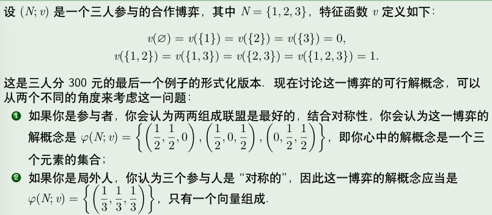
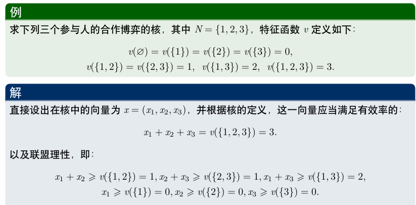
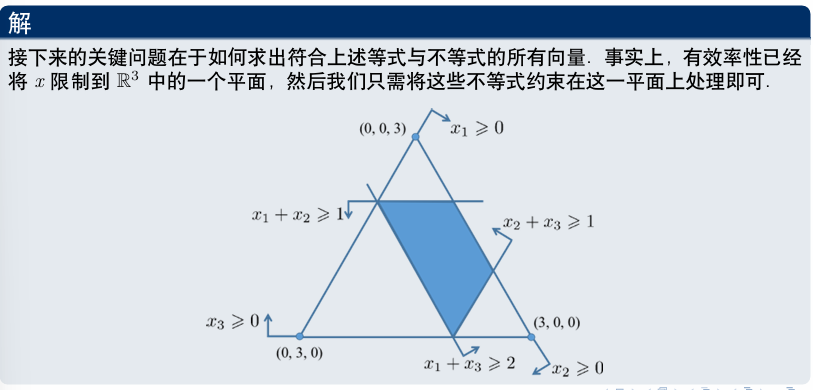
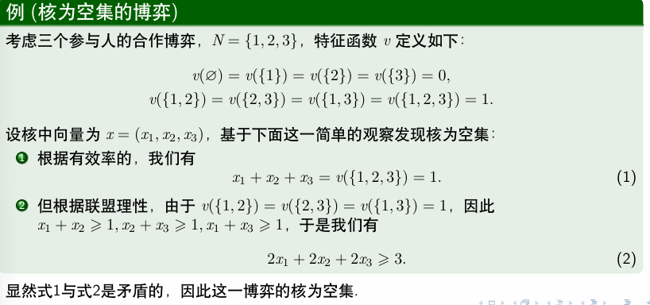
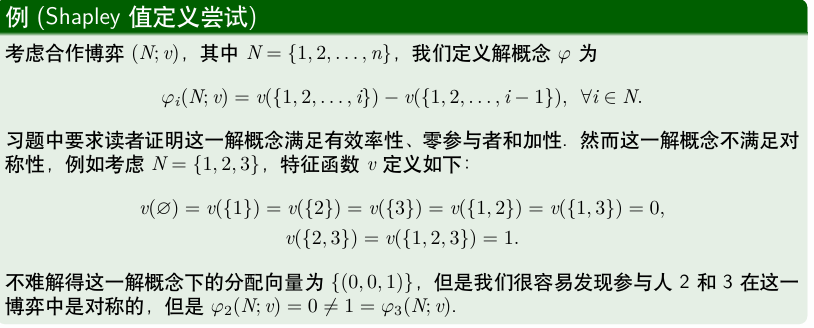
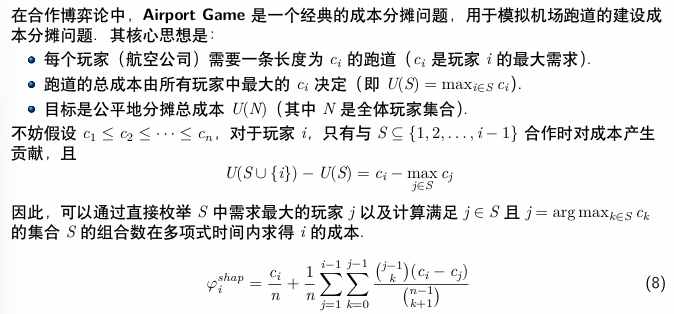

# 合作博弈与沙普利值

## 合作博弈

!!!Definition "合作博弈"
    一个具有可转移效用（transferable utility）的合作博弈（或称为 TU 博弈）是一个满足如下条件的二元组 $(N, v)$：
    
    1. $N=\{1,2,...,n\}$ 是一个有限的参与者集合；一个 $N$ 的子集被称为一个联盟（coalition），全体联盟构成的集合记为 $2^N$；
    - $v:2^N \rightarrow \mathbb{R}$ 称为该博弈的特征函数（characteristic function），对于任意的 $S \subseteq N$，$v(S)$ 表示联盟 $S$ 的价值（worth），且满足 $v(\emptyset)=0$

    !!!example
        考虑一个场景，假设有三个人A，B，C，他们的特点分别如下：

        1. A擅长于发明专利，依靠这一才能年收入达17万美元；
        - B有机敏的商业嗅觉，能准确发掘潜在市场，创建商业咨询公司年收入可达15万美元；
        - C擅长市场营销，开办专门的销售公司年收入可达18万美元。

        显然，三个人的才能互补，于是他们考虑合作：

        * B可以为A提供市场资讯，将A的发明专利卖给市场上最有需求的人，这样他们合作每年收入可达35万美元；
        * C利用他的才能销售A的发明专利，合作年收入可达38万美元；
        * 当然B和C也可以合作组建一个提供市场咨询和销售一体化的公司，这样每年合作收入可达36万美元；
        * 最后A，B，C如果共同合作，A在B的建议下发明最符合市场需求的专利，然后由C进行销售，这样他们合作每年收入可达56万美元。

        现在可以用定义形式化这一博弈：不难得到 $N = \{A, B, C\}$，全体联盟构成的集合

        \[
            2^N = \{\emptyset, \{A\}, \{B\}, \{C\}, \{A, B\}, \{A, C\}, \{B, C\}, \{A, B, C\}\}
        \]

        则该场景可以表示为一个合作博弈 $(N, v)$，其中特征函数 $v$ 定义如下：

        \[
            v(S) = 
            \begin{cases} 
            0 & S = \emptyset \\
            17 & S = \{A\} \\
            15 & S = \{B\} \\
            18 & S = \{C\} \\
            35 & S = \{A, B\} \\
            38 & S = \{A, C\} \\
            36 & S = \{B, C\} \\
            56 & S = \{A, B, C\} \\
            \end{cases}
        \]

!!!Definition "合作博弈的解概念"
    一个合作博弈 $(N, v)$ 的解概念是一个函数 $\varphi$，它将每个博弈 $(N, v)$ 与一个 $\mathbb{R}^n$ 的子集 $\varphi(N, v)$ 联系起来。如果对于任意的博弈 $\varphi(N, v)$ 都是一个单点集，则称这一解概念为单点解（point solution）。

    更通俗地说，合作博弈的解概念就是一个将每个博弈映射到一个可行的收入分配集合的函数，这个集合中的每个元素是一个分配向量 $(\varphi_1, \varphi_2, \ldots, \varphi_n)$，其中 $\varphi_i$ 表示参与者 $i$ 在当前分配下可以获得的收入。

    ???+ example
        <figure markdown="span">
            { width="500" }
        </figure>

### 核

!!!Definition "核"
    一个合作博弈 $(N, v)$ 的核（core）是一个解概念 $\varphi$，其中 $\varphi(N, v)$ 
    由满足以下两个条件的分配向量 $(x_1, x_2, \ldots, x_n)$ 组成：

    1. **有效率的（efficient）** : $\sum_{i=1}^n x_i = v(N)$，即所有参与者分完了整个联盟的全部收入；

    - **联盟理性（coalitionally rational）** : 对于任意的 $S \subseteq N$，有 $\sum_{i \in S} x_i \geq v(S)$，即对于任何联盟而言，他们在大联盟中分配到的收入一定不会比离开大联盟组成小联盟获得的收入少。

    ???+ example
        <figure markdown="span">
            { width="500" }
            { width="500" }
        </figure>

        也存在核为空集的博弈

        <figure markdown="span">
            { width="500" }
        </figure>

## Shapley Value

!!!quote "Shapley Value"

    想象一下，你和几个朋友一起合作完成一个大项目，最后赚了一大笔奖金。现在要分这笔钱，怎么分才最公平呢？每个人都觉得自己的贡献最大。

    **沙普利值就是为了解决这个“公平分钱”问题而提出的一种数学方法。**

    ---

    > **一个参与者应得的报酬，等于他/她在所有可能的合作顺序中，为团队带来的“平均边际贡献”。**

    我们来拆解这个核心思想：

    1.  **边际贡献 (Marginal Contribution)**
        这指的是当你加入一个已经存在的团队时，你为这个团队**额外增加**了多少价值。
        *   比如，原来团队能赚100万，你加入后，团队能赚125万。那么你这次的“边际贡献”就是25万。

    -  **所有可能的合作顺序**
        你加入团队的时机不同，你的“边际贡献”可能也不同。
        *   如果你是 **第一个** 加入的，你的贡献就是你单干的价值。
        *   如果你是 **最后一个** 加入的，你的贡献是“满员团队的价值”减去“少你一人的团队价值”。
        *   为了公平，我们必须考虑到你加入团队的所有可能顺序（第一个加入、第二个加入……最后一个加入）。

    -  **取平均值**
        沙普利值会计算出你在每一种加入顺序下的“边际贡献”，然后把它们全部加起来，再除以总的顺序数量，得到一个平均值。这个平均值，就被认为是你应该得到的、最公平的报酬。

    ---

    我们用这个思想来计算一下A应该分多少钱：

    总共有 $3! = 6$ 种可能的合作顺序：

    | 顺序 | A的“边际贡献”计算 | A的贡献值 |
    | :--- | :--- | :--- |
    | **A**, B, C | A第一个加入，贡献是 `v({A})` | **17** |
    | **A**, C, B | A第一个加入，贡献是 `v({A})` | **17** |
    | B, **A**, C | B先来，A再加入。贡献是 `v({A,B}) - v({B})` = 35-15 | **20** |
    | C, **A**, B | C先来，A再加入。贡献是 `v({A,C}) - v({C})` = 38-18 | **20** |
    | B, C, **A** | B,C先来，A最后加入。贡献是 `v({A,B,C}) - v({B,C})` = 56-36 | **20** |
    | C, B, **A** | C,B先来，A最后加入。贡献是 `v({A,B,C}) - v({C,B})` = 56-36 | **20** |

    现在我们把A在所有情况下的贡献加起来求平均：

    \[ 
        \text{A的沙普利值} = \frac{17 + 17 + 20 + 20 + 20 + 20}{6} = \frac{114}{6} = 19 
    \]
    
    所以，按照沙普利值的公平分配方案，**A应该得到19万美元**。

    用同样的方法，我们也可以算出B和C的应得报酬。

    ---

    **沙普利值的性质**

    1.  **提供唯一的“公平解”**：与“核（Core）”可能存在多个解或无解的情况不同，沙普利值对于任何合作博弈，总能给出一个唯一的、确定的分配方案。这在现实决策中非常重要。

    -  **“公平”有严格的数学公理支撑**：它的公平性不是凭感觉，而是满足一系列被广泛接受的公平原则（如：贡献相同的人收益相同；没有贡献的人收益为零；总收益被全部分配完毕等）。

### Shapley Value 的形式化定义

!!!definition "记号定义"
    令 $\varphi$ 为一个单点解，即对于任意的合作博弈 $(N; v)$（其中 $N = \{1, 2, \ldots, n\}$），$\varphi_i(N; v)$ 都是一个单点集，也就是唯一一个 $\mathbb{R}^n$ 中的向量。我们定义 $x(\varphi_i(N; v))$ 为向量 $\varphi(N; v)$ 中的第 $i$ 个位置的元素，即 $\varphi_i(N; v)$ 表示参与者 $i$ 在博弈 $(N; v)$ 中的分配到的收入。

    
    - 一个解概念 $\varphi$ 是有效率的 (efficiency)，若对于任意的合作博弈 $(N; v)$（其中 $N = \{1, 2, \ldots, n\}$），有 $\sum_{i=1}^{n} \varphi_i(N; v) = v(N)$。这与核的要求一致。

    - 一个解概念 $\varphi$ 是对称的 (symmetry)，若对于任意的合作博弈 $(N; v)$ 和任意的 $i, j \in N$，如果对于任意的 $S \subseteq N \setminus \{i, j\}$，有 $v(S \cup \{i\}) = v(S \cup \{j\})$，则 $\varphi_i(N; v) = \varphi_j(N; v)$。这意味着如果两个参与者对所有可能的合作子集的贡献相同，那么他们应该得到相同的分配。

    - 一个解概念 $\varphi$ 是零贡献者的 (null player)，若对于任意的合作博弈 $(N; v)$ 和任意的 $i \in N$，如果对于任意的 $S \subseteq N \setminus \{i\}$，有 $v(S \cup \{i\}) = v(S)$，则 $\varphi_i(N; v) = 0$。这意味着如果一个参与者对任何合作子集都没有增加价值，那么他们的分配应该为零。

    ???+ example
        <figure markdown="span">
            { width="500" }
        </figure>

        设定 $P_i(\sigma) = \{j \in N \mid \sigma(j) < \sigma(i)\}$

        即在排序 $\sigma$ 中位于参与人 $i$ 前面的所有参与人的集合。例如若在排序 $\sigma$ 下参与人 $i$ 排在了第一位，那么 $P_i(\sigma) = \varnothing$。

!!!definition "Shapley Value"
    === "基于排列的定义"
        令 $(N; v)$ 是一个合作博弈，其中 $N = \{1, 2, \ldots, n\}$，参与人 $i$ 的沙普利值定义为

        \[
        SV_i(N; v) = \frac{1}{n!} \sum_{\sigma \in S_n} \left( v(P_i(\sigma) \cup \{i\}) - v(P_i(\sigma)) \right),
        \]

        其中 $S_n$ 表示所有参与人的排列集合，$P_i(\sigma)$ 表示在排列 $\sigma$ 中位于参与人 $i$ 前面的所有参与人的集合。
        
        这个公式表示在所有可能的参与人排列中，计算参与人 $i$ 的边际贡献的平均值。

    === "基于组合的定义"

        对于合作博弈 $(N; v)$，其中 $N = \{1, 2, \ldots, n\}$，参与人 $i$ 的沙普利值定义为

        \[
            SV_i(N; v) = \frac{1}{n!} \sum_{S \subseteq N \setminus \{i\}} |S|!(n - |S| - 1)!(v(S \cup \{i\}) - v(S))
        \]

        其中 $S \subseteq N \setminus \{i\}$ 表示不包含参与人 $i$ 的所有子集。这个公式表示在所有可能的子集中，计算参与人 $i$ 的边际贡献的加权平均值。

        即对于前面是集合 $S$ 的子集，后面是集合 $N \setminus (S \cup \{i\})$ 的子集，一共有 $|S|!(n - |S| - 1)!$ 种组合，每种组合的贡献是 $v(S \cup \{i\}) - v(S)$。总的情况数是 $n!$。

    

### 留一法

一个常见的思路是采用逆向思维来评估数据集 $D_i$ 的贡献，即考虑在没有数据 $D_i$ 的情况下，模型性能会受到多大影响。这就是留一法（leave-one-out，简称 LOO）的核心思想。基于留一法，数据价值 $\varphi_i$ 的定义如下：

\[
\varphi^{\text{LOO}}_i = U(D) - U(D \setminus \{D_i\})
\]

即，使用完整数据集训练的模型表现与去除数据 $D_i$ 后训练的模型表现之间的差异。换句话说，这表示在已有其他数据集的情况下，加入 $D_i$ 后模型性能的提升程度。这个定义的直观合理性在于，如果数据 $D_i$ 对模型贡献很大，那么去除 $D_i$ 后模型表现应当显著下降，即 $\varphi^{\text{LOO}}_i$ 的值应当较大。

然而，留一法存在一个缺陷：如果 $D_i = D_j$，显然 $\varphi^{\text{LOO}}_i = \varphi^{\text{LOO}}_j = 0$，因为去掉数据 $D_i$ 或 $D_j$ 后，由于存在完全重复的数据，模型表现不会受到影响。

### Data Shapley

Data-Shapley 的公式定义基于 Shapley 值的概念，用于评估数据集中每个数据点 $D_i$ 对模型性能的贡献。

首先，我们来看第一个公式：

\[
\varphi_i^{\text{Shap}} = \frac{1}{n} \sum_{S \subseteq D \setminus \{D_i\}} \frac{U(S \cup \{D_i\}) - U(S)}{\binom{n-1}{|S|}}
\]

???Note
    其实这个形式可以转化为我们之前考虑的组合的形式，只需要在分子分母同时乘以 $(n-1)!$ 即可。

    \[
        \varphi_i^{\text{Shap}} = \frac{1}{n} \sum_{S \subseteq D \setminus \{D_i\}} \frac{U(S \cup \{D_i\}) - U(S)}{\binom{n-1}{|S|}}
    \]

    \[   
         = \frac{1}{n!} \sum_{S \subseteq D \setminus \{D_i\}} \frac{(n-1)!U(S \cup \{D_i\}) - U(S)}{\binom{n-1}{|S|}} 
    \]

    而

    \[
        \frac{(n-1)!}{\binom{n-1}{|S|}} = |S|!(n - |S| - 1)!
    \]

    这就是我们熟悉的形式了

    

* $\varphi_i^{\text{Shap}}$: 表示数据点 $D_i$ 的 Data-Shapley 值。它量化了 $D_i$ 对模型性能的平均贡献。
* $n$: 数据集中所有数据点的总数。
* $S$: 是原始数据集 $D$ 中不包含 $D_i$ 的任意子集（联盟）。
* $D \setminus \{D_i\}$: 表示从整个数据集 $D$ 中移除数据点 $D_i$ 后剩余的数据集。
* $S \subseteq D \setminus \{D_i\}$: 表示 $S$ 是从 $D \setminus \{D_i\}$ 中选择的子集。
* $U(S)$: 表示使用数据集 $S$ 训练模型后获得的性能（例如，准确率、F1 分数等）。
* $U(S \cup \{D_i\})$: 表示在数据集 $S$ 的基础上，加入数据点 $D_i$ 后训练模型获得的性能。
* $U(S \cup \{D_i\}) - U(S)$: 这部分代表了在给定联盟 $S$ 的情况下，数据点 $D_i$ 对模型性能的“边际贡献”（marginal contribution）。
* $\binom{n-1}{|S|}$: 这是一个二项式系数，表示在剩余的 $n-1$ 个数据点中，选择 $|S|$ 个数据点组成联盟 $S$ 的方式的数量。这个项用于对不同大小的联盟进行加权，确保每个数据点在所有可能的联盟中的边际贡献被公平地考虑。
* $\frac{1}{n} \sum_{S \subseteq D \setminus \{D_i\}} \dots$: 整个表达式表示对 $D_i$ 在所有可能联盟中的边际贡献进行平均。前面的 $\frac{1}{n}$ 是一个归一化因子。

进一步地，引入 $\Delta_j(D_i)$ 的概念：

\[
\Delta_j(D_i) = \frac{1}{\binom{n-1}{j}} \sum_{S \subseteq D \setminus \{D_i\}, |S|=j} (U(S \cup \{D_i\}) - U(S)) 
\]

* $\Delta_j(D_i)$: 表示加入数据集 $D_i$ 后，对所有大小为 $j$ 的联盟带来的模型训练结果提升的平均值。它被称为 $D_i$ 对大小为 $j$ 的联盟的“边际贡献”。
* $|S|=j$: 表示只考虑大小为 $j$ 的联盟 $S$。
* $\frac{1}{\binom{n-1}{j}}$: 用于对所有大小为 $j$ 的联盟中 $D_i$ 的边际贡献进行平均。

基于此，Data-Shapley 的定义可以进一步改写为：

$$\varphi_i^{\text{Shap}} = \frac{1}{n} \sum_{j=0}^{n-1} \Delta_j(D_i) $$

这个公式解释了 Data-Shapley 值是数据点 $D_i$ 对所有不同大小的联盟的边际贡献的平均。具体来说：

* 对于每个可能的联盟大小 $j$ (从 0 到 $n-1$)，计算 $D_i$ 对该大小的所有联盟的平均边际贡献 $\Delta_j(D_i)$。
* 然后，将这些不同大小联盟的平均边际贡献 $\Delta_j(D_i)$ 加起来，再除以 $n$。

!!!info "Beta Shapley"

    在 Data-Shapley 中，数据对任意大小的联盟的贡献是平等对待的。也就是说，一个数据集对小的联盟的贡献和对大的联盟的贡献在 Data-Shapley 中具有相同的权重。然而，一个自然的问题是，当联盟本身已经很大时，此时再加入一个数据集，对联盟的贡献通常而言会比较小，所以对较大联盟的边际贡献应该适当给予降低。因此更进一步，在数据估值中，如果对较大联盟的边际贡献权重适当给予缩小，更加重视对较小联盟的边际贡献，可能对数据集的评估会更加准确。基于此，Beta-Shapley 的定义为：

    $$
    \varphi_i^{\text{Beta}} = \frac{1}{n} \sum_{j=0}^{n-1} w_j \Delta_j(D_i)
    $$

    其中，$w_j$ 是一个权重因子，用于调整不同大小联盟的边际贡献在总和中的权重。

!!!info "Data Banzhaf"

    Data-Banzhaf 的定义如下：

    $$
    \varphi_i^{\text{banz}} = \sum_{S \subseteq D \setminus \{D_i\}} \frac{1}{2^{n-1}} (U(S \cup \{D_i\}) - U(S))
    $$

    从 Data-Banzhaf 的公式中可以看出，实际上是将 $D_i$ 对所有 $2^{n-1}$ 个联盟 $S \subseteq D \setminus \{D_i\}$ 的贡献取平均。与 Data-Shapley 不同，Data-Banzhaf 对每个单独的联盟的权重是相同的。

    - $2^{n-1}$: 表示所有可能的联盟数量。
    - $U(S \cup \{D_i\}) - U(S)$: 表示数据点 $D_i$ 对联盟 $S$ 的边际贡献。

    Data-Banzhaf 提供了一种不同的视角，即对随机学习算法的优化进行改进。

!!!Example "多项式时间复杂度游戏"
    <figure markdown="span">
        { width="500" }
    </figure>
    > 前面一项单独对空集的贡献提取出来，后面对于每一种j比i小的情况累加，上面的二项式系数是从j-1个挑出k个比j小的，下面的二项式系数是从n-1个挑出k+1个，因为此时的联盟大小是k+1，这是shapley的系数。

    另外一种方法是，将跑道视为分段修建。假设各航空公司的需求已排序，即 $c_1 \le c_2 \le \dots \le c_n$。我们将成本分摊过程分解如下：

    1.  **第一段 (长度 0 到 $c_1$)**:
        *   **成本**: $c_1$。
        *   **受益者**: 所有 $n$ 家公司。
        *   **分摊**: 成本由 $n$ 家公司平分，每家分摊 $\frac{c_1}{n}$。

    -  **第二段 (长度 $c_1$ 到 $c_2$)**:
        *   **成本**: $c_2 - c_1$。
        *   **受益者**: 剩下 $n-1$ 家公司。
        *   **分摊**: 成本由 $n-1$ 家公司平分，每家分摊 $\frac{c_2 - c_1}{n-1}$。

    -  **第 $j$ 段 (长度 $c_{j-1}$ 到 $c_j$)**:
        *   **成本**: $c_j - c_{j-1}$。
        *   **受益者**: 剩下 $n-j+1$ 家公司。
        *   **分摊**: 成本由 $n-j+1$ 家公司平分，每家分摊 $\frac{c_j - c_{j-1}}{n-j+1}$。

    ... 以此类推，直到最后一段。

    航空公司 $i$ 需要长度为 $c_i$ 的跑道，因此它参与了前 $i$ 段的成本分摊。其应付的总成本（即沙普利值）为：

    \[
    \varphi_i^{\text{shap}} = \underbrace{\frac{c_1}{n}}_{\text{第1段}} + \underbrace{\frac{c_2 - c_1}{n-1}}_{\text{第2段}} + \underbrace{\frac{c_3 - c_2}{n-2}}_{\text{第3段}} + \dots + \underbrace{\frac{c_i - c_{i-1}}{n-i+1}}_{\text{第i段}}
    \]
