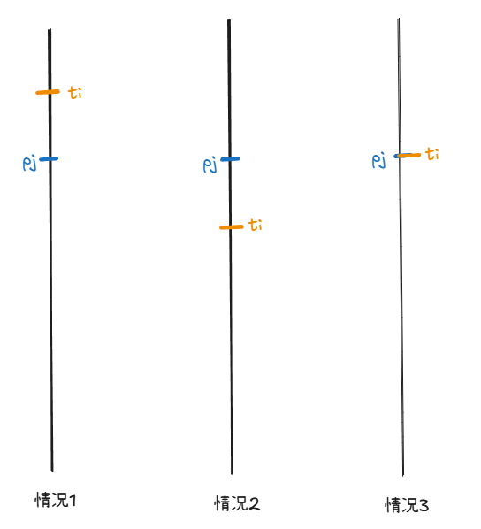
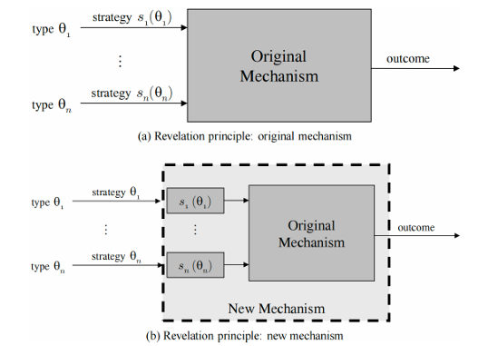
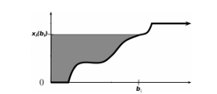
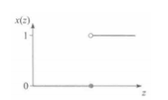

# 拍卖与机制设计基础

## 拍卖理论基础

!!!info "拍卖形式"
    - 公开拍卖
        - 英式拍卖：公开升价式拍卖
        - 荷兰式拍卖：公开降价式拍卖
    - 密封拍卖
        - 第一价格密封出价拍卖，价高者得，支付自己的报价
        - 第二价格密封出价拍卖，价高者得，支付第二高的报价
        - 有的拍卖中会设置保留价格（reserve price），指卖家在拍卖开始前设定的最低出售价格。如果所有报价都低于保留价格，卖家选择不卖出物品。当然有的拍卖也会设置入场费（entry fee），即所有参与者在拍卖开始前需要支付的费用，无论是否赢得拍卖。
    - 反向拍卖（reverse auction）是卖家报价的，在反向拍卖中，买家作为拍卖师通常具有一些采购需求，竞拍者是待采购商品的卖家，买家通过卖家的投标，结合其提供的商品质量决定选择哪些卖家的商品。不难发现，常见的招标就可以使用反向拍卖的方式进行。

### 单物品密封拍卖的一般框架

- 一个卖家拥有一个不可分割的物品待出售；
- 存在 $n$ 个潜在买家（竞拍者）$N=\{1,2,\dots,n\}$；
    - 每个买家 $i$ 对物品有一个心理价位（估值）$t_i$，但 $t_i$ 对卖家和其他买家来说是不完全信息（即 $t_i$ 是买家的类型）；
    - 买家估值的先验概率密度 $f_i :[a_i,b_i]\rightarrow\mathbb{R}^+$ 是共同知识，其中 $a_i$ 和 $b_i$ 是买家 $i$ 估值的下界和上界；
    - 假设 $f_i$ 连续且 $f_i(t_i)>0$ 对所有 $t_i \in[a_i,b_i]$ 成立，则 $t_i$ 的分布函数 $F_i(t_i) = \int_{a_i}^{t_i} f_i(s_i) \, ds_i$，
        分布函数在 $t_i$ 处的值表示买家 $i$ 的心理价位小于等于 $t_i$ 的概率；
- 卖家对物品也有一个估值，表示物品未售出时卖家持有的效用，记为 $t_0$，该信息是共同知识。为简化讨论，假定 $t_0=0$。

- 每个买家对物品的估值是私人信息，但具有先验分布的共同知识。
- 每个买家 $i$ 的策略是选择一个报价 $b_i$。
- 卖家没有策略，只需根据给定的拍卖规则（如一价或二价），基于买家的报价 $\mathbf{b}=(b_1,\dots,b_n)$，决定博弈的结果 $(\mathbf{x},\mathbf{p})$。
  - 其中，$\mathbf{x}$ 是物品的分配规则，$x_i(\mathbf{b})$ 表示买家 $i$ 在所有竞拍者投标为 $\mathbf{b}$ 时获得物品的概率。
  - $\mathbf{p}$ 是支付规则，$p_i(\mathbf{b})$ 表示买家 $i$ 在所有竞拍者投标为 $\mathbf{b}$ 时需要支付的价格。在单物品拍卖中，要求

\[
  \sum_{i=1}^{n} x_i(\mathbf{b}) \leqslant 1,
\]

即只有一个物品待出售。如果等于 1，代表物品总会卖出去；如果小于 1，代表卖家可能选择不卖出物品。注意，$x_i(\mathbf{b})$ 不一定只取 0 和 1，也可能是一个概率。

给定一个分配结果 $(x,p)$，每个买家 $i$ 的效用以拟线性效用函数的形式表达为

\[
  u_i = x_i(b)t_i - p_i(b)
\]

其中 $x_i(b)t_i$ 表示买家 $i$ 获得物品的期望收益（获得物品的概率乘以物品的效用），$p_i(b)$ 表示买家 $i$ 需要支付的价格。
注意无论什么类型的拍卖，最终的结果都是由分配规则和支付规则决定。

### 单物品第二价格拍卖

首先根据上述讨论形式化第二价格拍卖。在第二价格拍卖中，假设买家投标为 $\mathbf{b}=(b_1, \dots, b_n)$，那么最终的分配规则 $(\mathbf{x}, \mathbf{p})$ 为

\[
x_i(\mathbf{b}) = 
\begin{cases} 
1 & \text{如果 } b_i = \max_{j \in N} b_j \\ 
0 & \text{其他情况} 
\end{cases},
\]

\[
p_i(\mathbf{b}) = 
\begin{cases} 
\max_{j \neq i} b_j & \text{如果 } b_i = \max_{j \in N} b_j \\ 
0 & \text{其他情况} 
\end{cases}.
\]

即报价最高的买家赢得物品，但只需要支付第二高的报价。

!!!question "有多个买家报出相同的最高报价时该如何处理？"
    - 一方面由于每个买家的估值服从连续分布，因此这种情况的概率为 0；
    - 另一方面即使出现这种情况，卖家也可以随机选择一个报价最高的买家赢得物品打破平局；
    - 如果没有特别说明，都忽略多个买家报出相同最高报价的情况。

第二价格拍卖的博弈均衡非常简单且具有良好的性质：

!!!tip "二价拍卖诚实占优"
    在单物品第二价格拍卖中，即每个竞拍者将自身估值 $t_i$ 作为报价 $b_i$ 得到的 $\mathbf{b}=(t_1, \dots, t_n)$ 是（弱）占优策略均衡。简而言之，所有竞拍者诚实报价是（弱）占优策略均衡。

诚实报价是占优策略是二价拍卖的一个非常重要的性质：

- 竞拍者参与二价拍卖时的策略非常简单：只需要将自己的估值作为报价即可，不需要考虑与其他竞拍者的复杂关系；
- 另一方面，诚实报价可以显示竞拍者的真实估值，从而打破信息不对称，卖家只需直接选出报价最高的竞拍者即可实现社会福利最大化；
- 因为社会福利就等于拥有物品的人对物品的估值，因此最大化社会福利就要将物品转移到对其估值最高的人手中。

!!!success "证明"
    考虑任意的竞拍者 $i$，设 $p_i = \max_{j \neq i} b_j$，即 $p_i$ 是除了 $i$ 之外的所有竞拍者的最高报价。分三种情况讨论：

    <figure markdown>
    { width="500" }
    </figure>

    1. 如果 $t_i > p_i$，那么 $i$ 如果报价 $b_i=t_i$ 就会赢得拍卖并支付 $p_i$，效用 $t_i - p_i > 0$。考虑策略的偏离，如果选择报价提高至 $b_i' > t_i$，结果没有任何改变；如果报价降低至 $t_i > b_i' \ge p_i$，结果仍然一致；但如果降低报价至 $b_i' < p_i$，那么 $i$ 将不再赢得拍卖，因此 $i$ 的效用将变为 0，故 $t_i>p_i$ 时诚实报价是（弱）占优策略；
    2. 如果 $t_i < p_i$，那么 $i$ 如果报价 $b_i=t_i$ 不会赢得拍卖，效用 0。考虑策略的偏离，如果报价降低至 $b_i' < t_i$，结果没有任何改变；如果报价提高至 $t_i < b_i' < p_i$，结果仍然一致；但如果报价提高至 $b_i' \ge p_i$，那么 $i$ 将赢得拍卖并支付 $p_i$，因此 $i$ 的效用将变为 $t_i - p_i < 0$，故 $t_i < p_i$ 时诚实报价是（弱）占优策略；
    3. 如果 $t_i=p_i$，事实上拍卖的输赢带给 $i$ 的效用都是 0，因此 $i$ 无论报价多少都不会影响效用。

    综上，对于任意的竞拍者 $i$，诚实报价是（弱）占优策略均衡。

    !!!Warning "二价拍卖的缺陷"
        尽管第二价格拍卖具有如此好的性质，但在通常的印象中似乎并不如第一价格拍卖常见。一个重要的原因是，卖家可以操纵第二价格拍卖，通过向最高报价者谎称一个比较高的第二价格来提高自己的收益：
        
        例如在第二价格拍卖中，你是最高价格的报价者，你的报价为 100 元，第二高报价为 80 元，因此你赢得拍卖并支付 80 元；
        
        但因为是密封拍卖，你无法得知第二高报价的准确数值，如果卖家告诉
        你第二高报价是 90 元，你也无从得知 90 元是不是真的第二高报价，但
        卖家掌握这一信息，从而可以从信息操纵中获得更高的收益

### 第一价格拍卖

我们自然希望一价拍卖能有二价拍卖那样简单的结果，但只需要稍作分析就会发现一价拍卖的博弈结果并不那么简单。

首先，在一价拍卖中，假设买家投标为 $\mathbf{b}=(b_1, \dots, b_n)$，那么最终的分配规则 $(\mathbf{x}, \mathbf{p})$ 为

\[
x_i(\mathbf{b}) = 
\begin{cases} 
1 & \text{如果 } b_i = \max_{j \in N} b_j \\ 
0 & \text{其他情况} 
\end{cases},
\]

\[
p_i(\mathbf{b}) = 
\begin{cases} 
b_i & \text{如果 } b_i = \max_{j \in N} b_j \\ 
0 & \text{其他情况} 
\end{cases}.
\]

!!!warning "第一价格拍卖不是诚实占优的"
    - 如果一价拍卖中竞拍者报出自己的估值，那么赢下拍卖后的支付就是自己的估值，因此效用为 0，与没有赢下拍卖一致，因此从直观上看一价拍卖的参与人有动机报出低于自己估值的报价。
    - 严格来说，代入二价拍卖诚实报价占优的证明，一价拍卖在 $t_i > p_i$ 时（报价高于第二高价格时），如果将报价从 $t_i$ 下调到 $p_i$ 和 $t_i$ 之间，竞拍者 $i$ 仍然可以赢下拍卖，但效用可以提高到大于 0 的值，因此一价拍卖并非诚实报价是占优策略，而是有动机报出低于自己估值的报价；
    - 由此可以看出二价拍卖诚实的关键：报价与自己的估值无直接关联；
    - !!!question "问题：三价拍卖是否诚实？"
        三价拍卖也不是诚实占优的。

因此接下来尝试从贝叶斯纳什均衡的角度给出一价拍卖的不完全信息静态博弈结果。下面计算一价拍卖的贝叶斯纳什均衡，一般的结论推导比较复杂，因此只考虑非常简单的情况的计算。

!!!example "一价拍卖的贝叶斯纳什均衡"
    假设只有两个竞拍者，并且两个竞拍者的估值是独立的，且都服从 $[0,1]$ 上的均匀分布。两个竞拍者的真实估值记为 $t_1, t_2$，试求解博弈的纯策略贝叶斯纳什均衡。

    这一博弈对应类型空间连续且策略空间连续的情况，因此比之前介绍的例子都要复杂。自然地，可以考虑具有如下性质的特殊均衡：
    
    - 纯策略均衡；
    - 由于两个竞拍者是对称的，因此考虑对称均衡，即二者的出价策略都是当自己的估值为 $t_i$ 时出价 $\beta(t_i)$；
    - 假设 $\beta$ 是增函数，即估值越大报价越高；
    - $\beta(0) = 0$，即估值为 0 的竞拍者出价也为 0。

    回顾纯策略均衡的求解是寻找对方策略的最优反应，因此首先写出当竞拍者 1 报价 $b_1$，竞拍者 2 报价 $\beta(t_2)$ 时竞拍者 1 的效用为：

    \[
    (t_1 - b_1)\mathbb{P}(b_1 > \beta(t_2)) = (t_1 - b_1) \cdot \beta^{-1}(b_1)
    \]

    对 $b_1$ 求导有取极大值的必要条件为

    \[
    -\beta^{-1}(b_1) + \frac{t_1 - b_1}{\beta'(\beta^{-1}(b_1))} = 0.
    \]

    已知考虑对称均衡，故均衡时 $b_1 = \beta(t_1)$，代入上式有

    \[
    t_1 = t_1\beta'(t_1) + \beta(t_1),
    \]

    上式对任意的 $t_1$ 都成立，可以改写为

    \[
    t = (t\beta(t))'.
    \]

    不难解得 $\beta(t_1) = t_1/2$，这就解出了一价拍卖的对称递增均衡。当然上述一阶条件只是极值的必要条件，还需要检验充分性，此处省略。

### 收入等价定理

在第二价格拍卖中，竞拍者诚实报价是占优策略，但赢得拍卖的竞拍者只只需支付第二高报价；而在第一价格拍卖中，竞拍者会降低自己的报价，但赢得拍卖的竞拍者需要支付自己的报价（即最高的报价）。自然的问题是：**在这两种拍卖中，卖家的期望收入哪种拍卖会更高呢？**

在只有两个竞拍者，且两个个竞拍者的估值独立同分布于 $[0,1]$ 上的均匀分布的情况下：

- **一价拍卖**：竞拍者 $i$ 的均衡报价策略为 $b_i = t_i/2$。竞拍者 1 赢得拍卖的概率为 $\mathbb{P}(t_1/2 > t_2/2) = \mathbb{P}(t_2 < t_1) = t_1$。因此竞拍者 1 的期望支付为 $t_1 \cdot t_1/2 = t_1^2/2$。站在卖家的角度，$t_1$ 是不确定的，因此卖家认为竞拍者 1 的期望支付为

\[
    \int_0^1 \frac{t_1^2}{2} dt_1 = \frac{1}{6}.
\]

!!!info "另一种计算方式"
    在只有两个竞拍者，且两个竞拍者的估值独立同分布于 $[0,1]$ 上的均匀分布的情况下，可以直接写出一价拍卖选择对称递增均衡下的期望收益等于
    
    \[
    \mathbb{E}[\max(\beta(t_1), \beta(t_2))] = \mathbb{E}\left[\frac{\max(t_1, t_2)}{2}\right].
    \]
    
    $\max(t_1, t_2)$ 是次序统计量，对应的分布函数为
    
    \[
    F(t) = \mathbb{P}(\max(t_1, t_2) < t) = \mathbb{P}(t_1 < t) \cdot \mathbb{P}(t_2 < t) = t^2,
    \]
    
    故对应的密度函数为 $f(t) = 2t$，因此收益期望值等于
    
    \[
    \frac{1}{2} \cdot \mathbb{E}[\max(t_1, t_2)] = \frac{1}{2}\int_0^1 t \cdot 2t dt = \frac{1}{3}.
    \]

- **二价拍卖**：根据诚实报价占优以及支付第二高报价可知卖家的期望收入

\[
    \mathbb{E}[\min(t_1, t_2)]
\]

$\min(t_1, t_2)$ 是次序统计量，对应的分布函数为

\[
   \mathbb{P}(\min(t_1, t_2) < t) = 1 - \mathbb{P}(\min(t_1, t_2) > t) = 1 - \mathbb{P}(t_1 > t) \cdot \mathbb{P}(t_2 > t) = 1 - (1-t)^2.
\]

对应的密度函数为

\[
   f(t) = 2(1-t).
\]

故

\[
   \mathbb{E}[\min(t_1, t_2)] = \int_0^1 t \cdot 2(1-t) dt = \frac{1}{3}.
\]

因此对于卖家而言，在上述情况下选择第一和第二价格拍卖，最终得到的期望收益无差别。事实上这井不是巧合，而是下面这一定理的一个特例：

!!!tip "收入等价定理"
    假设竞拍者估价独立同分布，那么只要估价为 0 的竞拍者的期望支付为 0，且拍卖规则为报价最高者得到物品，则拍卖的递增对称均衡都会使得卖家获得相等都的期望收入。

!!!definition "递增对称均衡"
    拆解为三个部分理解：

    1.  **均衡 (Equilibrium)**: 指的是"贝叶斯纳什均衡"。在此状态下，没有任何一个参与者有动机单方面改变自己的策略，因为改变策略不会带来更好的收益。
    2.  **对称 (Symmetric)**: 指的是所有参与者都使用相同的策略函数。在拍卖的例子里，一个对称的策略就是，无论竞拍者是谁，都会使用同一个函数 $\beta(t)$ 来根据自己的估值 $t$ 决定报价 $b$。
    3.  **递增 (Increasing)**: 指的是策略函数 $\beta(t)$ 是一个单调递增函数。这意味着，对物品的估值 $t$ 越高，竞拍者出的报价 $b$ 就越高。这非常符合直觉。

   递增对称均衡描述了这样一种博弈的稳定状态：所有参与者都采用同一个单调递增的策略函数来出价，并且在这种情况下，没有人愿意单方面改变自己的策略。在一价拍卖的例子中，我们求解出的 $\beta(t) = t/2$ 就是一个递增对称均衡。

## 机制设计基础

!!!definition "机制"
    对一个不完全信息博弈，一个机制是一个二元组 $(S, M)$，其中 $S = S_1 \times \cdots \times S_n$ 是所有参与人可选的纯策略集合，$M$ 是一个将所有参与人的纯策略向量 $(s_1, \ldots, s_n) \in S$ 映射到结果集 $O$ 上的一个概率分布的一个映射。

    如果一个机制是确定性的 (deterministic)，那么对于每个行动向量，机制 $M$ 将其行动映射到一个确定的结果 $o_i \in O$ 上。

    例如，一个单物品密封拍卖机制是将买家的投标向量映射到一个结果 $(x, p)$ 上的机制，其中 $x$ 是分配规则，$p$ 是支付规则。

    上述定义不仅适用于拍卖机制，只要针对不完全信息博弈，并且将参与人策略映射到结果，就是符合上述机制定义的。

### 直接显示机制与显示原理

为了介绍显示原理，首先需要定义如下两个基本概念：

!!!definition "直接显示机制"
    对于一个机制 $(S, M)$，如果：
    
    1. 对每个参与人 $i$ 都有 $S_i = T_i$，即每个参与人的行动就是报示自己的类型，则这一机制称为直接显示机制 (direct revelation mechanism) 或直接机制 (direct mechanism)；
    2. 如果每个参与人如实报告自己的类型时的行动向量 $\mathbf{s} = (t_1, \ldots, t_n)$ 是博弈的纳什均衡，则称这一机制是激励相容的，或者说是诚实的 (truthful)。更详细地，如果 $\mathbf{s}$ 是占优策略均衡，则称这一机制是占优策略激励相容 (dominant-strategy incentive compatible, DSIC) 的。如果 $\mathbf{s}$ 是贝叶斯纳什均衡，则称这一机制是贝叶斯激励相容 (Bayesian incentive compatible, BIC) 的。

不难发现，如果单物品密封价格拍卖中各参与人的类型（即估值）集合为 $[0, +\infty)$，则每个参与人的行动集合（报价）也是 $[0, +\infty)$，故满足直接显示机制。此外，由于二价拍卖下诚实报价是占优策略均衡，故二价拍卖是占优策略激励相容的。

!!!tip "显示原理"
    给定任意一个机制及其占优策略均衡（或贝叶斯纳什均衡），都可以找到一个激励相容的直接机制，使得该机制均衡下的结果和原机制均衡下对应的结果一致。

可以先用一价拍卖的例子体会上述定理的含义。回忆只有两个竞拍者，且两个竞拍者的估值独立同分布于 $[0,1]$ 上的均匀分布的情况下，一价拍卖选择对称递增均衡为 $\beta(t) = t/2$。

如果此时机制变为：报价最高者获得物品，但只需要支付最高报价的一半，那么该机制下诚实报价就可以体现到和原机制相同的完全一致的结果。下图给出了这一思想一般化的证明示意。

<figure markdown="span">
{ width="500" }
</figure>

通俗地说，机制设计者为参与者完成了均衡求解的任务，因此参与者只需输入自己的真实类型，就能获得与原机制均衡相同的结果。激励相容的直接机制因此能够实现与原机制一致的结果。

由此可见，显示原理是一个非常巧妙的定理，其作用非常显著：在后续的机制设计问题中，我们只需考虑所有参与者在均衡下如实报告自己类型的机制即可；

- 因为任何机制都可以转化为直接显示机制，而这种转化不会改变机制的结果；
- 因此，仅通过这一类机制，我们就能获得所有可能机制的结果，从而大大缩小了机制设计中需要考虑的机制集合；
- 此外，在直接显示机制中，参与者需要诚实地报告自己的类型，从而解决了信息不对称的问题。

显示机制是由2007年诺贝尔经济学奖得主迈尔森提出并证明的，他获得诺奖的最重要贡献之一就是显示原理。

---

### 迈尔森引理

一价拍卖是激励相容的直接显示机制，然而一价拍卖并不是。

自然的问题是：哪些机制是激励相容的？迈尔森引理（Myerson's lemma）给出了拍卖机制（从报价到分配和支付的机制）激励相容的充要条件：这里首先给出迈尔森引理在占优策略均衡下的版本

!!!tip "迈尔森引理"
    一个拍卖机制是 DSIC（占优策略激励相容）的，当且仅当其分配规则和支付规则 $(\mathbf{x}, \mathbf{p})$ 满足：
    
    - $x$ 是单调的，即 $x_i(b_i)$ 是 $b_i$ 的单调不减函数；
    - 给定 $x$ 的情况下，只要给定 $p_i(0)$ 的值，对任意的 $i \in N$ 和 $b_i \in [0, +\infty)$，$p$ 的表达式是唯一确定的：
    
    \[
    p_i(b_i) = p_i(0) + b_i \cdot x_i(b_i) - \int_0^{b_i} x_i(s)ds.
    \]

引理的第一个条件是很好理解的，即报价越高，获得物品的概率越高：

- 直观而言，如果报价降低能有更高的概率获得物品，那么竞拍者就会有动机选择降低自己的报价，不符合激励相容性质；

第二个条件说明，要满足 DSIC 性质，在给定的分配规则下，只要报价为 0 时的支付 $p_i(0)$ 确定（通常都为 0），则只有一种特定的支付规则能够使得竞拍者如实报告自己的估值。

这一支付规则被称为迈尔森支付公式。下图是一个直观解释：横坐标是竞拍者 $i$ 报价的取值，纵坐标是竞拍者 $i$ 的分配结果，$x_i(b_i)$ 所围成的曲线是分配规则，$x_i(b_i)$ 到纵坐标所围成的面积表示于长方形减去线下方面积，正好对应竞拍者 $i$ 报价为 $b_i$ 时的支付（设 $p_i(0) = 0$）。

<figure markdown="span">
{ width="500" }
</figure>

显示直觉的权衡：不能提取全部的剩余，否则无法激励诚实。

!!!example "迈尔森引理与二价拍卖"
    根据二价拍卖的分配规则可知：

    <figure markdown="span">
    { width="500" }
    </figure>

    - 当 $b_i < \max_{j \neq i} b_j$ 时，$x_i$ 在 $[0, b_i]$ 内均为 0，因此根据迈尔森支付公式计算出此时支付 $p_i(b_i) = 0$，符合二价拍卖结果；
    - 当 $b_i > \max_{j \neq i} b_j$ 时，$x_i$ 在 $[\max_{j \neq i} b_j, b_i]$ 内均为 1，其余部分为 0。如下图所示

    因此根据迈尔森支付公式计算出此时支付

    \[
    p_i(b_i) = b_i - \left(b_i - \max b_j\right) = \max b_j,
    \]

    也符合二价拍卖结果。

    根据上图的直观，对于竞拍者 $i$ 而言，二价拍卖的分配规则是一个阶梯函数，其中间断点位于 $\max_{j \neq i} b_j$，报价高于此值时获得物品，低于此值时不会获得物品。一般地，称阶梯形分配规则的间断点为关键值（critical value）。

    需要注意的是，迈尔森引理并没有限制单物品拍卖，如果是多个完全相同物品的拍卖，且每个竞拍者具有单位需求（只需要一份物品，例如数据），不难发现上面的陈述并没有需要修改之处：

    - 此时买家的估值仍然是一维的；
    - 问题：假设有 $m$ 个完全相同的物品，每个竞拍者具有单位需求，请设计 DSIC 拍卖机制。(从高到低分配给m个竞拍者，支付第m+1高的bid)

    综合显示原理和迈尔森引理，在之后的拍卖设计讨论中都只需要考虑竞拍者如实报告自己估值的机制，但在使用此类机制研究时要注意，在一个给定的分配规则下只有一种特定的支付规则才能达到。因此拍卖机制设计问题进一步转化为只需要设计分配规则，因为激励相容情况下的支付规则是对应唯一确定的（只要固定 $p_i(0)$ 的取值）。

在直观理解了迈尔森引理后，接下来给出迈尔森引理的证明：

首先验证"当"的部分，相对而言比较简单直接。设竞拍者 $i$ 的估值为 $t_i$，当其报价为 $t_i'$ 时，其收益表达为

\[
u_i(t_i') = t_i \cdot x_i(t_i') - p_i(t_i') = (t_i - t_i')x_i(t_i') + \int_0^{t_i'} x_i(s)ds - p_i(0),
\]

特别地，当报价 $t_i' = t_i$，即竞拍者诚实报价时，其收益为

\[
u_i(t_i) = \int_0^{t_i} x_i(s)ds - p_i(0).
\]

故有

\[
u_i(t_i) - u_i(t_i') = (t_i' - t_i)x_i(t_i') - \int_{t_i}^{t_i'} x_i(s)ds
\]

当 $t_i' \geqslant t_i$ 时，由于 $x_i$ 是增函数，故

\[
\int_{t_i}^{t_i'} x_i(s)ds \leqslant (t_i' - t_i)x_i(t_i'),
\]

因此 $u_i(t_i) - u_i(t_i') \geqslant 0$。当 $t_i' \leqslant t_i$ 时同理可得 $u_i(t_i) - u_i(t_i') \geqslant 0$。

故无论其他竞拍者的报价如何，竞拍者 $i$ 选择如实报告自己的估值是占优策略，因此该机制是 DSIC 的。

接下来证明"仅当"的部分，即要求激励相容推出这一机制。这里需要用到一个特殊的交换技巧。假设机制 $(\mathbf{x}, \mathbf{p})$ 是 DSIC 的，有两个任意的变量 $0 \leqslant y < z$。一种可能的情况是，智能体 $i$ 的估值是 $z$，提交报价是 $y$，此时 DSIC 要求 $u_i(z) \geqslant u_i(y)$(按估值报价收益不低于其它报价)，展开为

\[
z \cdot x_i(z) - p_i(z) \geqslant z \cdot x_i(y) - p_i(y),
\]

另一种情况是，智能体 $i$ 的估值是 $y$，提交报价是 $z$，此时要求

\[
y \cdot x_i(y) - p_i(y) \geqslant y \cdot x_i(z) - p_i(z),
\]

上述两式移项，组合后可以得到

\[
z \cdot (x_i(y) - x_i(z)) \leqslant p_i(y) - p_i(z) \leqslant y \cdot (x_i(y) - x_i(z)),
\]

实际上由上式左右两端已经可以看出，$(z - y)(x_i(y) - x_i(z)) \leqslant 0$，因为 $z > y$，故 $x_i(y) - x_i(z) \leqslant 0$，又因为这一结果对任意的 $0 \leqslant y < z$ 成立，故 $x_i$ 是单调递增的，故也是可微且几乎处处可导的。

进一步地，对不等式中三部分别除以 $y - z$，然后令 $y \to z$ 可得下式几乎处处成立：

\[
p_i'(y) = y \cdot x_i'(y),
\]

两边对 $y$ 积分可得

\[
\int_0^{b_i} p_i'(y)dy = \int_0^{b_i} y \cdot x_i'(y)dy,
\]

使用分部积分即可得到迈尔森支付公式

\[
p_i(b_i) = p_i(0) + b_i \cdot x_i(b_i) - \int_0^{b_i} x_i(s)ds.
\]

## 福利最大化机制设计

### VCG机制

考虑一般的物品分配场景：

- 例如有四个竞拍者和四个不同的物品（例如四个不同地区/不同频段的频谱），记为 $S = \{A, B, C, D\}$；
- 买家对 $S$ 的任意子集都有不同的估值；
- 可能的分配结果 $\Omega$ 包含将所有物品分配出去的所有可能结果，其中 $\omega \in \Omega$ 表示一个合理的分配方案；
- 例如将物品 $B$ 分配给竞拍者 1，$A, C, D$ 分配给竞拍者 2 就是一个合理的分配结果。

如何为这种情况设计福利最大化的拍卖机制？

迈尔森引理中实家对物品的估值是一维变量可以描述的，此处无法做到。事实上迈尔森引理至今也无法推广至多维的一般情况。

因此我们需要求助于其他的机制。可能的分配结果集合记为 $\Omega$，其中 $\omega \in \Omega$ 表示一个合理的分配结果。下面首先假设所有竞拍者是诚实报价的，即对分配结果 $\omega$ 的报价 $b_i(\omega)$ 就等于他对 $\omega$ 中给他分配的物品的效用值。则下面的分配规则给出了福利最大化的分配规则：

\[
\omega^* = \arg\max_{\omega \in \Omega} \sum_{i=1}^n b_i(\omega).
\]

此外，为了讨论方便，记 $\omega^*_{-i}$ 为去掉参与人 $i$ 后的福利最大化分配结果，即 $\omega^*_{-i} = \arg\max_{\omega \in \Omega} \sum_{j \neq i} b_j(\omega)$。记所有参与人的投标向量为 $\mathbf{b} = (b_1, \ldots, b_n)$，下面的支付公式给出了福利最大化 DSIC 机制的支付规则：

\[
p_i(\mathbf{b}) = \sum_{j \neq i} b_j(\omega^*_{-i}) - \sum_{j \neq i} b_j(\omega^*).
\]

上述公式的含义是，$i$ 需要支付的价格是，在 $i$ 不参与分配时其他人的最大福利情况下其他人的福利，事实上也可以理解为参与人 $i$ 给其他人所造成的负外部性。

!!!tip
    VCG机制是DSIC的；

!!!example "VCG机制与二价拍卖"
    事实上，二价拍卖是 VCG 机制在单物品拍卖下的特例：

    - 首先，分配机制满足福利最大化。在单物品拍卖中，这意味着将物品分配给对物品估值最高的竞拍者，这与二价拍卖的原则一致。
    - 其次是支付规则：

      - 如果你不是估值最高的竞拍者，那么在你不参与时，最大福利等于估值最高的竞拍者的估值 $v_i$；在你参与时，最大福利也等于估值最高的竞拍者的估值 $v_i$，此时你的福利为0，因此，你的支付为 $v_i - (v_i-0) = 0$。
      - 如果你是估值最高的竞拍者，那么在你不参与时，最大福利等于估值第二高的竞拍者的估值 $v_2$；在你参与时，最大福利等于你的估值 $v_1$，此时你的福利为 $v_1$。因此，你的支付为 $v_2 - (v_1-v_1) = v_2$。

