# 多臂老虎机 (Multi-Armed Bandit)

!!!Definition
    一个赌鬼要玩多臂老虎机，摆在他面前有 $K$ 个臂（Arms）或动作选择（Actions），每一轮游戏中，他要选择拉动一个臂并会获得一个随机奖励（reward）（这一随机奖励来源于一个赌场设定好的分布，但赌鬼一开始不知道这一分布）。如果总共玩 $T$ 轮，他该如何最大化奖励

    <figure markdown="span">
        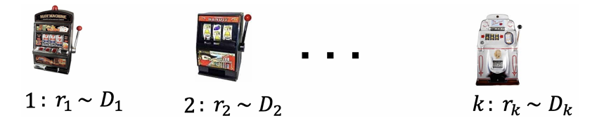
        <figcaption>多臂老虎机</figcaption>
    </figure>

## 随机多臂老虎机

!!!Definition "随机多臂老虎机"
    在每一步 $t=1,2,\ldots,T$ 中：

    1. 玩家选择一个臂 $a_t \in A = \{a_1, \ldots, a_K\}$；
    - 玩家获得该臂对应的随机奖励 $r_t \sim R(a_t)$（$r_t \in [0,1]$）；
    - 玩家依据过往轮次的奖励情况调整选择策略，实现奖励最大化。

    说明：

    * 奖励分布的均值记为 $\mu(a_k) = \mathbb{E}[R(a_k)]$，$k \in [K]$；
    * 最优臂 $a^*$ 的奖励均值 $\mu^* = \max_{a \in A} \mu(a)$；
    * 奖励均值差异 $\Delta(a) = \mu^* - \mu(a)$。

    !!!Note
        奖励均值差异和奖励均值是未知的，玩家需要通过探索来估计这些值。定义这些值是为了在上帝视角分析算法的性能。

遗憾分析

{==

伪遗憾

\[
    \text{伪遗憾} = \sum_{t=1}^T \left( \mu^* - \mu(a_t) \right) = \mu^*T - \sum_{t=1}^T \mu(a_t)
\]

期望遗憾

\[
    \text{期望遗憾} = \mathbb{E}[\text{伪遗憾}] = \mu^*T - \mathbb{E}[\sum_{t=1}^T \mu(a_t)]
\]

==}

由于选择策略的随机性，$\mu(a_t)$ 是随机变量。

!!!info "次线性"
    一个函数 $f(x)$ 是次线性的，如果对于所有 $x$，有 $f(x) \leqslant cx$ 成立，其中 $c$ 是一个常数。

    在MAB问题中，我们常常关注算法遗憾界（regret bound）。一个好的遗憾界是次线性的（sub-linear），这意味着算法能逐渐学到最优臂，即

    \[
        \lim_{T \to \infty} \frac{RegretBound(T)}{T} = 0
    \]

!!!Note "Hoeffding不等式"
    设 $X_1, X_2, \ldots, X_n$ 是独立同分布的随机变量，且 $X_i \in [0,1]$。则对于任意 $\epsilon > 0$，有

    \[
        \mathbb{P}\left( \left| \frac{1}{n} \sum_{i=1}^n X_i - \mathbb{E}[X_i] \right| \geqslant \epsilon \right) \leqslant 2e^{-2n\epsilon^2}
    \]

    称 $[\mu - \epsilon, \mu + \epsilon]$ 是置信区间（confidence interval），$\epsilon$ 是置信半径（confidence radius）。

    若令 $\epsilon = \sqrt{\frac{\alpha \log T}{n}}$，则有

    \[
        \mathbb{P}(|\mu - \overline{X}_n| \geqslant \epsilon) = \mathbb{P}\left( \left| \mu - \overline{X}_n \right| \geqslant \sqrt{\frac{\alpha \log T}{n}} \right) \leqslant 2T^{-2\alpha}, \forall \alpha > 0
    \]

    一般取 $\alpha = 2$

### 贪心算法

<figure markdown="span">
    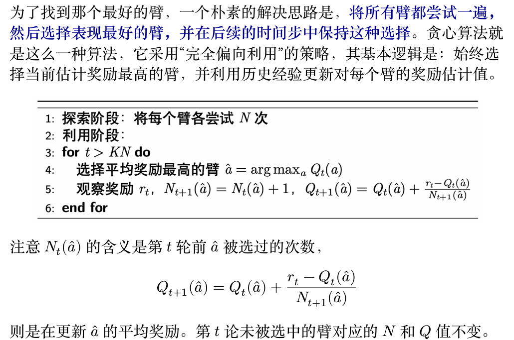{ width="500" }
    <figcaption>贪心算法</figcaption>
</figure>

#### 贪心算法期望遗憾界

贪心算法期望遗憾界为 $O\left(T^{\frac{2}{3}}(K\log T)^{\frac{1}{3}}\right)$。

    
分析框架：好事件 vs. 坏事件

我们将利用阶段的期望遗憾 $\mathbb{E}[R(\text{exploitation})]$ 分解为两部分：

$$
\mathbb{E}[R] = \mathbb{E}[R | E] \cdot P(E) + \mathbb{E}[R | \bar{E}] \cdot P(\bar{E})
$$

*   **事件 $E$ (好事件)**: 我们的采样估计是"准确"的。具体来说，所有臂 $a$ 的样本均值 $Q(a)$ 与其真实均值 $\mu(a)$ 的差距都小于某个范围 $\text{rad}$。
    $$ E = \{ \forall a, |\mu(a) - Q(a)| \le \text{rad} \} $$
    其中我们定义 $\text{rad}$ 为 $\sqrt{\frac{2\log T}{N}}$。

*   **事件 $\bar{E}$ (坏事件)**: 事件 $E$ 的补集，即至少有一个臂的采样估计"不准确"，超出了 $\text{rad}$ 的范围。

分析坏事件 $\bar{E}$ 的贡献

根据霍夫丁不等式和联合界，坏事件发生的概率 $P(\bar{E})$ 极小：

\[
    P(\bar{E}) \le \sum_{a=1}^K P(|\mu(a) - Q(a)| > \text{rad}) \le \sum_{a=1}^K 2e^{-2N(\text{rad})^2} = \sum_{a=1}^K 2e^{-4\log T} = 2K T^{-4} 
\]

在坏事件中，最坏情况下的遗憾为 $T$。因此，这部分对总遗憾的贡献可以忽略不计：

\[
    \mathbb{E}[R | \bar{E}] \cdot P(\bar{E}) \le T \cdot O(K T^{-4}) = O(K T^{-3}) 
\]

分析好事件 $E$ 的贡献

假设我们处在"好事件" $E$ 中，即 $|\mu(a) - Q(a)| \le \text{rad}$ 对所有臂都成立。
只有当我们选错了臂（即选择了次优臂 $a$ 而非最优臂 $a^*$)时，才会产生遗憾。这种情况发生的条件是 $Q(a) > Q(a^*)$。
利用好事件的定义，我们可以推导出一系列不等式：

\[
    \mu(a) + \text{rad} \ge Q(a) > Q(a^*) \ge \mu(a^*) - \text{rad} 
\]

整理上式可得，单步遗憾的上界为：

\[
    \Delta_a = \mu(a^*) - \mu(a) < 2 \cdot \text{rad} 
\]

这意味着，在好事件中，即便我们选错了，这个次优臂也不会太差。因此，利用阶段的总遗憾上
界为：

\[
    \mathbb{E}[R(\text{exploitation}) | E] \le (T - KN) \cdot (2 \cdot \text{rad}) 
\]

综合与优化

将所有部分的遗憾相加，我们得到总期望遗憾 $R(T)$ 的上界：

\[
    \mathbb{E}[R(T)] \lesssim \underbrace{(K-1)N}_{\text{探索遗憾}} + \underbrace{(T - KN) \cdot (2 \cdot \text{rad})}_{\text{利用遗憾}} + \underbrace{O(K T^{-3})}_{\text{可忽略}} 
\]

代入 $\text{rad}$ 的定义，并忽略一些小项：

\[
    \mathbb{E}[R(T)] \lesssim KN + 2T \sqrt{\frac{2\log T}{N}} 
\]

为了最小化这个上界，我们需要平衡探索成本（随 $N$ 增加）和利用遗憾（随 $N$ 减小）。我们令两项的量级相等来找到最优的 $N$：

\[
    KN \approx T\sqrt{\frac{\log T}{N}} \implies N^{3/2} \approx \frac{T\sqrt{\log T}}{K} \implies N \approx \left(\frac{T\sqrt{\log T}}{K}\right)^{2/3} 
\]

将这个最优的 $N$ 代回遗憾表达式 $KN$ 中：

\[
    \mathbb{E}[R(T)] \approx K \cdot \left(\frac{T\sqrt{\log T}}{K}\right)^{2/3} = K \cdot \frac{T^{2/3}(\log T)^{1/3}}{K^{2/3}} = K^{1/3}T^{2/3}(\log T)^{1/3} 
\]

最终得到遗憾界为：

\[
    \mathbb{E}[R(T)] = O\left(T^{\frac{2}{3}}(K\log T)^{\frac{1}{3}}\right) 
\]

!!!info "$\epsilon$-贪心算法"
    <figure markdown="span">
        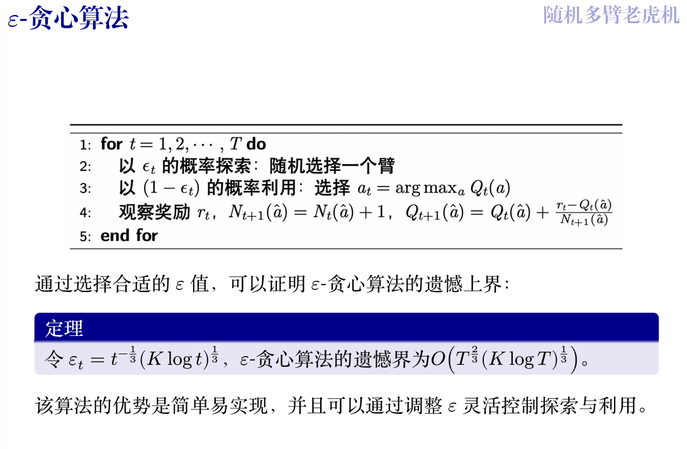{ width="500" }
        <figcaption>$\epsilon$-贪心算法</figcaption>
    </figure>

### 上置信界算法

<figure markdown="span">
    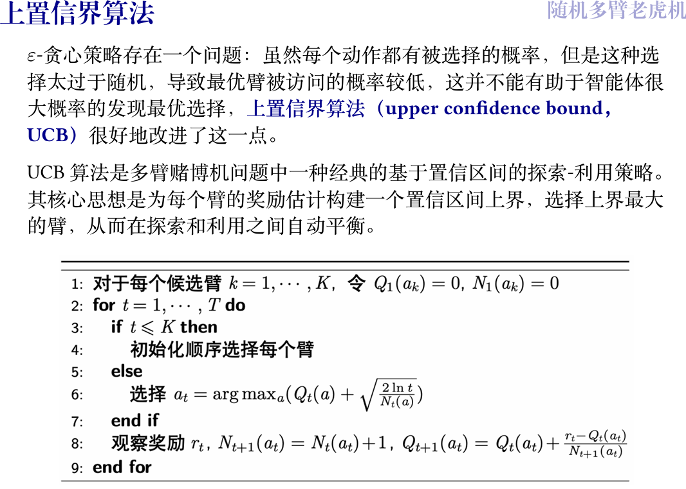
    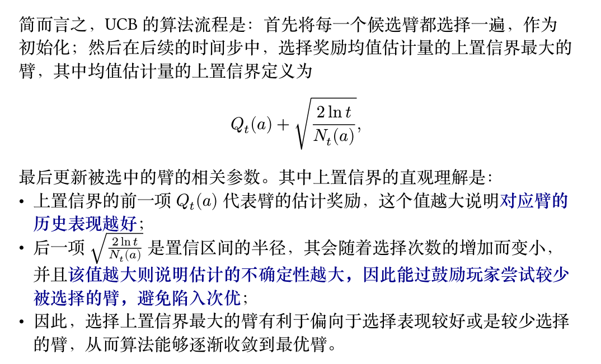
</figure>

UCB算法期望遗憾界为 $O\left(\sqrt{KT\log T}\right)$。

### 汤普森采样算法

汤普森采样采用贝叶斯方法来解决探索-利用困境。其核心思想是为每一个臂（选项）维护一个关于其奖励概率的"信念"，这个"信念"通过一个概率分布来表示。

在做决策时，算法并不是直接选择当前看起来最好的臂，而是**为每个臂的"信念"分布进行一次采样**，然后选择被采样出最高值的那个臂。

*   **探索** ：如果一个臂的"信念"分布很宽（意味着不确定性很高），那么它既有可能被采样出很高的值（从而被选中去探索），也有可能被采样出很低的值。

*   **利用** ：如果一个臂被选择了很多次，其"信念"分布会变得很窄，集中在其真实的奖励概率附近。如果这个概率很高，那么每次采样出的值都会很高，从而被稳定地利用。

在获得奖励后，算法会根据奖励结果更新被选择臂的"信念"分布，使其更接近真实情况。

具体而言，汤普森采样算法通常使用 **Beta 分布**来作为每个臂的奖励概率的信念分布。这在奖励为二元（成功/失败，即伯努利试验）的场景下尤其方便。

!!!info "算法流程"
    *   **Beta 分布**:
        *   我们使用 Beta 分布 $\text{Beta}(\alpha, \beta)$ 来为每个臂的成功概率建模。
        *   参数 $\alpha$ 和 $\beta$ 可以直观地理解为观测到的 **成功次数** 和 **失败次数** 。
    *   当 $\alpha$ 增大时，分布的质量会向 1 集中；当 $\beta$ 增大时，分布会向 0 集中。

    *   **算法流程**:
        1.  **初始化**: 为每个选项 $k$，初始化其成功次数 $S(a_k) = 0$ 和失败次数 $F(a_k) = 0$。
        2.  **循环**: 在每一轮 $t = 1, \dots, T$ 中：
            a. **采样**: 对每个臂 $k$，从其当前的信念分布 $\text{Beta}(S(a_k) + 1, F(a_k) + 1)$ 中采样一个随机值 $\theta_k$。
            b. **选择**: 选择本轮采样值 $\theta$ 最高的臂 $a_t = \underset{k}{\operatorname{argmax}}(\theta_k)$。
            c. **执行与更新**: 拉动臂 $a_t$，观察奖励 $r_t$。
            *   如果成功 ($r_t = 1$)，则更新该臂的成功计数：$S(a_t) \leftarrow S(a_t) + 1$。
            *   如果失败 ($r_t = 0$)，则更新该臂的失败计数：$F(a_t) \leftarrow F(a_t) + 1$。

    <figure markdown="span">
        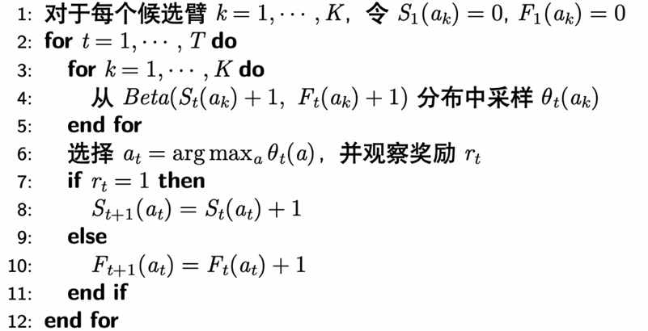{ width="500" }
    </figure>

    这个过程会不断重复，通过贝叶斯更新，每个臂的 Beta 分布会越来越准确地反映其真实的成功概率，从而使得算法能更快地收敛到最优臂。

!!!question
    <figure markdown="span">
        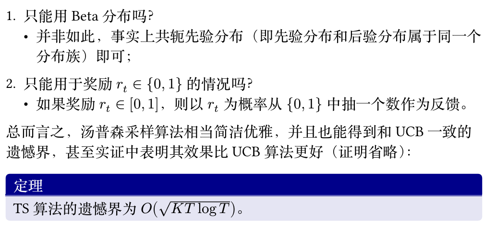{ width="500" }
    </figure>
    Beta分布经过更新$\alpha$和$\beta$后仍然是Beta分布。

## 对抗性多臂老虎机

!!!definition "对抗性多臂老虎机"
    对抗性多臂老虎机（Adversarial MAB）问题是多臂老虎机（MAB）问题的一种变体。
    与随机多臂老虎机问题不同，对抗性多臂老虎机中的奖励（或代价）是由对手动态生成的，而不是从固定的奖励分布中随机抽取的。对手可能会根据玩家的策略进行调整，从而形成对抗性。其基本模型如下：
    在每一步 $t=1,2,\dots,T$ 中：
    
    1. 玩家在行动集合 $[n]=\{1,\dots,n\}$ 上选择一个概率分布 $p_t$；
    - 对手在已知 $p_t$ 的情况下选择一个代价向量 $c_t\in[0,1]^n$，为每个行动分配一个代价；
    - 玩家根据概率分布 $p_t$ 选择一个行动 $i_t$，并观察到该行动的代价 $c_t(i_t)$；
    - 玩家学习整个代价向量 $c_t$，以调整未来的策略。

    注：
    
    1. 玩家的目标是选择一个策略序列 $p_1,p_2,\dots,p_T$，使得总代价最小化（相对于奖励最大化），即最小化期望代价 $\mathbb{E}_{i_t\sim p_t} \left[\sum_{t=1}^{T} c_t(i_t)\right]$。
    - 对手不一定真实存在，这只是一个最坏情况分析；
    - 在这种情况下，玩家不仅能学习到所选行动的代价，还能学习到所有行动的代价，因此这是一个全反馈的情境，与之前的情况不同。

    ???+ idea "通俗的解释"
        你面前有一排老虎机。每台机器的中奖概率是固定的，但你不知道具体是多少。你的任务是通过不断尝试，尽快找出哪台机器最好（中奖概率最高），然后一直玩那台。这就像是在和一个"诚实但守口如瓶"的赌场老板玩，规则是固定的，只是你不知道而已。
        现在，我们来看看对抗性多臂老虎机：
        这次，你面对的不再是固定的机器，而是一个"狡猾的"赌场老板。这个老板知道你心里在想什么。

        - 不再有固定的"最佳选择"：与之前不同，这里没有哪一台机器是永远最好的。老板会每一轮都重新设置所有机器的"代价"（你可以理解为玩一次要花的钱，或者奖励的反面）。
        - 对手知道你的策略：在你出手之前，你可能会想好一个策略，比如"我今天有70%的可能去玩1号机，30%的可能去玩2号机"。这个狡猾的老板能看穿你的策略。
        - 对手会针对你：老板看到你今天大概率要玩1号机，他就会立刻把1号机的代价调得非常高，让你付出惨重代价。同时，他可能会把你基本不考虑的那些机器的代价调得很低。
        - "事后诸葛亮"：在你玩完一把之后（比如你按计划玩了1号机，付出了高昂代价），老板会把所有机器这一轮的代价都告诉你。你会发现，果然你没选的那些机器代价都很低。这个"事后全盘信息"（在模型里叫 full feedback）是这个模型的一个关键特点，能帮助你调整下一轮的策略。

### 遗憾的定义

第一种遗憾定义的想法是，与所有轮次结束后（每一轮的成本都已知）的事后最优作差，然而下面的例子表明这一定义是不合理的

!!!example
    设行动集合为 $\{1,2\}$，在每一轮 $t$，对手按如下步骤选择代价向量：假设算法选择一个概率分布 $p_t$，如果在此分布下选择行动 1 的概率至少为 $\frac{1}{2}$，那么 $c_t = (1,0)$，反之 $c_t = (0,1)$。在此情况下，在线算法期望代价至少为 $\frac{T}{2}$，而在事先知晓代价向量的情况下，最优算法的期望代价为 0。 
    
    这一例子表明，与事后最优比较可能出现线性级别的遗憾，因此这一基准太强了。因此转而将遗憾定义为在线算法与最优固定行动事后代价之差。

!!!definition "遗憾的定义"
    固定代价向量 $c_1, c_2, \ldots, c_T$，决策序列 $p_1, p_2, \ldots, p_T$ 的遗憾为

    \[
    R_T = \mathbb{E}_{i_t \sim p_t} \left[ \sum_{t=1}^{T} c_t(i_t) \right] - \min_{i \in [n]} \sum_{t=1}^{T} c_t(i).
    \]

    即遗憾被定义为和每轮都选择同一行动的最优的固定行动的代价之差，这样的定义相对而言更加合理：
    
    - 在前面的例子中，固定策略序列（全选 0 或 1）的遗憾不再是简单的 0；
    - 平均遗憾：$\frac{R_T}{T}$。若 $T \to \infty$，$R_T = o(T)$，则称算法是无遗憾（no-regret）的，等价的即 $R_T$ 关于 $T$ 是次线性的；
    - 这一定义的合理在于，有自然的算法实现无遗憾，但无悔的实现也不是平凡的。

### 跟风算法

!!!definition "跟风算法"
    跟风算法指在每一个时间点$t$，选择最小累积代价
    
    \[
        \sum_{s=1}^{t-1} c_s(i)
    \]
    
    的行动$i$。

<figure markdown="span">
    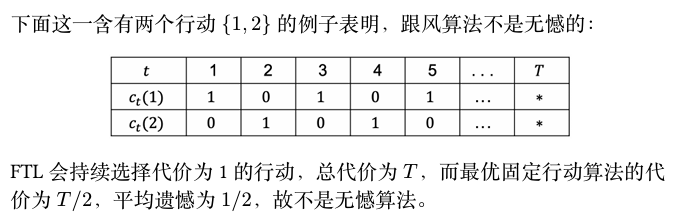{ width="500" }
    <figcaption>FTL算法不是无悔的</figcaption>
</figure>

!!!info "随机化是无悔的必要条件"
    若算法是无悔的，则策略是随机化的，只需要证明若策略是确定性的，则算法不是无悔的。

    对于确定性算法，对手可以直接推断出我们的行为，从而在每一步设置我们选择的行为代价为1，其它代价为0；

    这样，总代价为$T$，而最优固定行动的代价不会超过$\dfrac{T}{n}$，因此遗憾为$1-\dfrac{1}{n}$，不是无悔的。

    如果采用随机策略，则对手只能推断出我们的概率分布 $p_t$，而不能推断出我们的具体行动 $i_t \sim p_t$，因此对手无法完美利用我们的算法。

### MWU算法

!!!quote "引入"
    考虑一个简化的在线学习场景，每个行动的代价之可能为 0 或 1，并且存在一个完美的行动，其代价永远为 0（但玩家一开始不知道哪个是完美行动），是否存在次线性遗憾的算法？
    
    观察：只要一个行动出现了非零代价，那就可以永远排除它，但我们并不知道剩余行动中哪个最好；
    可以设计算法如下：对每一步 $t=1,2,\dots,T$，记录截至目前从没出现过代价 1 的行动，然后在这些行动中根据均匀分布随机选择一个行动。

    对于任意 $\epsilon \in (0, 1)$，下面两种情况之一一定会发生：

    - $S_{\text{good}}$ 中至少 $\epsilon k$ 个行动有代价 1，此时这一阶段的期望代价至多为 $\epsilon$(均匀分布，每个行动的概率为$\dfrac{1}{k}$，选中$\epsilon k$个行动的概率为$\epsilon$，因此期望代价为$\epsilon$)；
    - $S_{\text{good}}$ 中至多 $\epsilon k$ 个行动有代价 1，每次出现这一情况时，下一步就可以排除掉至少 $\epsilon k$ 个行动，因此这种情况最多出现 $\log_{1-\epsilon} \frac{1}{n}$ 次(每一次都只剩下$k(1-\epsilon)$个行动，因此最多出现$m$次,有$n(1-\epsilon)^m = 1$)。

    因此总的遗憾至多为(放缩后)

    \[
    R_T \leqslant T \times \epsilon + \log_{1-\epsilon} \frac{1}{n} = T \epsilon + \frac{\ln n}{-\ln(1-\epsilon)} \leqslant T \epsilon + \frac{\ln n}{\epsilon}
    \]

    最后的不等号导来源于 $-\ln(1-\epsilon) \geq \epsilon (0 < \epsilon < 1)$。显然当 $\epsilon = \sqrt{\frac{\ln n}{T}}$ 时，$R_T \leq 2\sqrt{T \ln n}$，即次线性遗憾。

<figure markdown="span">
    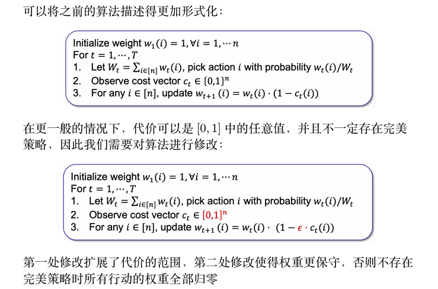{ width="500" }
    <figcaption>更一般的情况</figcaption>
</figure>

> 初始化权重为1，每次挑选之后，查看此次的代价向量$c_t$，如果$c_t(i) = 1$，则将$i$的权重变小，下一次根据权重随机挑选

上图中第二种算法就是乘性权重（Multiplicative Weights Update, MWU）算法。算法的直观是，根据每个行动在之前阶段的表现来决定下一阶段的权重，即表现好的行动权重增加，表现差的行动权重减少。

!!!Note
    乘性权重算法在之前的问题设定下的遗憾至多为 $O(\sqrt{T \ln n})$。

    ???proof
        <figure markdown="span">
            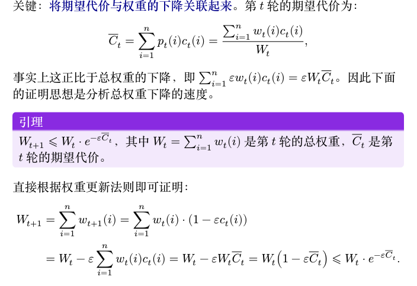
            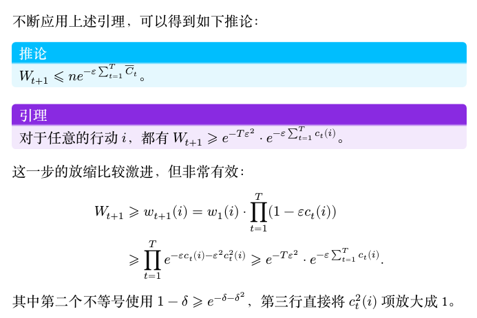
            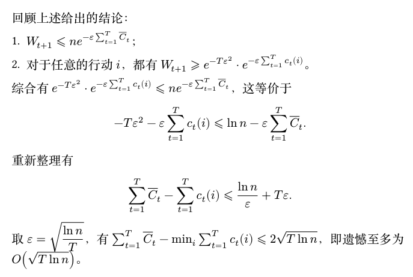
        </figure>

## 多臂老虎机应用
> 动态定价问题

!!!quote
    假设你要出售一份数据，你知道会有 $N$ 个人来购买你的数据，并且每个人对数据的估值 $v$ 都完全一致，都在 $[0,1]$ 中。买家是逐个到达的，你需要提供一个价格 $p$，如果 $v \geq p$，买家就会购买你的数据，否则买家会离开。你的目标是尽快地学习到 $v$ 的值，误差范围是 $\epsilon = \frac{1}{N}$。

    如果你确遇到了最坏的情况，$\log N$ 次搜索之后，可以设置到价格 $p \geq \bar{v} - \frac{2}{N}$，其中 $\bar{v}$ 是我们第 $\log N$ 轮学习到的值；
    
    在这种情况下，$N$ 轮之后的总收益是：
    
    \[
        \overbrace{0}^{\text{前 log N 轮}} + \overbrace{(N-\log N)(v - \frac{2}{N})}^{\text{后 N-log N 轮}} \approx vN - v\log N - 2.
    \]

    - 则二分搜索的遗憾为 $R \approx vN - (vN - v\log N - 2) = v\log N + 2$;
    - 这是最小的可能遗憾吗?
    
    !!!note "定理"
        存在一个改进的算法，使得其遗憾至多为 $1 + 2\log\log N$。

    - 尽管二分搜索是在没有任何先验信息的情况下能搜索到 $N$ 的最快算法, 但当猜测的 $p_i > v$ 时, 卖家一分钱也赚不到;
    - 也就是说, 二分搜索在向上探索的时候可能过于激进, 因此改进的算法需要在探索时更加保守

### 改进算法

<figure markdown="span">
    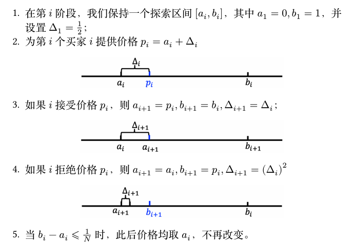{ width="500" }
    <figcaption>改进算法</figcaption>
</figure>

???+ proof "证明"
    首先需要分析区间长度 $b_i - a_i$ 的特点，有如下结论：

    !!!abstract "引理"
        $\Delta_i = 2^{-2^{j-1}}$，并且当 $\Delta_{i+1} = (\Delta_i)^2$ 时，$b_{i+1} - a_{i+1} = \Delta_i = \sqrt{\Delta_{i+1}}$。

    第一个结论根据数学归纳法可以证明：

    1.  当 $i=1$ 时，$\Delta_1 = \frac{1}{2} = 2^{-2^0}$；
    2.  假设对于 $i=k$ 成立，即 $\Delta_k = 2^{-2^{j-1}}$，则

    \[ 
        \Delta_{k+1} = (\Delta_k)^2 = (2^{-2^{j-1}})^2 = 2^{-2^{j-1} \cdot 2} = 2^{-2^j} 
    \]

    第二个结论，当 $\Delta_{i+1} = (\Delta_i)^2$ 时，根据算法直接得到 $b_{i+1} - a_{i+1} = \Delta_i = \sqrt{\Delta_{i+1}}$。

    ---

    -   在 $b_i - a_i \le \frac{1}{N}$ 后，总的遗憾最多为 $N \times \frac{1}{N} = 1$；
    -   因此重点在于分析达到这一步之前的遗憾；
    -   在达到这一步之前 $\Delta$ 更新了多少次？
        -   $\log \log N$：令 $2^{-2^i} = \frac{1}{N}$，则 $2^i = \log N$，则 $i = \log \log N$；
    -   接下来就要证明每个 $\Delta_i$ 内产生的遗憾是有限的。

    !!!abstract "引理"
        任意的步长 $\Delta_i$ 内的遗憾至多为 2。

    -   如果在 $\Delta_i$ 下直接被拒绝，遗憾至多为 1；
    -   如果发生出售，则最多出售 $\frac{\sqrt{\Delta_i}}{\Delta_i}$ 次，因为 $\Delta_{i-1} = \sqrt{\Delta_i}$，如果超出这个次数，那么 $\Delta_{i-1}$ 在前面的步骤不会更新；
    -   因此出售过程中的遗憾最多为
        
        \[
            \frac{\sqrt{\Delta_i}}{\Delta_i} \times \sqrt{\Delta_i} = 1.
        \]
    
    综合上述两个引理可以得到改进算法的遗憾为 $1 + 2\log\log N$。

