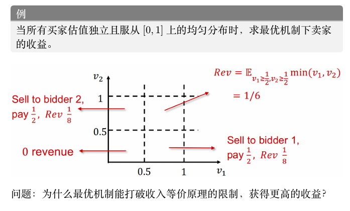

# 拍卖理论

## 虚拟福利最大化

!!!quote "基本模型"
    考虑单物品情况，即一个卖家有一个不可分割的物品待出售；

    - 与此前单物品拍卖讨论一致，有 n 个潜在买家（竞拍者）\( N = \{1, 2, \ldots, n\} \)；
    - 每个买家 i 对物品有一个心理价值，表示为私有信息：
    - 其连续分布概率密度 \( f_i: [a_i, b_i] \to \mathbb{R}^+ \) 是共同知识，且 \( f_i(t_i) > 0 \) 对所有 \( t_i \in [a_i, b_i] \) 成立；
    - 记 \( T \) 为所有参与者可能的估值组合，即
        
    \[
        T = [a_1, b_1] \times [a_2, b_2] \times \ldots \times [a_n, b_n]
    \]
    
    - 假定不同买家的估值分布是相互独立的（但不需同分布）；
    - 故在 \( T \) 上估值的联合密度函数记为 \( f(t) = \prod_{i=1}^n f_i(t_i) \)；
    - 按惯例记 \( f_{-i}(t_{-i}) = \prod_{j \in N, j \neq i} f_j(t_j) \)，即除 i 之外所有买家的估值联合密度；
    - 此外，为了讨论方便，卖家对物品的估值为 0 是共同知识。

### BIC 迈尔森引理

由于考虑的是贝叶斯纳什均衡，因此应当考虑其他参与人都如实报告自己估值的，即 \(b_{-i} = t_{-i}\) 时，估值为 \(t_i\) 的竞拍者 \(i\) 报告 \(t_i'\) 的期望效用，这与 DSIC 不同，DSIC只需要考虑自己的就足够了。

\[
U_i(t_i') = \int_{T_{-i}} (t_i \cdot x_i(t_i', t_{-i}) - p_i(t_i', t_{-i}))f_{-i}(t_{-i})dt_{-i}
\]

理解这一表达式：买家效用为他的估值 \(t_i\) 乘以物品分配概率 \(x_i(t_i', t_{-i})\)，减去支付 \(p_i(t_i', t_{-i})\)。然而买家不能确定其他买家真实估值，因此还需要根据先验分布对其他人的估值求期望。因此 BIC 的条件就是 \(U_i(t_i) \geq U_i(t_i')\) 对所有 \(i \in N\) 和 \(t_i' \in [a_i, b_i]\) 成立。

然而这一 \(U_i\) 的表达式的确看起来非常不友好，因此会试图简化。定义

\[
Q_i(t_i') = \int_{T_{-i}} x_i(t_i', t_{-i})f_{-i}(t_{-i})dt_{-i}
\]

则 \(Q_i(t_i')\) 的含义为，当其他买家诚实报价，买家 \(i\) 报价 \(t_i'\) 时，他获得物品的概率。定义

\[
M_i(t_i') = \int_{T_{-i}} p_i(t_i', t_{-i})f_{-i}(t_{-i})dt_{-i}
\]

则 \(M_i(t_i)\) 的含义为，当其他买家诚实报价，买家 \(i\) 报价 \(t_i'\) 时，他的期望支付。因此，\(U_i(t_i')\) 可以简化为

\[
U_i(t_i') = t_i Q_i(t_i') - M_i(t_i')
\]

这就与 DSIC 情况下的 \(u_i(t_i') = t_i \cdot x_i(t_i') - p_i(t_i')\) 形式上一致了，只是获得物品的概率和支付都求了期望，并且假定了其他买家如实报价。

因此仿照 DSIC 迈尔森引理可以给出 BIC 版本的迈尔森引理，并且证明过程完全类似，因此不再赘述，除了需要注意积分下界因为显示机制要求报价集合为 \(T_i = [a_i, b_i]\) 而变为了 \(a_i\)：

!!!tip "BIC 迈尔森引理"
    一个拍卖机制是 BIC（即贝叶斯激励相容）的，当且仅当其分配规则和支付规则 \((x, p)\) 满足：
    
    - \(Q_i(t_i)\) 是单调不减函数；
    - 对任意的 \(i \in N\) 和 \(b \in [a_i, b_i]\)，有
    
    \[
    M_i(b) = M_i(a_i) + bQ_i(b) - \int_{a_i}^b Q_i(s)ds
    \]

    

由此得到了 BIC 的充要条件。然而现在还不能转入最大化卖家收益的讨论。因为仅满足 BIC 的机制是不够合理（feasible）的。合理的机制除了满足 BIC 外，还应当满足如下两个条件：

- **第一个条件是分配规范性**。因为只有一个物品在分配，故对于所有 \(t \in T\)，有

\[
\sum_{i=1}^n x_i(t) \leq 1,
\]

并且 \(x_i(t) \geq 0\) 对所有 \(i \in N\) 和 \(t \in T\) 成立；

- **第二个条件是**，对所有 \(i \in N\) 和 \(t_i \in [a_i, b_i]\)，有 \(U_i(t_i) \geq 0\)，即需要满足（事中阶段的）个人理性，否则竞拍者在得知自己的类型后会选择退出拍卖。

下面的定理给出了在 BIC 的基础上满足个人理性的充要条件：

!!!warning "定理"
    一个 BIC 的拍卖机制是 IR（个人理性）的，当且仅当对于每个 \(i \in N\) 都满足 \(M_i(a_i) \leq 0\)。

即要求当竞拍者估值为最低值时的期望支付小于等于 0。

!!!proof "证明"
    根据 BIC 的条件，不难写出

    \[
    U_i(t_i) = t_i Q_i(t_i) - M_i(t_i) = \int_{a_i}^{t_i} Q_i(s)ds - M_i(a_i).
    \]

    个人理性要求对任意的 \(t_i \in [a_i, b_i]\)，都有 \(U_i(t_i) \geq 0\)。因为等式右侧当 \(t_i = a_i\) 时取最小值 \(-M_i(a_i)\)，故个人理性成立当且仅当 \(M_i(a_i) \leq 0\)。

    
## 转化为虚拟福利最大化问题

首先当所有买家如实报告自己的类型时，投标结果为 \(t = (t_1, \ldots, t_n)\)。卖家期望收入是（注意卖家对物品估值为 0，故只有卖出才能产生收益）

\[
U_0 = \int_T \left(\sum_{i=1}^n p_i(t)\right) f(t)dt
\]

下面这一引理给出了最大化卖家收入 \(U_0\) 的合理的最优机制的一个简洁明了的条件：

!!!tip "引理"
    假设分配规则 \(x\) 最大化
    
    \[
    \int_T \left(\sum_{i=1}^n \left(t_i - \frac{1-F_i(t_i)}{f_i(t_i)}\right) x_i(t)\right) f(t)dt,
    \]
    
    支付规则 \(p\) 使得 \(M_i(a_i) = 0\) 对所有 \(i \in N\) 成立，且 \((x, p)\) 满足 BIC、分配规范性和 IR，则 \((x, p)\) 是合理的最优机制。

引理的具体证明因为技术性较强不展开描述，下面描述大致步骤：

1. **根据 BIC 迈尔森引理和展开 \(U_0\) 的表达式**。然后利用分部变换技巧得到

\[
U_0 = \int_T \left(\sum_{i=1}^n \left(t_i - \frac{1-F_i(t_i)}{f_i(t_i)}\right) x_i(t)\right) f(t)dt + \sum_{i=1}^n M_i(a_i);
\]

2. **从而目标转化为在满足 BIC、分配规范性和 IR 的情况下最大化上式**。其中号前的部分只与分配规则 \(x\) 有关，加号后的部分展开后只与支付规则 \(p\) 有关，因此可以分别考虑这两个部分：

   - 对于加号前的部分，目标就是找到分配机制 \(x\) 使其最大化；
   - 对于加号后的部分，根据个人理性等价条件有 \(M_i(a_i) \leq 0\)，因此要最大化 \(U_0\) 就要选择支付规则 \(p\) 使得 \(M_i(a_i) = 0\) 对所有 \(i \in N\) 成立。

由此，这一引理的结论得证。

有了这一引理，接下来的任务就是找到一个分配机制 \(x\) 使得

\[
\int_T \left(\sum_{i=1}^n \left(t_i - \frac{1-F_i(t_i)}{f_i(t_i)}\right) x_i(t)\right) f(t)dt
\]

最大化。而支付规则在 \(x\) 确定后直接根据迈尔森引理以及 \(M_i(a_i) = 0\) 的条件确定即可。

令

\[
c_i(t_i) = t_i - \frac{1-F_i(t_i)}{f_i(t_i)},
\]

称其为竞拍者 \(i\) 的 **虚拟估值** （virtual valuation），则目标就是找到一个分配机制 \(x\) 使得

\[
\int_T \left(\sum_{i=1}^n c_i(t_i)x_i(t)\right) f(t)dt
\]

最大化。

如果对任意的 \(t\)，都能找到一个 \(x\) 使得

\[
\sum_{i=1}^n c_i(t_i)x_i(t)
\]

最大化，自然也能满足最大化要求。

- 因此，目标进一步转化为找到一个分配机制 \(x\) 使得对任意的 \(t\)，都能找到一个 \(x\) 使得 \(\sum_{i=1}^n c_i(t_i)x_i(t)\) 最大化；

- 如果 \(c_i(t_i)\) 是竞拍者 \(i\) 的真实估值，那么最大化 \(\sum_{i=1}^n c_i(t_i)x_i(t)\) 就是最大化竞拍者福利，然而 \(c_i(t_i)\) 并不是真实估值，只是虚拟估值，因此这一问题称为 **虚拟福利最大化问题** 。

!!!summary "虚拟福利最大化"
    
    1. **利用显示原理将机制设计空间限制在直接显示机制**，因此只需要设计竞拍者如实报告估值的机制，因此卖家收益最大化问题可以写为如下数学规划问题：
    
    \[
    \begin{align}
    \max_{x,p} \quad & U_0 = \int_T \left(\sum_{i=1}^n p_i(t)\right) f(t)dt \\
    \text{s.t.} \quad & (x,p) \text{ 满足 BIC}, \\
    & (x,p) \text{ 满足个人理性}, \\
    & \sum_{i=1}^n x_i(t) \leq 1.
    \end{align}
    \]
    
    2. **利用 BIC 迈尔森引理将 BIC 转化为两个等价条件**，其一是期望分配概率 \(Q_i\) 的单调性，其二是期望支付 \(M_i\) 可由 \(Q_i\) 和 \(M_i(a_i)\) 唯一表达；
    
    3. **将个人理性条件转化为等价条件** \(M_i(a_i) \leq 0\)；
    
    4. **将目标函数利用积分变换等将目标问题转化为虚拟福利最大化问题**。

### 最优机制

下面的任务是确定最优的分配机制 \(x\) 使得虚拟福利最大化。事实上不难看出如何做到这一点：

- 因为最大化目标函数是 \(\sum_{i=1}^n c_i(t_i)x_i(t)\)，且要求 \(\sum_{i=1}^n x_i(t) \leq 1\)，故而实际上要最大化的就是 \(c_i(t_i)\) 的一个加权平均，其中权重不大于 1；

- 显然只需要给 \(c_i(t_i)\) 最大的一项或多项赋予为 1 的权重即可，并且这一最大值必须大于等于 0，否则不如全部权重都为 0 的情况。即只允许同时满足

    - 最大化 \(c_i(t_i) = t_i - \frac{1-F_i(t_i)}{f_i(t_i)}\)
    - \(c_i(t_i) \geq 0\)

两个条件的参与人 \(i\) 有获得物品的概率，并且如果有这样的参与人，他们获得物品的概率和为 1。换一种说法，即

\[
p_i(t) > 0 \Rightarrow c_i(t_i) = \max_{j \in N} c_j(t_j) \geq 0.
\]

然而时刻要记住，我们设计的机制必须是合理的，即满足 BIC、分配规范性和 IR：

- **显然上述解已经满足了分配规范性**，IR 与分配机制的选择无关，因此只需要考虑 BIC；

- **根据 BIC 迈尔森引理**，其中第二条与支付机制的选择有关，因此只需要检验第一条 \(Q_i(t_i)\) 单调不减是否满足；

- **这一条件并非一定成立**。例如当 \(c_i\) 为递减函数时，反而最低的估值会获得物品；

- 因此引入一个充分条件（称为正则化条件）来保证这一要求的成立：

!!!tip "正则化条件"
    称这一问题符合正则化条件，如果对于任意的 \(i \in N\)，都有 \(c_i(t_i)\) 关于 \(t_i\) 是单调递增的：

    - 这显然是 \(Q_i\) 关于 \(t_i\) 单调递增的充分条件，因为如果 \(c_i(t_i)\) 关于 \(t_i\) 单调递增，那么根据之前 \(x_i\) 的选择，当参与人 \(i\) 提高报价时，他得到物品的概率不会降低，从而 \(Q_i\) 关于 \(t_i\) 单调递增也成立；
    
    **因此当满足正则化条件时，上面给出的解的确是合理的最优机制**。

现在继续考虑正则化条件满足的情况。已有正则化条件下的最优机制的分配规则 \(x\)，接下来需要确定支付规则 \(p\)。不难理解分配规则仍然是一个阶梯函数，令

\[
z_i(t_{-i}) = \inf\{s_i \mid c_i(s_i) \geq 0 \text{ 且 } c_i(s_i) \geq c_j(t_j), \forall j \neq i\}
\]

即 \(z_i(t_{-i})\) 是使得参与人 \(i\) 刚好能有机会获得物品的最低报价，也就是所谓阶梯函数的间断点。那么根据支付公式

\[
p_i(b, t_{-i}) = b \cdot x_i(b, t_{-i}) - \int_{a_i}^b x_i(s, t_{-i})ds
\]

可以解出分配规则对应的支付规则 \(p\) 为

\[
p_i(t) = \begin{cases}
z_i(t_{-i}) x_i(t), & c_i(z_i(t_{-i})) \geq t_0 \text{ 且 } c_i(z_i(t_{-i})) \geq c_j(t_j), \forall j \neq i \\
0, & \text{其他情况}
\end{cases}
\]

更简单的，如果只有一个满足 \(c_i(z_i(t_{-i})) \geq t_0\) 和 \(c_i(z_i(t_{-i})) \geq c_j(t_j), \forall j \neq i\) 的 \(i\)，则 \(x_i(t) = 1\)，且

\[
p_i(t) = \begin{cases}
z_i(t_{-i}), & x_i(t) = 1 \\
0, & x_i(t) = 0.
\end{cases}
\]

!!!example 
    
    考虑一种最简单的情况来具象化前面给出的结论。考虑一个所有买家估值独立同分布的情形（即对称模型），并且符合正则化条件，得到
    
    \[
    z_i(t_{-i}) = \max\left\{c^{-1}(t_0), \max_{j \neq i} t_j\right\}.
    \]
    
    - 结合前面得到的 \((x,p)\)，此时的最优机制其实就是一个 **含保留价格的二价拍卖机制**；
    
    - 在对称情况下所有买家估值同分布情形下，卖家对每位买家的虚拟估值函数相同，故具有最高估值（即最高报价）的赢得物品，并且支付第二高报价和保留价格之间的较高者，并且如果最高报价低于保留价格，则不分配物品。
    
    **更具体而言**，当所有买家估值独立且取从 \([0,1]\) 上的均匀分布时，虚拟估值函数为 \(c_i(t_i) = 2t_i - 1\)。因此保留价格为 \(1/2\)。此时的最优机制就是 **保留价格为 \(1/2\) 的第二价格拍卖**。

    <figure markdown>
    
    </figure>

!!!summary
    - 满足正则化条件，分配给虚拟估值最高的买家，且估值不小于0；
    - 如果卖出，支付为第二高报价和保留价格之间的较高者；
    

    尽管最优机制可以使得卖家获得最大的期望效用，但是这一机制存在一些天然的缺陷：
    
    1. **卖家很难准确估计每一个买家的估值分布**，因此这一机制很难完美实现，特别是应用于数据拍卖场景时，数据买家的估值不确定性更大，因此之后会讨论在无先验分布下的机制设计；
    
    2. **非对称模型（即买家的估值不同分布）下，报价最高的买家可能并不是最有可能获得物品的买家**。这一点显然，因为不同的分布下虚拟估值会有所不同(收入等价原理为报价高的买家获得物品，所以不一定满足收入等价原理)：
    
        - 若 \(f_i(t_i) = \frac{1}{b_i-a_i}\)，即买家的估值均匀分布，不难计算得到 \(c_i(t_i) = 2t_i - b_i\)。这关于 \(t_i\) 是单调递增的，因此符合正则化条件；
        
        - 但是此时的最优机制是选出 \(2t_i - b_i\) 最大的 \(i\)，如果 \(b_i < b_j\)，那么可能存在 \(t_i < t_j\) 但是 \(2t_i - b_i > 2t_j - b_j\) 的情况，即报价更低的买家可能获得物品；
    
    3. **最优机制不是事后有效率的**。例如我们考虑对称模型下，卖家估值等于 0 且买家估值都大于 0 的情况，此时显然物品要售出才是帕累托最大化（也是俗称的最优事后有效率）的，但是如果所有买家的报价都低于 \(c_i^{-1}(0)\)，那么物品就不会被售出，这显然不是事后有效率的。

