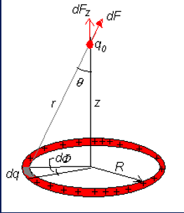
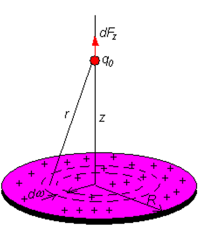

# 普通物理学二(H)
> 授课:方明虎

## Electric Charge and Coulomb's Law(电荷和库仑定律)

**A ring of charge**

对于一个均匀带电的圆环，距离其中心 $z$ 的带电量为 $q_0$ 所受的沿 $Z$ 方向的力 $F_z$ 

???info "figure"
    

先计算电荷密度

\[
\lambda = \frac{q}{2 \pi R}
\]

\[
dF = \frac{1}{4 \pi \epsilon_0} \frac{q_0 dq}{r^2} = \frac{1}{4 \pi \epsilon_0} \frac{q_0 \lambda Rd\phi}{(z^2 + R^2)}
\]

\[
F_z = \int dF_z = \int dF \cos \theta = \int \frac{q_0 \lambda Rd\phi}{4 \pi \epsilon_0 (z^2 + R^2)} \frac{z}{\sqrt{z^2 + R^2}}
\]

\[
= \frac{1}{4 \pi \epsilon_0} \int_0^{2\pi} \frac{q_0 \lambda Rz}{(z^2 + R^2)^{3/2}} d\phi
\]

\[
= \frac{1}{4 \pi \epsilon_0} \cdot \frac{q_0 q z}{(z^2 + R^2)^{3/2}} \bigg|_0^{2\pi}
\]

\[
= \frac{1}{4 \pi \epsilon_0} \cdot \frac{q_0 q z}{(z^2 + R^2)^{3/2}}
\]

!!!Note
    当 $z$ 非常大,原式子就退化成了两个点电荷之间的相互作用
    
    \[
      z \to +\infty, F_z \to \frac{1}{4 \pi \epsilon_0} \dfrac{q_0q}{z^2}
    \]

**A disk of charge**

如果是一个圆盘，$F_z$ 可以用圆环来逼近

???info "figure"
    

\[
\sigma = \frac{q}{\pi R^2}
\]

\[
dq = \sigma dA = \sigma(2 \pi \omega d\omega) = 2 \pi \sigma \omega d\omega
\]

\[
dF_z = \frac{1}{4 \pi \epsilon_0} \frac{q_0 (2 \pi \sigma \omega d\omega) z}{(z^2 + \omega^2)^{3/2}}
\]

\[
F_z = \frac{1}{4 \pi \epsilon_0} q_0 2 \pi \sigma z \int_0^{R} \frac{\omega d\omega}{(z^2 + \omega^2)^{3/2}}
\]

\[
= \frac{1}{4 \pi \epsilon_0} \cdot \frac{2 q_0 q}{R^2} \left( 1 - \frac{z}{\sqrt{z^2 + R^2}} \right)
\]

当 $z$ 非常大,原式子就退化成了两个点电荷之间的相互作用(用Taylor展开分析)

$$ z \to +\infty, F_z \to \frac{1}{4 \pi \epsilon_0} \dfrac{q_0q}{z^2} $$

\[
  \left( 1 - \frac{z}{\sqrt{z^2 + R^2}} \right) \to \left( 1- (1+\frac{R^{2}}{z^{2}})^{-\frac{1}{2}} \right) = \frac{R^{2}}{2z^{2}}
\]

`