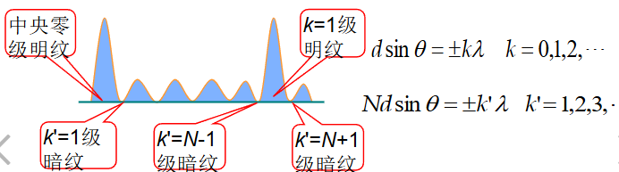
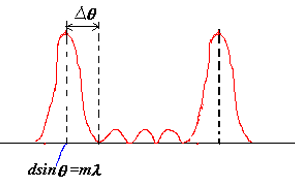
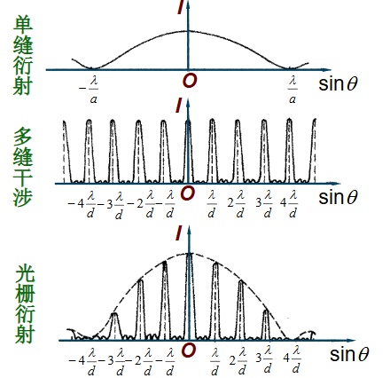
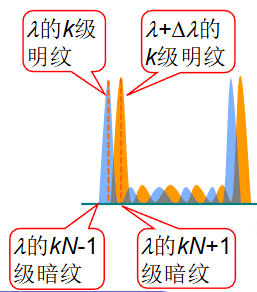
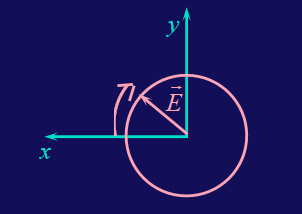
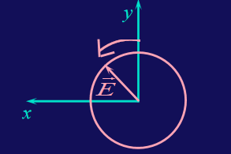
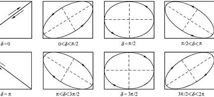
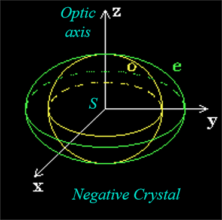
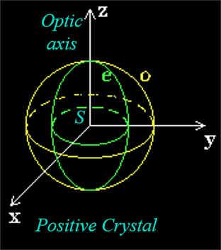
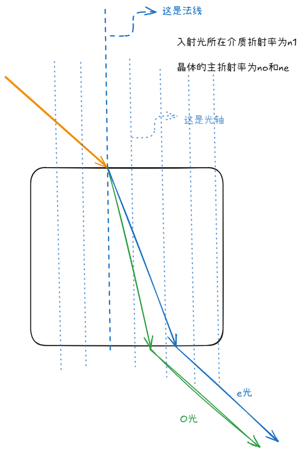

# 光学

## 可见光

在电磁波中，可见光只占了很小一部分

!!!property
    - 可见光波长范围：$400nm-700nm$
    - 可见光频率范围：$4.3\times10^{14}Hz-7.5\times10^{14}Hz$
    - 可见光波长与频率的关系：$\lambda f=c$
    - 人眼最敏感的波长$550nm$左右为黄绿光
    - 波长越长，频率越低，能量越低,所以红光能量最低，紫光能量最高
    - 

### 波的多普勒效应

\[
f'=\dfrac{v\pm v_0}{v\pm v_s}f
\]

其中，$v$为波在介质中的传播速度，波源速度为$v_s$，接收者速度为$v_0$，$f$为波的频率

对于光波，有红移和蓝移

- 红移：波源远离接收者，波长变长，频率变小，光谱向红色移动

\[
    f=f_0 \sqrt{\dfrac{1-\frac{u}{c}}{1+\frac{u}{c}}}
\]

- 蓝移：波源靠近接收者，波长变短，频率变大，光谱向蓝色移动
  
\[
    f=f_0 \sqrt{\dfrac{1+\frac{u}{c}}{1-\frac{u}{c}}}
\]

!!!key-point 
    通式为
    
    \[
        f = f_0 \dfrac{\sqrt{1-\frac{u^2}{c^2}}}{1-\frac{u}{c}\cos \theta}
    \]

    其中$\theta$为速度与光波运动的夹角

## 几何光学

### 全反射

全反射是光波在传播过程中发生的一种物理现象。当光从光密介质（如玻璃或水）进入光疏介质（如空气）时，如果入射角大于某个临界角（称为临界角），光就不会发生折射，而是全部被反射回光密介质，这种现象称为全反射

例如，在玻璃中，$n=1.5$，在空气中，$n_0=1$;又有

\[
   \dfrac{\sin \theta_2}{\sin \theta_1}=\dfrac{n_1}{n_2}
\]

临界角为$\theta_2 = 90^\circ$，所以此时

\[
    \sin \theta_c = \dfrac{n_2}{n_1}
\]

如果入射角大于临界角，光就会发生全反射，被束缚在光密介质中,在这个例子中，临界角为$\theta_c = \arcsin \dfrac{1}{1.5} = 41.8^\circ$

!!!Note
    求折射率,可以通过以下公式求解
    
    \[
        n = \dfrac{\sin \theta_1}{\sin \theta_2}
    \]

    其中$\theta_1$为空气中入射角，$\theta_2$为折射角

### 色散

**色散现象**是指当白光或复色光通过介质（如棱镜、光栅）时，不同波长的光由于折射率不同而发生不同程度的偏折，从而使光被分解成各种单色光的现象。它是光的波动特性的一种表现，主要由介质的**折射率随波长的变化**引起。

\[
n = \frac{c}{v}
\]

由于 \( v \) 与波长 \( \lambda \) 相关，介质对不同波长的光折射率不同，导致折射角不同。通常情况下：

- 短波长光（如紫光）折射率较大，偏折角较大。
- 长波长光（如红光）折射率较小，偏折角较小。

这种波长依赖性导致了色散。

### 惠更斯原理

!!!Summary "定理内容"
    波前上的每一个点都可以看作是新的球面波（次波）源，这些次波相干叠加后形成了波的传播方向和波前。

!!!Example "惠更斯原理证明光的反射与折射"
    

    
    

    **反射**

    证明三角形全等，运用等角互余

    $$
    A_1 C_1 = A_n B_n = v_1 t_n
    $$

    $$
    \Delta A_1 C_1 B_n \cong \Delta B_n A_n A_1
    $$

    $$
    \therefore \angle A_n A_1 B_n = \angle C_1 B_n A_1
    $$

    $$
    \Rightarrow i_1' = i_1 
    $$

    **折射**

    \[
    \angle D_1B_nA_1 = i_2
    \]

    \[
    \sin i_2 = \frac{A_1D_1}{A_1B_n}
    \]

    \[
    \sin i_1 = \frac{A_nB_n}{A_1B_n}
    \]

    \[
    \therefore \frac{\sin i_1}{\sin i_2} = \frac{A_nB_n}{A_1D_1} = \frac{v_1 t}{v_2 t} = \frac{v_1}{v_2}
    \]

    再运用

    \[
        v=\dfrac{c}{n}
    \]

    带入即可

### 费马原理

光程定义为

\[
    L = n_1 s_1 + n_2 s_2
\]

其中$n_1$和$n_2$分别为两个介质的折射率，$s_1$和$s_2$分别为两个介质中光线的实际路径长度

积分形式为

\[
    L = \int n ds
\]

费马原理是指光线在传播过程中，若可以成像，则光程的变分为零(对某一个变量求偏导为零)

即

\[
    \delta \int n ds = 0
\]

!!!Example "费马原理证明反射和折射"
    

    
    

    \[
    L = \sqrt{a^2 + x^2} + \sqrt{b^2 + (d - x)^2}
    \]

    \[
    \frac{dL}{dx} = \frac{1}{2} \cdot \frac{2x}{\sqrt{a^2 + x^2}} - \frac{1}{2} \cdot \frac{2(d - x)}{\sqrt{b^2 + (d - x)^2}} = 0
    \]

    \[
    \frac{x}{\sqrt{a^2 + x^2}} = \frac{(d - x)}{\sqrt{b^2 + (d - x)^2}}
    \]

    \[
    \sin \theta_1 = \sin \theta_1' \quad \theta_1 = \theta_1'
    \]

    

    
    

    $$
    L = n_1 \sqrt{a^2 + x^2} + n_2 \sqrt{b^2 + (d - x)^2}
    $$

    $$
    \frac{dL}{dx} = \frac{1}{2} n_1 \frac{2x}{\sqrt{a^2 + x^2}} - \frac{1}{2} n_2 \frac{2(d - x)}{\sqrt{b^2 + (d - x)^2}} = 0
    $$

    $$
    n_1 \frac{x}{\sqrt{a^2 + x^2}} = n_2 \frac{(d - x)}{\sqrt{b^2 + (d - x)^2}}, \quad n_1 \sin \theta_1 = n_2 \sin \theta_2
    $$

## 成像(Image Formation)

成像的基本原则是等光程

左边称为物方，右边称为像方

### 球面镜成像

C为球心;r为球半径;

首先，使用正弦定理

\[
\begin{cases}
\dfrac{p}{\sin \phi} = \dfrac{o + r}{\sin \theta} = \dfrac{r}{\sin u} \\
\dfrac{p'}{\sin \phi} = \dfrac{i - r}{\sin \theta'} = \dfrac{r}{\sin u'}
\end{cases}
\]

\[
\begin{align*}
n \sin \theta &= n' \sin \theta' \\
\theta - u &= \theta' + u' = \phi
\end{align*}
\]

\[
\begin{cases}
\dfrac{p}{o + r} = \dfrac{\sin \phi}{\sin \theta} \\
\dfrac{p'}{i - r} = \dfrac{\sin \phi}{\sin \theta'}
\end{cases}
\]

\[
\therefore \frac{p}{n(o + r)} = \frac{p'}{n'(i - r)}
\]

使用余弦定理

\[
\begin{cases}
p^2 = (o + r)^2 + r^2 - 2r(o + r) \cos \phi = o^2 + 4r(o + r) \sin^2 \frac{\phi}{2} \\
p'^2 = (i - r)^2 + r^2 + 2r(i - r) \cos \phi = i^2 - 4r(i - r) \sin^2 \frac{\phi}{2}
\end{cases}
\]

\[
\cos \phi = 1 - 2 \sin^2 \frac{\phi}{2}
\]

\[
\Rightarrow \frac{o^2}{n^2(o + r)^2} - \frac{i^2}{n'^2(i - r)^2} = -4r \sin^2 \frac{\phi}{2} \left[ \frac{1}{n^2(o + r)} + \frac{1}{n'^2(i - r)} \right]
\]

不同的$\phi$对应不同的成像位置,球面不能成像；

唯一可能的位置为两边为0；

\[
\begin{cases}
\dfrac{o^2}{n^2(o + r)^2} - \dfrac{i^2}{n'^2(i - r)^2} = 0 \\
\dfrac{1}{n^2(o + r)} + \dfrac{1}{n'^2(i - r)} = 0
\end{cases}
\]

或者使用旁轴近似,即$\phi$很小,右边为0；

\[
\frac{o^2}{n^2(o + r)^2} = \frac{i^2}{n'^2(i - r)^2}
\]

\[
\frac{n(o + r)}{o} = \frac{n'(i - r)}{i}
\]

{==

\[
\frac{n'}{i} + \frac{n}{o} = \frac{n' - n}{r}
\]

==}

又有

\[
\begin{cases}
i \to \infty, \quad o = f = \dfrac{n}{n' - n} r \\
o \to \infty, \quad i = f' = \dfrac{n'}{n' - n} r
\end{cases}
\]

\[
\dfrac{f}{f'} = \dfrac{n}{n'}, \quad \dfrac{f}{o} + \dfrac{f'}{i} = 1
\]

!!!Note "符号的约定"
    - $o$,实为+，虚为-(Q，在左为+，右为-)
    - $i$,实为+，虚为-(Q'，在左为-，右为+)
    - $r$,凸为+，凹为-(C,在左为-，右为+)
    
    

    
    

    

    
    

### 球面镜反射

\[
n \sin \theta = n' \sin \theta' \quad \text{if } \theta > 0, \text{ then } \theta' < 0
\]

\[
n = -n'
\]

\[
f = \frac{n}{n' - n} r = -\frac{r}{2}
\]

\[
f' = \frac{n'}{n' - n} r = \frac{1}{2} r
\]

带入折射公式

\[
\Rightarrow \frac{1}{o} + \frac{1}{i} = -\frac{2}{r}
\]

如果是平面镜，那么$r \to \infty$，成虚像；

### 放大倍数

首先，由旁轴近似

\[
    n \sin \theta = n' \sin \theta' \Rightarrow  n \theta = n' \theta'
\]

$y'<0$

\[
y \approx o \cdot \theta, \, -y' = i \cdot \theta'
\]

\[
\therefore m = \frac{y'}{y} = -\frac{i\theta'}{o\theta} = -\frac{n \cdot i}{n' \cdot o}
\]

如果$n=n'$，则$m=-\dfrac{i}{o}$ 负号表示倒像

### 薄透镜成像

首先，对于$n$和$n_L$,$n_L$和$n'$，分别使用球面镜成像公式

\[
\begin{cases} 
\frac{f_1'}{i_1} + \frac{f_1}{o_1} = 1 \tag{1} \\ 
\frac{f_2'}{i_2} + \frac{f_2}{o_2} = 1 \tag{2}
\end{cases}
\]

其中

\[
\begin{aligned}
f_1 &= \frac{n}{n_L - n} r_1, \quad f_1' = \frac{n_L}{n_L - n} r_1 \\
f_2 &= \frac{n_L}{n' - n_L} r_2, \quad f_2' = \frac{n'}{n' - n_L} r_2
\end{aligned}
\]

$o_2$是Q经过第一个球面镜的虚像像距,所以

\[
-o_2 = i_1 - d, \quad o_2 = d - i_1
\]

对于(1)式两边同时乘以$f_2$，对于(2)式两边同时乘以$f_1'$

\[
\begin{cases} 
\frac{f_1' f_2}{i_1} + \frac{f_1 f_2}{o_1} = f_2 \\ 
\frac{f_1' f_2'}{i_2} + \frac{f_1' f_2}{-i_1} = f_1'
\end{cases}
\]

相加

\[
\frac{f_1' f_2'}{i_2} + \frac{f_1 f_2}{o_1} = f_1' + f_2
\]

\[
\frac{f_1' f_2'}{i} + \frac{f_1 f_2}{o} = f_1' + f_2
\]

除过去,得到

\[
\frac{f'}{i} + \frac{f}{o} = 1
\]

其中，令

\[
    f' = \frac{f_1' f_2'}{f_1' + f_2}
\]

\[
    f = \frac{f_1 f_2}{f_1 + f_2}
\]

####  磨镜者公式(Lens Maker's Equation)

\[
f' = \frac{f_1' f_2'}{f_1' + f_2} = \frac{\frac{n_L}{n_L - n} \cdot \frac{n'}{n' - n_L} r_1 r_2}{\frac{n_L}{n_L - n} r_1 + \frac{n'}{n' - n_L} r_2} = \frac{n'}{\frac{n_L - n}{r_1} + \frac{n' - n_L}{r_2}}
\]

\[
f = \frac{f_1 f_2}{f_1 + f_2} = \frac{\frac{n}{n_L - n} \cdot \frac{n_L}{n' - n_L} r_1 r_2}{\frac{n}{n_L - n} r_1 + \frac{n_L}{n' - n_L} r_2} = \frac{n}{\frac{n_L - n}{r_1} + \frac{n' - n_L}{r_2}}
\]

所以

\[
    \dfrac{f'}{f} = \dfrac{n'}{n}
\]

如果$n=n'=1$，则$f' = f$

\[
f = f' = \frac{1}{(n_L - 1) \left( \frac{1}{r_1} - \frac{1}{r_2} \right)}
\]

如果$f'和f$都为正，则透镜为凸透镜，反之$f，f'$为负，则透镜为凹透镜

#### 符号约定

- 如果 $Q$ 在 $F$ 点的左侧，$x > 0$
- 如果 $Q$ 在 $F$ 点的右侧，$x < 0$
- 如果 $Q'$ 在 $F'$ 点的左侧，$x' < 0$
- 如果 $Q'$ 在 $F'$ 点的右侧，$x' > 0$

\[
o = f + x
\]

\[
i = f' + x'
\]

\[
\frac{1}{f + x} + \frac{1}{f' + x'} = \frac{1}{f}
\]

可以化简为

\[
xx' = ff'
\]

#### 横向放大倍数与屈光度

对于单个镜面，放大倍数为

\[
m_1 = -\dfrac{ni_1}{n_L o_1}, \quad m_2 = -\dfrac{n i_2}{n' o_2}
\]

其中$o_2$是Q经过第一个球面镜的虚像像距,是负的；

\[
m = m_1 m_2 = \dfrac{n i_1}{n_L o_1} \cdot \dfrac{n_L i_2}{n' o_2} = \dfrac{n i_1}{n_L o_1} \cdot \dfrac{n_L i}{n' (-i_1)} = -\dfrac{n i}{n' o} = -\dfrac{fi}{f' o}
\]

定义屈光度

\[
D = \dfrac{1}{f}
\]

### 人眼成像

人眼最近可以看清的距离为25cm，最远可以看清的距离为无穷远；

\[
\frac{1}{250 \, \text{mm}} + \frac{1}{25 \, \text{mm}} = \frac{1}{f}
\]

此时$f = 22.7mm$

看无穷远时,$d_o = \infty, d_i = 25mm$,此时$f = 25mm$

!!!idea "近视眼和远视眼可以抵消吗？"
    近视眼和远视眼不能抵消，近视眼是看不清无穷远，成像在视网膜前方，远视眼是看不清25cm，成像在视网膜后方；两者都是因为人的晶状体变化跟不上，如果同时有近视眼和远视眼，可能只能看到特定距离的物体；

#### 放大镜

对于很小的物体，我们可以把它凑得离眼睛很近，但是这样对晶状体的压力很大，所以我们使用放大镜，凑得很近的时候，利用放大镜成一个放大的虚像

例如，原本在$N$的地方有一个小物体，高度为$d_0$

\[
    \tan \theta = \frac{d_0}{N} \sim \theta = \frac{d_0}{N}
\]

利用放大镜

\[
\text{Compare to unaided eye:} \quad \theta = \frac{h_0}{N}, \quad \theta' = \frac{h_i}{d_i} = \frac{h_o}{d_o}
\]

放大倍数

\[
M = \frac{\theta'}{\theta} = \frac{h_o/d_o}{h_o/N} = \frac{N}{d_o}
\]

对于该放大镜

\[
\frac{1}{d_o} + \frac{1}{d_i} = \frac{1}{f} \quad \Rightarrow \quad \frac{1}{d_o} = \frac{1}{f} - \frac{1}{d_i}
\]

我们要把像成在N处，$d_i$是虚像，所以$-d_i = N$

也就是说

\[
\frac{1}{d_o} = \frac{1}{f} + \frac{1}{N}
\]

得到放大倍数为

\[
M = \frac{N}{d_o} = N(\frac{1}{f} + \frac{1}{N}) = \frac{N}{f}+1
\]

## 波动光学

### 光的干涉(Interference)

#### 光的叠加

电场强度 $E$ 的振动在空间的传播可以表示为：

\[
E = E_0 \cos(\omega t + \varphi_1 - 2\pi \frac{x}{\lambda})
\]

对于两列光波的叠加：

- $\omega_1 = \omega_2 = \omega$
- $E_1 = E_{10} \cos(\omega t + \varphi_{10})$
- $E_2 = E_{20} \cos(\omega t + \varphi_{20})$

叠加电场：

\[
E = E_1 + E_2
\]

- 同相位：$\Delta \varphi = 0$,相干，in phase
- 反相位：$\Delta 

!!!Note "复平面矢量推导"
    对于两列光波的叠加：

    - $\omega_1 = \omega_2 = \omega$
    - $E_1 = E_{10} \cos(\omega t + \varphi_{10})$
    - $E_2 = E_{20} \cos(\omega t + \varphi_{20})$

    叠加电场：

    \[
    E = E_1 + E_2 = E_0 \cos(\omega t + \varphi_0)
    \]

    光强：

    \[
    I_0 = E_0^2 = E_{10}^2 + E_{20}^2 + 2E_{10}E_{20}\cos\Delta\varphi
    \]

    其中，$\Delta\varphi = \varphi_{20} - \varphi_{10}$

    

    
    

!!!info "干涉的光强分布"
    干涉现象的光强分布可以表示为：

    \[
    I = I_1 + I_2 + 2\sqrt{I_1 I_2} \cos \Delta \varphi
    \]

    其中，$I_1$ 和 $I_2$ 是两列光波的强度，$\Delta \varphi$ 是相位差。

    当 $I_1 = I_2$ 时，光强分布为：

    \[
    I = 4I_1 \cos^2 \frac{\Delta \varphi}{2}
    \]

    这表明光强的最大值为 $I_{\text{max}} = 4I_1$，最小值为 $I_{\text{min}} = 0$。

    

    
        

#### 媒质中的光程

相位差在分析光的干涉时十分重要，为便于计算光通过不同媒质时的相位差，引入“光程差”的概念。(光程是 $\int n ds$)

\[
    \Delta \varphi = \dfrac{2\pi}{\lambda} \Delta L
\]

如果在介质中

\[
\lambda_n = \dfrac{v}{f} = \dfrac{c/n}{f} = \dfrac{c/f}{n} = \dfrac{\lambda_0}{n}
\]

此时

\[
     \Delta \varphi = \dfrac{2\pi}{\lambda} n \Delta  L
\]

!!!Summary "结论"
    - 相干条件：振动方向相同，相位差恒定,频率相同

    干涉判断：

    \[
    \Delta \varphi = 
    \begin{cases} 
    \pm 2k\pi, & k = 0,1,2,\ldots \quad (\text{干涉加强}) \\
    \pm (2k + 1)\pi, & k = 0,1,2,\ldots \quad (\text{干涉减弱})
    \end{cases}
    \]

    \[
    \delta = 
    \begin{cases} 
    \pm k\lambda_0, & k = 0,1,2,\ldots \quad (\text{干涉加强}) \\
    \pm \left(2k + 1\right)\dfrac{\lambda_0}{2}, & k = 0,1,2,\ldots \quad (\text{干涉减弱})
    \end{cases}
    \]

#### 杨氏双缝干涉实验

    

    

- 干涉相长，明纹：$\delta = d \cdot \frac{x}{D} = \pm k\lambda$
- 干涉相消，暗纹：$\delta = d \cdot \frac{x}{D} = \pm (2k - 1)\frac{\lambda}{2}$
- 暗纹中心：$x_{\pm(2k+1)} = \pm (2k - 1)\frac{D}{2d}\lambda, \, k = 1,2,3\ldots$
- 明纹中心：$x_{\pm k} = \pm k\frac{D}{d}\lambda, \, k = 0,1,2,3\ldots$
- 两相邻明纹（或暗纹）间距：$\Delta x = \frac{D}{d}\lambda$

???question
    - 若S1、S2两条缝的宽度不等，条纹有何变化？ 
    两条缝的宽度不等，使两光束的强度不等；虽然干涉条纹中心距不变，但原极小处的强度不再为零，条纹的可见度变差。

    - 若使用白光进行干涉实验，条纹有何变化？
    若使用白光光源，则在中央零级出现白色亮纹，两侧对称排列若干彩色条纹。

    - 用白光 作双缝干涉实验时，能观察 到几级清晰可辨的彩色光谱？
    在中央白色明纹两侧， 只有第一级彩色光谱是清晰可辨的。

#### 洛埃德镜实验

    

当屏移到A'B'位置时，在屏上的P点出现暗条纹。这一结论证实，光在镜子表面反射时有相位$\pi$突变。

{==Reflection Phase Shifts==}半波损失

如果光是从光 疏媒质传向光密媒质，在其分界面上反射时将发生半波损失，折射波无半波损失。在上述实验中，光从空气传向玻璃，因此在反射时发生半波损失。产生$\pi$的相位差，因此为暗纹。

#### 等厚干涉

当一束平行光入射到厚度不均匀的透明介质薄膜上，如图所示，两光线 $a$ 和 $b$ 的光程差：

\[
\delta = 2n_2e + \delta'
\]

其中，$\delta'$ 为因为半波损失而产生的附加光程差。

- 当 $e$ 保持不变时，光程差仅与膜的厚度有关，凡厚度相同的地方光程差相同，从而对应同一条干涉条纹 —— 等厚干涉条纹。

    

**劈尖膜**

    

从空气到玻璃存在半波损失

\[
    \delta = 2ne + \frac{\lambda}{2}
\]

发生干涉时

\[
    \delta = \begin{cases}
    2ne + \frac{\lambda}{2} = k\lambda, & \text{明纹} \\
    2ne + \frac{\lambda}{2} = (2k - 1)\frac{\lambda}{2}, & \text{暗纹}
    \end{cases}
\]

相邻明纹（或暗纹）间距

\[
    \Delta e = \frac{\lambda}{2n}
\]

???Example "利用劈尖测量工件凹凸"
    

        
    

    如果工件表面是精确的平面,等厚干涉条纹应该是等距离的平行直条纹，现在观察到的干涉条纹弯向空气膜的左端。因此，可判断工件表面是下凹的

    利用相似三角形关系，我们可以得到：

    \[
    \frac{a}{b} = \frac{\Delta h}{(e_k - e_{k-1})} = \frac{\Delta h}{\frac{\lambda}{2}}
    \]

    所以：

    \[
    \Delta h = \frac{a \lambda}{b \cdot 2}
    \]

**牛顿环实验**

    

光程差为

\[
    \delta = 2e + \frac{\lambda}{2}
\]

\[
\delta = 2e + \frac{\lambda}{2} = 
\begin{cases} 
k\lambda, & (k = 1, 2, 3, \ldots) \quad \text{明纹} \\ 
(2k + 1)\frac{\lambda}{2}, & (k = 0, 1, 2, \ldots) \quad \text{暗纹} 
\end{cases}
\]

由几何关系可知

\[
(R - e)^2 + r^2 = R^2
\]

展开并简化得到：

\[
R^2 - 2Re + e^2 + r^2 = R^2
\]

忽略 $e^2$ 项，得到：

\[
e = \frac{r^2}{2R}
\]

\[
r = 
\begin{cases} 
\sqrt{(k - \frac{1}{2})R\lambda}, & k = 1, 2, 3, \ldots \quad \text{明环} \\ 
\sqrt{kR\lambda}, & k = 0, 1, 2, \ldots \quad \text{暗环} 
\end{cases}
\]

对于 $k = 0$，$r = 0$，中心是暗斑。

对于 $k = 1$，

\[
r = 
\begin{cases} 
\sqrt{\frac{1}{2}R\lambda}, & k = 1, 2, 3, \ldots \quad \text{明环} \\ 
\sqrt{R\lambda}, & k = 0, 1, 2, \ldots \quad \text{暗环} 
\end{cases}
\]

\[
\Delta r = r_{k+1} - r_k = \frac{\sqrt{R\lambda}}{\sqrt{k} + \sqrt{k+1}}
\]

牛顿环是等厚干涉，其干涉条纹是内疏外密的同心圆环。

    

### 光的衍射(Diffraction)

光在传播过程中遇到障碍物时，会绕过障碍物继续传播，这种现象称为光的衍射。

!!!Note
    - 菲涅尔衍射:菲涅耳衍射是指当光源和观察屏，或两者之一离障碍物（衍射屏）的距离为{==有限远==}时，所发生的衍射现象
    - 夫琅禾费衍射:当光源和观察屏两者均离障碍物（衍射屏）的距离为{==无限远==}时，所发生的衍射现象

!!!info "惠更斯-菲涅尔原理"
    - 惠更斯原理：波面上的每一点都可以看作是新的次波源，这些次波源发出的球面次波(wavelets)的包络面就是新的波c面。
    - 惠更斯-菲涅尔原理：次波源发出的球面次波在空间某点的相干叠加，决定了该点波的强度。

    \[
    dE = CK(\theta) \frac{dS}{r} \cos\left(\omega t - \frac{2\pi r}{\lambda}\right)
    \]

    - $K(\theta)$ 为倾斜因子，当 $\theta = 0$ 时，$K(\theta) = 1$( 沿原波传播方向的子波振幅最大)，$\theta$ 越大，$K(\theta)$ 越小, 当 $\theta = \frac{\pi}{2}$ 时，$K(\theta) = 0$。大于 $\frac{\pi}{2}$ 时，$K(\theta)$ 为0，子波不能向后传播。
    

!!!key-point "惠更斯-菲涅尔原理的数学表示"
    \[
    E(P) = \int_S \frac{CK(\theta)}{r} \cos\left(\omega t - \frac{2\pi r}{\lambda}\right) dS
    \]  

    在夫琅禾费衍射中，由于距离是无限远，所以 $r$ 和 $\theta$ 都是常数，可以写成：

    \[ 
    E(P) \propto \int_S  \cos\left(\omega t - \frac{2\pi r}{\lambda}\right)  dS 
    \]

#### 单缝夫琅禾费衍射

光路图如下：

    

- 光程差：$\delta = a \sin \theta$，这是因为费马原理等光程

    

当 $\theta = 0$ 时，$a \sin \theta = 0$，此时为中央明纹

#### 菲涅尔半波带法

在波阵面上截取一个条状带，使它上下两边缘发的光在屏上处的光程差为 $\lambda/2$，此带称为半波带。

- 当 $a \sin \theta = \lambda$ 时，可将缝分为两个“半波带”。

    

- 相邻半波带上对应点发的光在 $P$ 处干涉相消形成暗纹。

由半波带法可得明暗纹条件：

- 暗纹：$a \sin \theta = \pm k\lambda$, $k = 1,2,3,\ldots$
- 明纹：$a \sin \theta = \pm (2k + 1)\frac{\lambda}{2}$, $k = 1,2,\ldots$
- 中央明纹：$a \sin \theta = 0$

对于其它角度，使用振幅矢量叠加法；

\[
A_\theta = A_1 + A_1 e^{i\Delta\varphi} + A_1 e^{i2\Delta\varphi} + \ldots + A_1 e^{i(N-1)\Delta\varphi}
\]

通过公式推导，我们可以得到：

\[
A_\theta = A_1 \frac{e^{iN\Delta\varphi} - 1}{e^{i\Delta\varphi} - 1} = A_1 \frac{e^{iN\Delta\varphi/2} \left(e^{iN\Delta\varphi/2} - e^{-iN\Delta\varphi/2}\right)}{e^{i\Delta\varphi/2} \left(e^{i\Delta\varphi/2} - e^{-i\Delta\varphi/2}\right)}
\]

这可以进一步简化为：

\[
A_\theta = A_1 \frac{\sin(N\Delta\varphi/2)}{\sin(\Delta\varphi/2)}
\]

振幅的绝对值为：

\[
|A_\theta| = A_1 \frac{\sin(N\Delta\varphi/2)}{\sin(\Delta\varphi/2)}
\]

当 $N\Delta\varphi = \frac{2\pi}{\lambda} a \sin \theta$ 时，我们可以定义：

{==

\[
u = \frac{\pi}{\lambda} a \sin \theta
\]

==}

因此，振幅可以近似为：

\[
|A_\theta| \approx A_1 N \frac{\sin u}{u}
\]

这表明光的强度分布与 $\sin u / u$ 的形式有关，称为“sinc”函数。

    

暗纹当 sinc 函数为 0, \( u = \pi \), \( a \sin \theta = k \lambda \), 即 \( \sin \theta = \frac{k \lambda}{a} \)

次级大宽度为两个相邻暗纹之间的距离，即：

\[
\Delta \sin \theta = \frac{\lambda}{a}
\]

如果问实际距离，则需要乘以 $D$(前提是角度很小)

!!!Note "波长变化对于衍射条纹的影响"
    假设固定$\lambda$，变化$a$，则条纹间距会变化。

    - 当 \(\frac{\lambda}{a} \to 1\) 时，\(\sin \theta_0 \to 1\)，此时屏幕已无暗纹；

    - 当 \(\frac{\lambda}{a} \to \infty\) 时，\(\Delta x_0 = \infty\)，此时屏幕亮度均匀；

    - 当 \(\frac{\lambda}{a} \to 0\) 时，\(\Delta x_0 \to 0\) 此时衍射图样聚集在一起，屏幕上只显出单一的亮线——单缝的几何光学像。(a很大，相当于没有阻挡，正常的几何光学成像)

!!!info "圆孔的夫琅禾费衍射"

    实验装置如下：

    

        
    

    
    其会形成一系列的同心圆环，称为“爱里斑”。

    

        
    

#### 衍射受限与瑞利判据

理想点光源的像是一个点，但实际上由于衍射，像是一个爱里斑。(可以近似为一个宽度为透镜高度，后面是无限大透镜的衍射)

    

很近的两个物点象斑有可能重叠，从而分辨不清。

!!!Tip "瑞利判据"
    对于两个等光强的非相干物点,若其中一点的象斑中心恰好落在另一点的象斑的边缘(第一暗纹处),则此两物点被认为是刚刚可以分辨。此时两个爱里斑重叠部分的光强为爱里斑中心光强的80%。

    

        
    

    
#### 光栅衍射

!!!Definition "光栅"
    光栅—大量等宽等间距的平行狭缝(或反射面) 构成的光学元件。
    
    光栅常数：周期长度 $d = a + b$

    

        
    

光栅的衍射图样为在原单缝的中央明纹中，出现暗纹，随着 $N$ 的增加，衍射条纹的亮度会逐渐增加，但是也逐渐变细。

是多个单缝衍射的干涉结果。

    

相邻两光的相位差为

$$
\Delta \varphi = \frac{2\pi d \sin \theta}{\lambda}
$$

相邻振动的振幅 $A_1, A_2, \ldots, A_N$

$$
A_2 = A_1 e^{i \Delta \varphi}
$$

$$
A_3 = A_1 e^{i 2 \Delta \varphi}
$$

$$
\vdots
$$

$$
A_N = A_1 e^{i (N-1) \Delta \varphi}
$$

$$
A_p = A_1 + A_2 + \ldots + A_N
$$

$$
= A_1 + A_1 e^{i \Delta \varphi} + \ldots + A_1 e^{i (N-1) \Delta \varphi}
$$

$$
= A_1 \frac{e^{iN\Delta \varphi/2}}{e^{i\Delta \varphi/2}} \frac{\sin(N\Delta \varphi/2)}{\sin(\Delta \varphi/2)}
$$

$$
|A_p| = A_1 \frac{\sin(N\Delta \varphi/2)}{\sin(\Delta \varphi/2)}
$$

这里类似于单缝衍射的振幅矢量叠加法，但是也有所不同。

- 当 $\Delta \varphi = 2k\pi$ 时，每一个振幅矢量方向相同，所以 $A_p = NA_1$，此时为最大值。

即

$$
d \sin \theta = \pm k \lambda \quad k = 0, 1, 2, \ldots \quad k < \frac{d}{\lambda} \quad 
$$

这里的$k$有范围，因为$d \sin \theta$ 最大为 $d$，所以 $k$ 最大为 $\frac{d}{\lambda}$。

**k为主极大级数，k=0称中央明纹。光栅极大的位置由相邻狭缝间的干涉极大决定**

- 当$N\Delta \varphi = 2k\pi$时，此时矢量叠加闭合，$A_p = 0$，此时为暗纹。

$$
N d \sin \theta = \pm k' \lambda \quad k' = 1, 2, 3, \ldots, N - 1 \quad (k' \neq kN)
$$

!!!Warning 
    k'不能取N的整数倍，因为这时是主极大的位置。

!!!Summary "光栅衍射的谱线特点"
    

    1）主级大明纹的位置与缝数N无关，它们对称地分布在中央明纹的两侧，中央明纹光强最大；
    
    2）在相邻的两个主级大之间，有N−1个极小（暗纹）和N−2个光强很小的次极大，当N很大时，实际上在相邻的主极大之间形成一片暗区，即能获得又细又亮暗区很宽的光栅衍射条纹。

!!!info "定量分析光栅衍射的光强"

    \[
    I = I_0 \left( \frac{\sin u}{u} \right)^2 \left( \frac{\sin N \beta}{\sin \beta} \right)^2
    \]

    其中

    $$
    u = \frac{\pi a \sin \theta}{\lambda}
    $$

    $$
    \beta = \frac{\pi d \sin \theta}{\lambda}
    $$

    当 $\theta \to 0$ 时，$I_m \to N^2 I_0$，所以缝数越多，光强越大。

    {==半角宽度==}

    
    

    如果 $\theta$ 不小，$\sin \theta \neq \theta$

    \[
    d \sin \theta = m \lambda
    \]
    
    与它最近的0点为($Nd\sin \theta' = (mN + 1) \lambda$)

    \[
    d \sin (\theta + \Delta \theta) = (m + \frac{1}{N}) \lambda
    \]

    所以使用拉格朗日中值定理，有

    \[
    d \cos \theta \cdot \Delta \theta = \frac{1}{N} \lambda
    \]

    \[
    \Delta \theta = \frac{\lambda}{N d \cos \theta}
    \]

    $\theta$ 很小时，$\cos \theta \to 1$，所以

    \[
    \Delta \theta = \frac{\lambda}{N d}
    \]

    所以缝越多，半角宽度越小，条纹越细。

#### 光栅衍射的缺极

缺级：缺级是指光栅中不同单缝衍射互相干涉的主极大位置于单缝衍射的暗纹位置重合，导致光栅衍射的明纹消失。

即

\[
    d \sin \theta = \pm k \lambda 
\]

\[
    a \sin \theta = \pm k' \lambda
\]

当 $\dfrac{a}{d} = \dfrac{k'}{k}$ 时，光栅衍射的明纹消失。

如果说第一个缺级出现在$k=2$($k'=1$),这说明$d=2a=a+b$，即$b=a$。

图例给出的是$d=4a$的情况；

 

!!!info "光栅光谱"
    光栅光谱是指复色光照射光栅时，谱线按波长向外侧依次分开排列，形成的光谱；
     
    

        
    

    只有第一级，第二级开始有重叠。

!!!info "光栅光谱的分辨本领"
    光栅的分辨本领是指把波长靠得很近的两条谱线分辨的清楚的本领。
    
    与瑞利判据类似，当两条谱线刚好能分辨时，一个在极大，一个在极小。
     
    { align=right}

    波长为 $\lambda + \Delta \lambda$ 的第 $k$ 级主极大的角位置为：

    \[
    (a + b) \sin \theta = k (\lambda + \Delta \lambda)
    \]

    波长为 $\lambda$ 的第 $kN+1$ 级极小的角位置为：

    \[
    N (a + b) \sin \theta = (kN + 1) \lambda
    \]

    因此，分辨本领 $R$ 为：

    \[
    R = \dfrac{\lambda}{\Delta \lambda} = kN
    \]

    即要分辨清楚第$k$级光谱，需要$N$条缝。这里的$\lambda$是平均波长，$\Delta \lambda$是波长偏移。

!!!answer "色散本领与分辨本领"

    首先，对于$m$级的主极大，有

    \[
    d \sin \theta = m \lambda
    \]

    所以两边同时取微分，有

    \[
    d \cos \theta \cdot \Delta \theta = m \cdot \Delta \lambda
    \]

    所以可以定义色散本领

    \[
    D = \frac{\Delta \theta}{\Delta \lambda} = \frac{m}{d \cos \theta}
    \]

    使用瑞利判据，当其可以分辨时，两者角度相差为半角宽度，即

    \[
    \Delta \theta = \frac{\lambda}{N d \cos \theta} 
    \]

    所以此时可以分辨的极限波长差为

    \[
    \Delta \lambda =  \dfrac{\Delta \theta}{D} = \frac{\lambda}{N d \cos \theta} \cdot \frac{d \cos \theta}{m} = \frac{\lambda}{N m}
    \]

    所以分辨本领定义为

    \[
    R = \frac{\lambda}{\Delta \lambda} = Nm
    \]

#### Bragg 公式

    

布拉格公式：

\[
2d \sin \theta = n \lambda
\]

其中$d$是晶格常数，$\theta$是入射角，$n$是整数，$\lambda$是波长。

解释了不同晶面间反射的干涉增强条件.

### 光的偏振(Polarization)
在自然光中，光波的电矢量在任意时刻和任意位置的方向都是随机的，这种光称为非偏振光。而在某些情况下，光波的电矢量在某一方向上的振动，而在另一方向上的振动为零，这种光称为偏振光。

#### 线偏振光

自然光通过偏振片之后，只有在某一方向上的电矢量振动，这种光称为线偏振光。
只有与偏振片的缝方向{==垂直==}的电矢量才能通过;其它的电矢量会被吸收。

在自然光中，任意两个垂直分量的振幅是相等的，即可以把自然光分解为任意两个垂直方向的线偏振光的叠加，那么经过偏振片后，只有与偏振片允许(TA)的分量通过，其它分量被吸收。假设自然光的电矢量为$E_0$,则经过偏振片后的电矢量为$\dfrac{E_0}{\sqrt{2}}$。光强为$I_0$，则经过偏振片后的光强为$\dfrac{I_0}{2}$。($I_0 \propto E_0^2$)

!!!info "马隆定律"
    线偏振光通过与振动方向成$\theta$角的偏振片后，光强为$I = I_0 \cos^2 \theta$。

    

           
    

    所以在上图中$I_2=I_1 \cos^2 \theta$

!!!key-point "利用马隆定律推导自然光通过偏振片后的光强"
    我们知道自然光通过任意方向偏振片光强都变为原来的一半；我们可以使用马隆定律来推导这一结论。

    首先，对于自然光，可以将其看作无数个方向上的振动，它与偏振片的夹角为$\alpha$,$\alpha$满足$0$到$2\pi$的均匀分布。

    概率密度为$p=\dfrac{1}{2\pi}$，所以通过偏振片后的光强为
    对应的光强为$I = I_0 \cos^2 \alpha$，所以平均光强为

    \[
    \overline{I} = \int_0^{2\pi} \dfrac{1}{2\pi} I_0 \cos^2 \alpha d\alpha = \dfrac{1}{2} I_0
    \]

!!!eg "例子"
    

        
    

    一束沿$x$方向的线偏振光,经过两个偏振片，第一个偏振片(TA方向)与$x$轴成$\theta$角，第二个偏振片与$y$轴平行,求$\theta$为多少时，第二个偏振片的透射光强最大。

    \[
        I_2 = I_1 \cos^2 \theta \cos^2(90^\circ - \theta) = I_1 \cos^2 \theta \sin^2 \theta
    \]

    基本不等值可知，当$\theta = 45^\circ$时，透射光强最大。

#### 常见偏振态

**线偏振光**
对于两束等强正交线偏振光，如果其相位差为$k \pi$，则同时变大，同时变小，合成的为线偏振光。

**圆偏振光**

<figure markdown="span">
  
  <figcaption>RCP</figcaption>
</figure>

<figure markdown="span">
  
  <figcaption>LCP</figcaption>
</figure>
如果两束等强正交线偏振光的相位差为$\dfrac{\pi}{2}+k \pi$，则其中一束光最大时，另一束光最小，周期性振动，合成的为圆偏振光。

由相位超前的向相位落后的旋转(也很方便记忆，由先到达最大的向后到达最大的旋转)。

**椭圆偏振光**

当两束线偏振光不等强，或者相位差不是$k \dfrac{\pi}{2}$时，合成的光为椭圆偏振光。

<figure markdown="span">
  { width="70%" }
  <figcaption>偏振光分类</figcaption>
</figure>

**无偏振光**
    
即最常见的自然光，可以向任意方向振动，没有固定的振动方向。自然光可以看作是由两个振动方向垂直、{==相互间没有固定相位差、等振幅的线偏振光（非相干光）==}组合而成的。

无偏振光与圆偏振光的区别在于，传播的时候，无偏振光的振动方向是随机变化的，而圆偏振光的矢量轨迹是一个圆;

**部分偏振光**

按比例的含有自然光和偏振光的光。振动方向是随机变化的，在其中一个方向上的振动是最强的;

{== 部分偏振光可分解为两束振动方向相互垂直的、不等幅的、不相干的线偏振光。==}

部分偏振光与椭圆偏振光的区别在于，部分偏振光的振动方向是随机变化的，而椭圆偏振光的矢量轨迹是一个椭圆。

!!!definition "偏振度"

    \[
    P = \frac{I_{max} - I_{min}}{I_{max} + I_{min}}
    \]

    其中$I_{max}$是强度最大方向最大光强，$I_{min}$是强度最小方向光强,相减即为偏振光的光强，相加即为总光强。

    对于线偏振光，$I_{min}=0$,偏振度为1；对于自然光，$I_{max}=I_{min}$,偏振度为0。
    
    
#### Brewster 角

当自然光以某一角度入射时(反射角与折射角之和为90度),反射光为线偏振光。

假设入射角为$\theta_1$，折射角为$\theta_2$，则有

\[
\theta_1 + \theta_2 = 90^\circ
\]

根据折射定律，有

\[
n_1 \sin \theta_1 = n_2 \sin \theta_2
\]

所以

\[
    n_1 \sin \theta_1 = n_2 \sin \theta_2   =   n_2 \cos \theta_1
\]

所以

\[
    \tan \theta_1 = \frac{n_2}{n_1}
\]

    

如果经过多次反射，每一次都为brewster角，则最后折射出来的光大部分都为线偏振光。

#### 双折射现象(Birefringence)

!!!definition "双折射现象"

    双折射现象是指当光线通过某些各向异性介质（如方解石晶体）时，会分裂成两束偏振方向互相垂直的光线。这两束光线分别称为普通光（o光）和非常光（e光）;

    具体来说，当一束未偏振的光进入双折射介质时，会分裂成两束光线：一束遵循常规折射定律（斯涅尔定律），称为普通光(ordinary light, o光)；另一束则不遵循常规折射定律，称为非常光(extraordinary light, e光)。

    对于o光来说，其在介质中四面八方的折射率相同,其速度恒等于$v_o$,对于e光来说，其在介质中四面八方的折射率不同，其速度在不同方向上从$v_e$到$v_o$变化。

    称$n_o=\dfrac{c}{v_o}$，$n_e=\dfrac{c}{v_e}$为主折射率；

    双折射现象广泛应用于光学仪器中，如偏光显微镜、液晶显示器等。

    

        
    

!!!definition "光的快慢轴"
    对于e光来说，其折射率在介质中不同方向不同，所以其传播速度不同，而频率不变，所以波长会变化；

    对于传播方向快的；有

    \[
         v_{fast} = f \lambda_{fast}
    \]

    对于传播方向慢的；有

    \[
         v_{slow} = f \lambda_{slow}
    \]

    其中$f$是频率，$\lambda$是波长。

    所以$\lambda_{fast} > \lambda_{slow}$。

    

        
    

     
#### 光轴(Optical Axis)

o光和e光沿着光轴方向传播时，速度相同，折射率相同，对于 **负晶体而言** ,$n_o > n_e$,$v_o< v_e$，对于 **正晶体而言** ，$n_o < n_e$，$v_o > v_e$。

<figure markdown="span">
  
  <figcaption>负晶体</figcaption>
</figure>

常见的负晶体有$CaCO_3$

<figure markdown="span">
  
  <figcaption>正晶体</figcaption>
</figure>

常见的正晶体有二氧化硅$SiO_2$

{== 将光轴和光的传播方向构成的平面称为主平面(Principal Plane)。==}

- o光：振动方向垂直于主平面；
- e光：振动方向平行于主平面；

!!!idea "光轴与快慢轴之间的关系"
    负晶体而言,e光在光轴方向传播速度最慢，其它地方比o光快，光轴为慢轴，与光轴垂直的，传播速度最快的方向为快轴；

    正晶体而言,e光在光轴方向传播速度最快，其它地方比o光慢，光轴为快轴，与光轴垂直的，传播速度最慢的方向为慢轴；

    

图中画虚线的为光轴，当一束光照向这样的结构时，{==可以将其振动方向分解为o光和e光的振动方向==}，由于光轴方向上o光和e光的速度相同，所以o光和e光在光轴方向上传播的距离相同，所以o光和e光在光轴方向上的相位差为0，但是在传播方向上，e光的速度为$v_e$，o光的速度为$v_o$，所以e光和o光的相位差为

    

\[
    \Delta \phi = \dfrac{2\pi}{\lambda} (n_e - n_o) d
\]

其中$d$是片的厚度

!!!Note "QWP和FWP"

    - QWP：Quarter Wave Plate，四分之一波片，$\Delta \phi = \dfrac{\pi}{2}$
    
    \[
        (n_o-n_e)d = \pm \dfrac{\lambda}{4}
    \]

    - HWP：Half Wave Plate，半波片，$\Delta \phi = \pi$

    \[
         (n_o-n_e)d = \pm \dfrac{\lambda}{2}
    \]

    - FWP：Full Wave Plate，全波片，$\Delta \phi = 2\pi$
    
    \[
        (n_o-n_e)d = \pm \lambda
    \]

当光通过QWP时,o光和e光的相位差为$\dfrac{\pi}{2}$;

- 如果是线偏振光,则一开始将其分解为o光和e光的振动方向,原本的相位差为$k\pi$,通过QWP后,相位差为$k\pi+\dfrac{\pi}{2}$,所以合成后出射的光为圆偏振光。

- 如果是圆偏振光,则通过QWP或者HWP后,相位差为$k\pi$。所以合成后出射的光为线偏振光。

!!!eg "例子"
    

        
    

    一束自然光通过45度偏振片后，出射的光为线偏振光，再通过QWP后，出射光满足

    \[
    E_x =E_0 \sin (kz-\omega t)
    \]

    \[
    E_y =-E_0 \cos (kz-\omega t)
    \]

    即慢轴不变，快轴相当于前进了$\dfrac{3\pi}{2}$，相当于落后了$\dfrac{\pi}{2}$，所以合成后出射的光为圆偏振光。为RCP。

    

        
    

    

!!!eg "例子"
    

        
    

    对于3A,第一次无法将振动方向分解为o光和e光的振动方向，所以出射的光仍为原光，第二次完全被阻挡，所以出射的光为0，$I_1=0$
    
    对于3B,第一次将振动方向分解为o光和e光的振动方向，由于是$1/4$波片，所以出射的光为圆偏振光,
    
    \[
        E_s =E_f  = \dfrac{E_0}{\sqrt{2}}
    \]
     
    第二次相当于两束线偏振光经过,由马隆定律可知

    \[
        E'_s = E'_f =  \dfrac{E_0}{\sqrt{2}} \cos 45^\circ = \dfrac{E_0}{2}
    \]

    由于快慢光独立衰减，所以最后的光强为

    \[
        I_2 = I_s + I_f = \dfrac{E_0^2}{4} + \dfrac{E_0^2}{4} = \dfrac{I_0}{2}
    \]

!!!Danger
    虽说e光并不满足折射定律，但是有一种例外，当光轴与入射面垂直时(主平面与入射面垂直,光轴和法线平行)，e光满足折射定律,有

    \[
        n_e \sin \theta_e = n_1 \sin \theta_1
    \]

    和

    \[
        n_o \sin \theta_o  = n_1 \sin \theta_1
    \]

    <figure markdown="span">
        { width="60%" }
        <figcaption>示意图</figcaption>
    </figure>

    不要把法线和光轴搞混了(-_-)