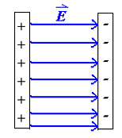
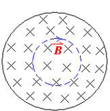
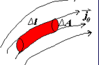

# Maxwell Equation
>改变人类文明进程的伟大方程(我了个豆，敲LaTeX真累啊)

## 对称性原则

我们首先回忆学过的方程

在真空中，我们有

- 电场高斯定理

\[
    \oiint \boldsymbol{E} \cdot \boldsymbol{dS} = \frac{Q}{\varepsilon_0}
\]

- 磁场高斯定理

\[
    \oiint \boldsymbol{B} \cdot \boldsymbol{dS} = 0
\]

- 法拉第电磁感应定律

\[
    \oint \boldsymbol{E} \cdot \boldsymbol{dl} = -\frac{d\Phi_B}{dt} = -\oiint \frac{\partial \boldsymbol{B}}{\partial t} \cdot \boldsymbol{dS}
\]

- 安培环路定理

\[
    \oint \boldsymbol{B} \cdot \boldsymbol{dl} = \mu_0 I_{enc}
\]

在电介质或者磁芯材料中，我们有

- 电场高斯定理推广

\[
    \oiint \boldsymbol{D} \cdot \boldsymbol{dS} = Q_{free}
\]

- 磁场环路定理推广
  
\[
    \oint \boldsymbol{H} \cdot \boldsymbol{dl} = I_{free} = \oiint \boldsymbol{J} \cdot \boldsymbol{dS}
\]

我们还有欧姆定律微分形式

\[
    \boldsymbol{J} = \sigma \boldsymbol{E}
\]

{==对称性原则==}：物理学家们希望方程是对称美观的，观察电场和磁场的高斯定律，于是自然不想看到磁场高斯定律的等号右边空空如也，也希望电场环路定律出现电流的形式，所以引入了磁荷$q_m$对方程进行修正

\[
    \begin{cases}
    \oiint \boldsymbol{B} \cdot \boldsymbol{dS} = q_m \\
    \oint \boldsymbol{E} \cdot \boldsymbol{dl} = \dfrac{dq_m}{dt}= -\oiint \dfrac{\partial \boldsymbol{B}}{\partial t} \cdot \boldsymbol{dS}
    \end{cases} 
\]

## Stokez公式与麦克斯韦方程
> 我宣佈現在我也是麥克斯韋了

    

使用电场的环路定理，再用斯托克斯公式变成面积分

\[
\oint \boldsymbol{H} \cdot d\boldsymbol{l} = i_0 = \iint_{S_2} \boldsymbol{J}_0 \cdot d\boldsymbol{A}
\]

\[
-\iint_{S_1} \boldsymbol{J}_0 \cdot d\boldsymbol{A} = \iint_{S_2} \boldsymbol{J}_0 \cdot d\boldsymbol{A} = i_0
\]

\[
\iint_{S} \boldsymbol{J}_0 \cdot d\boldsymbol{A} = \iint_{S_1} \boldsymbol{J}_0 \cdot d\boldsymbol{A} + \iint_{S_2} \boldsymbol{J}_0 \cdot d\boldsymbol{A} = 0
\]

这启发我们，以一个封闭的曲面包裹着电流，其面积分为0；

但是这样的结论在给电容器充电时出现了诡异的情况

    

对于(1,2)曲面，面积分为0，(1,4)曲面，面积分为0，但是(1,3)曲面，面积分不为0，此时电流从1面进入，但是没有从3面出去；这太不自然了

所以我们自然引入位移电流$I_D$

\[
   \oint \boldsymbol{H} \cdot \boldsymbol{dl} = I_{free} + I_D
\]

但是$I_D$是什么呢？我们可以从面积分的形式出发

考虑(1,3)曲面$S$，只进不出

\[
    \oiint_S \boldsymbol{J} \cdot \boldsymbol{dS} = -\dfrac{dq}{dt}
\]

\[
    \oiint_S \boldsymbol{D} \cdot \boldsymbol{dS} = q
\]

\[
    \oiint_s \dfrac{\partial \boldsymbol{D}}{\partial t} \cdot \boldsymbol{dS} = \dfrac{dq}{dt}
\]

所以在(1,3)曲面上，我们有

\[
    \oiint_S \left( \boldsymbol{J} + \dfrac{\partial \boldsymbol{D}}{\partial t} \right) \cdot \boldsymbol{dS} = 0
\]

此时在1曲面进的等于3曲面出的

\[
    - \oiint_{S_1} \boldsymbol{J} \cdot \boldsymbol{dS} = \oiint_{S_3} \boldsymbol{J} \cdot \boldsymbol{dS} 
\]

!!!key-point "位移电流"
    1曲面没有位移电流，3曲面没有自由电流，位移电流$I_D=I_0$

最后，更加完整的定义为

$$
\Phi_D = \iint \boldsymbol{D} \cdot d\boldsymbol{A} \quad \text{electric displacement flux}
$$

$$
i_D = \frac{d\Phi_D}{dt} = \iint \frac{\partial \boldsymbol{D}}{\partial t} \cdot d\boldsymbol{A} \quad \text{displacement current}
$$

$$
\boldsymbol{j}_D = \frac{\partial \boldsymbol{D}}{\partial t} \quad \text{displacement current density}
$$

分别是电位移通量，位移电流，位移电流密度

!!!proof "i_D=i_0"
    $$
    E = \frac{\sigma_e}{\epsilon_0} = \frac{q}{\epsilon_0 A} \quad \therefore \quad q = \epsilon_0 A E = \epsilon_0 \Phi_E = AD
    $$

    $$
    \therefore \quad i_0 = \frac{dq}{dt} = \epsilon_0 \frac{d\Phi_E}{dt} = \frac{d\Phi_D}{dt} = i_D, \quad \boldsymbol{D} = \epsilon_0 \boldsymbol{E}
    $$

电容充满电之后$i_D=i_0=0$;

这个电流也会产生磁场

{ align=left } 

{ align=right }

\[
\oint \boldsymbol{H} \cdot d\boldsymbol{l} = \int \int \frac{\partial \boldsymbol{D}}{\partial t} \cdot d\boldsymbol{A}  \enspace  (I_D)
\]

\[
\oint \frac{\boldsymbol{B}}{\mu_0} \cdot d\boldsymbol{l} = \epsilon_0 \int \int \frac{\partial \boldsymbol{E}}{\partial t} \cdot dA
\]

\[
\oint \boldsymbol{B} \cdot d\boldsymbol{l} = \mu_0 \epsilon_0 \int \int \frac{\partial \boldsymbol{E}}{\partial t} \cdot dA
\]

变化的电场产生磁场，变化的磁场产生电场，这就是麦克斯韦方程

最后，我们得到

\[
    \oint \boldsymbol{H} \cdot \boldsymbol{dl} = \iint \boldsymbol{J} \cdot \boldsymbol{dS} + \iint \frac{\partial \boldsymbol{D}}{\partial t} \cdot \boldsymbol{dS}
\]

以及

\[
    \nabla \times \boldsymbol{H} = \boldsymbol{J} + \frac{\partial \boldsymbol{D}}{\partial t}
\]

## 电磁波

我们可以从麦克斯韦方程推导出电磁波的性质

积分形式：

\[
\oiint \boldsymbol{E} \cdot d\boldsymbol{A} = \frac{q_0}{\epsilon_0}
\]

\[
\oiint \boldsymbol{B} \cdot d\boldsymbol{A} = 0
\]

\[
\oint \boldsymbol{E} \cdot d\boldsymbol{l} = -\iint \frac{\partial \boldsymbol{B}}{\partial t} \cdot d\boldsymbol{A}
\]

\[
\oint \boldsymbol{H} \cdot d\boldsymbol{l} = i_0 + \iint \frac{\partial \boldsymbol{D}}{\partial t} \cdot d\boldsymbol{A}
\]

微分形式（自由空间：\(\rho_0 = 0, \boldsymbol{J}_0 = 0\)）：

\[
\nabla \cdot \boldsymbol{E} = 0
\]

\[
\nabla \times \boldsymbol{E} = -\frac{\partial \boldsymbol{B}}{\partial t} = - \kappa_m \mu_0 \frac{\partial \boldsymbol{H}}{\partial t}
\]

\[
\nabla \cdot \boldsymbol{H} = 0
\]

\[
\nabla \times \boldsymbol{H} = \kappa_e \epsilon_0 \frac{\partial \boldsymbol{E}}{\partial t}
\]

分量形式：

\[
\frac{\partial E_x}{\partial x} + \frac{\partial E_y}{\partial y} + \frac{\partial E_z}{\partial z} = 0
\]

\[
\begin{vmatrix}
\hat{i} & \hat{j} & \hat{k} \\
\frac{\partial}{\partial x} & \frac{\partial}{\partial y} & \frac{\partial}{\partial z} \\
E_x & E_y & E_z
\end{vmatrix} = -\kappa_m \mu_0 \left(
\frac{\partial H_x}{\partial t} \hat{i} +
\frac{\partial H_y}{\partial t} \hat{j} +
\frac{\partial H_z}{\partial t} \hat{k}
\right)
\]

\[
\frac{\partial H_x}{\partial x} + \frac{\partial H_y}{\partial y} + \frac{\partial H_z}{\partial z} = 0
\]
 

\[
\begin{vmatrix}
\hat{i} & \hat{j} & \hat{k} \\
\frac{\partial}{\partial x} & \frac{\partial}{\partial y} & \frac{\partial}{\partial z} \\
H_x & H_y & H_z
\end{vmatrix} = \kappa_e \epsilon_0 \left(
\frac{\partial E_x}{\partial t} \hat{i} +
\frac{\partial E_y}{\partial t} \hat{j} +
\frac{\partial E_z}{\partial t} \hat{k}
\right)
\]

### 平面波

首先，假设单一波源，在很远的自由空间中，在球面上取一弧面，可以近似为平面波；以其传播方向为$z$轴，电场和磁场分别为$x$和$y$轴

    

将上面的式子依次展开，得到以下8个方程

\begin{align*}
    \frac{\partial E_x}{\partial x} + \frac{\partial E_y}{\partial y} + \frac{\partial E_z}{\partial z} &= 0 \tag{1} \\
    \frac{\partial E_z}{\partial y} - \frac{\partial E_y}{\partial z} &= -\kappa_m \mu_0 \frac{\partial H_x}{\partial t} \tag{2-1} \\
    \frac{\partial E_x}{\partial z} - \frac{\partial E_z}{\partial x} &= -\kappa_m \mu_0 \frac{\partial H_y}{\partial t} \tag{2-2} \\
    \frac{\partial E_y}{\partial x} - \frac{\partial E_x}{\partial y} &= -\kappa_m \mu_0 \frac{\partial H_z}{\partial t} \tag{2-3} \\
    \frac{\partial H_x}{\partial x} + \frac{\partial H_y}{\partial y} + \frac{\partial H_z}{\partial z} &= 0 \tag{3} \\
    \frac{\partial H_z}{\partial y} - \frac{\partial H_y}{\partial z} &= \kappa_e \epsilon_0 \frac{\partial E_x}{\partial t} \tag{4-1} \\
    \frac{\partial H_x}{\partial z} - \frac{\partial H_z}{\partial x} &= \kappa_e \epsilon_0 \frac{\partial E_y}{\partial t} \tag{4-2} \\
    \frac{\partial H_y}{\partial x} - \frac{\partial H_x}{\partial y} &= \kappa_e \epsilon_0 \frac{\partial E_z}{\partial t} \tag{4-3}
\end{align*}

接下来，运用这八个方程，一步步推导出电磁波的性质

### 横波

首先，我们有，在$x$和$y$方向的电场强度和磁场强度都是一样的，不会变化；所以

\[
   \dfrac{\partial E_x}{\partial x} = \dfrac{\partial E_y}{\partial y} = \dfrac{\partial H_x}{\partial x} = \dfrac{\partial H_y}{\partial y} = 0
\]

由 (1) 式，我们有

\[
    \dfrac{\partial E_z}{\partial z} = 0
\]

由 (2-3) 式，我们有

\[
    \dfrac{\partial H_z}{\partial t} = 0 
\]

由 (3) 式，我们有

\[
    \dfrac{\partial H_z}{\partial z} = 0
\]

由 (4-3) 式，我们有

\[
    \dfrac{\partial E_z}{\partial t} = 0
\]

所以电场和磁场随着z轴的变化是不变的，可以设为$0$

\[
    E \perp k, H \perp k
\]

### $E \perp H$

运用$E_z=H_z=0$，我们有

(2-1) 式

\[
    \dfrac{\partial E_y}{\partial z} = \kappa_m \mu_0 \dfrac{\partial H_x}{\partial t}
\]

(2-2) 式

\[
    \dfrac{\partial E_x}{\partial z} = -\kappa_m \mu_0 \dfrac{\partial H_y}{\partial t}
\]

(4-1) 式

\[
    \dfrac{\partial H_y}{\partial z} = -\kappa_e \epsilon_0 \dfrac{\partial E_x}{\partial t}
\]

(4-2) 式

\[
    \dfrac{\partial H_x}{\partial z} = \kappa_e \epsilon_0 \dfrac{\partial E_y}{\partial t}
\]

由于$x,y$的方向是任意定的，那么我们可以设$x$的方向就是电场的方向；那么我们有

\[
    \dfrac{\partial H_x}{\partial z} = 0 =\dfrac{\partial H_x}{\partial t}
\]

所以磁场强度的方向与电场强度方向垂直，故$E \perp H$

### 波动方程
> 原来光就是电磁波

对上面的四个方程中的(2-2)两边对$t$求偏导

\[
\frac{\partial^2 E_x}{\partial z^2} = -\kappa_m \mu_0 \frac{\partial}{\partial t} \cdot \frac{\partial H_y}{\partial z} = \kappa_m \mu_0 K_e \epsilon_0 \frac{\partial^2 E_x}{\partial t^2}
\]

同理，对(4-1)操作，得到以下两个方程

\begin{align*}
\frac{\partial^2 E_x}{\partial z^2} - \kappa_e \epsilon_0 K_m \mu_0 \frac{\partial^2 E_x}{\partial t^2} &= 0 \\
\frac{\partial^2 H_y}{\partial z^2} - \kappa_e \epsilon_0 K_m \mu_0 \frac{\partial^2 H_y}{\partial t^2} &= 0
\end{align*}

猜根得到

\[
    \begin{cases}
     E_x=E_{x0} e^{i(\omega t - kz)}\\
     H_y=H_{y0} e^{i(\omega t - kz)}\\
    \end{cases}
\]

带入方程，得到

\[
    \begin{cases}
     k^2 = \kappa_e \epsilon_0 \kappa_m \mu_0 \omega^2\\
     k = \omega \sqrt{\kappa_e \epsilon_0 \kappa_m \mu_0}
    \end{cases} 
\]

又因为

\[
    v=\dfrac{\omega}{k}= \dfrac{1}{\sqrt{\kappa_e \epsilon_0 \kappa_m \mu_0}}
\]

在真空中，磁导率和介电常数为1；代入数据计算发现，$v=c=3.0 \times 10^8 m/s$，这就是光速

!!!info
    詹姆斯·克拉克·麦克斯韦（James Clerk Maxwell）在1861年至1862年期间，通过他的电磁理论推导出了光速。他在发表于1865年的论文《电磁场的动力学理论》（*A Dynamical Theory of the Electromagnetic Field*）中系统地总结了这一成果。

    麦克斯韦通过结合法拉第电磁感应定律、安培定律（修正后引入了位移电流）、高斯定律以及高斯磁定律，形成了一组描述电磁场的方程组，即后来被称为“麦克斯韦方程组”。在推导过程中，他注意到电磁波的传播速度与介质的电磁性质相关：

    \[
    v = \frac{1}{\sqrt{\mu_0 \varepsilon_0}}
    \]

    当麦克斯韦使用当时已知的实验数据计算该值时，发现其结果接近于已知的光速（约 \( 3 \times 10^8 \, \text{m/s} \)）。因此，他提出了一个革命性的假设：光是一种电磁波。这一发现是物理学史上的重要里程碑，将电磁学和光学统一在一个理论框架内。

而式子中余下的

\[
    \sqrt{\kappa_e \kappa_m} = n
\]

即为折射率(光速在真空中的速度与介质中的速度的比值)

\[
    v=\dfrac{c}{n}
\]

### 电场和磁场

由推导电场与磁场相互垂直的(2-2)式$\dfrac{\partial E_x}{\partial z} = -\kappa_m \mu_0 \dfrac{\partial H_y}{\partial t}$,继续将得出的电场和磁场代入，得到

\[
\begin{align*}
-i k E_{x_0} e^{i(\omega t - kx)} &= -\kappa_m \mu_0 i \omega H_{y_0} e^{i(\omega t - kx)} \\
k E_{x_0} &= \kappa_m \mu_0 \omega H_{y_0} \\
E_{x_0} &= \kappa_m \mu_0 \frac{\omega}{k} H_{y_0} = \kappa_m \mu_0 v H_{y_0} \\
&= \kappa_m \mu_0 \frac{1}{\sqrt{\kappa_m \mu_0 \kappa_e \varepsilon_0}} H_{y_0} \\
\sqrt{\kappa_e \varepsilon_0} E_{x_0} &= \sqrt{\kappa_m \mu_0} H_{y_0} \\
\sqrt{\kappa_e \varepsilon_0} E_{x_0} e^{i \phi_E} &= \sqrt{\kappa_m \mu_0} H_{y_0} e^{i \phi_H}
\end{align*}
\]

初相相同

\[
\begin{cases}
\sqrt{\kappa_e \varepsilon_0} E_0 = \sqrt{\kappa_m \mu_0} H_0 \\
\phi_E = \phi_H
\end{cases}
\]

在真空中，$\kappa_e=\kappa_m=1$

所以

\[
    \sqrt{\varepsilon_0} E_0 = \sqrt{\mu_0} H_0
\]

\[
    E_0 = \dfrac{\mu_0 H_0}{\sqrt{\varepsilon_0 \mu_0}}=cB_0
\]

!!!key-point
    \[
        B_0=\dfrac{E_0}{c}
    \]

    电场和磁场只差一个常数！

    

## 电磁波的能量密度

单位体积内电磁波的能量包括电场的部分和磁场的部分

\[
U = \iiint \left( \frac{1}{2} \varepsilon_0 E^2 + \frac{1}{2} \frac{B^2}{\mu_0} \right) dv
\]

更一般的

\[
U = U_E + U_B
= \iiint \left( \frac{1}{2} \boldsymbol{D} \cdot \boldsymbol{E} + \frac{1}{2} \boldsymbol{B} \cdot \boldsymbol{H} \right) dv
\]

\[
\frac{dU}{dt} = \frac{d}{dt} \iiint \left( \frac{1}{2} \boldsymbol{D} \cdot \boldsymbol{E} + \frac{1}{2} \boldsymbol{B} \cdot \boldsymbol{H} \right) dv
\]

\[
= \frac{1}{2} \iiint \frac{\partial}{\partial t} \left( \boldsymbol{D} \cdot \boldsymbol{E} + \boldsymbol{B} \cdot \boldsymbol{H} \right) dv
\]

展开：

\[
\frac{\partial}{\partial t} \left( \boldsymbol{D} \cdot \boldsymbol{E} + \boldsymbol{B} \cdot \boldsymbol{H} \right) 
= \kappa_e \varepsilon_0 \frac{\partial}{\partial t} (\boldsymbol{E} \cdot \boldsymbol{E}) + \kappa_m \mu_0 \frac{\partial}{\partial t} (\boldsymbol{H} \cdot \boldsymbol{H})
\]

\[
= 2 \kappa_e \varepsilon_0 \boldsymbol{E} \cdot \frac{\partial \boldsymbol{E}}{\partial t} + 2 \kappa_m \mu_0 \boldsymbol{H} \cdot \frac{\partial \boldsymbol{H}}{\partial t}
\]

{==

\[
= 2 \boldsymbol{E} \cdot \frac{\partial \boldsymbol{D}}{\partial t} + 2 \boldsymbol{H} \cdot \frac{\partial \boldsymbol{B}}{\partial t}
\]

==}

由麦克斯韦方程：

\[
\frac{\partial \boldsymbol{D}}{\partial t} = \nabla \times \boldsymbol{H} - \boldsymbol{J_0}
\]

\[
\frac{\partial \boldsymbol{B}}{\partial t} = -\nabla \times \boldsymbol{E}
\]

代入高亮部分后得到：

\[
2 \boldsymbol{E} \cdot \left( \nabla \times \boldsymbol{H} - \boldsymbol{J_0} \right) - 2 \boldsymbol{H} \cdot \left( \nabla \times \boldsymbol{E} \right)
\]

\[
= 2 \left[ \boldsymbol{E} \cdot (\nabla \times \boldsymbol{H}) - \boldsymbol{H} \cdot (\nabla \times \boldsymbol{E}) - \boldsymbol{J_0} \cdot \boldsymbol{E} \right]
\]

\[
= -2 \nabla \cdot (\boldsymbol{E} \times \boldsymbol{H}) - 2 \boldsymbol{J_0} \cdot \boldsymbol{E}
\]

以上的化简运用了

\[
\boldsymbol{E} \cdot (\nabla \times \boldsymbol{H}) - \boldsymbol{H} \cdot (\nabla \times \boldsymbol{E}) = - \nabla \cdot (\boldsymbol{E} \times \boldsymbol{H})
\]

最后运用高斯定理化简得到

\[
\frac{dU}{dt} = - \iiint \nabla \cdot (\boldsymbol{E} \times \boldsymbol{H}) dv - \iiint (\boldsymbol{J_0} \cdot \boldsymbol{E}) dv
\]

{==

\[
= - \iint (\boldsymbol{E} \times \boldsymbol{H}) \cdot d\boldsymbol{A} - \iiint (\boldsymbol{J_0} \cdot \boldsymbol{E}) dv
\]

==}

接下来，我们继续讨论最后的$J_0 \cdot E$ 积分会得到什么

由于$J_0 =\sigma (\boldsymbol{E}+\boldsymbol{K}) , \therefore \boldsymbol{E}=\dfrac{1}{\sigma} J_0 - \boldsymbol{K}$

所以

{ align=right }

\[
\begin{align*}
\int\int\int \left( \boldsymbol{j_0} \cdot \boldsymbol{E} \right) dv & = \left( \boldsymbol{j_0} \cdot \boldsymbol{E} \right) \Delta A \cdot \Delta l \\
& = \boldsymbol{j_0} \cdot \left( \rho \boldsymbol{j_0} - \boldsymbol{K} \right) \Delta A \cdot \Delta l \\
& = \rho j_0^2 \Delta A \cdot \Delta l - \boldsymbol{j_0} \cdot \boldsymbol{K} \Delta A \cdot \Delta l \\
& = \rho \frac{\Delta l}{\Delta A} \left( j_0 A \right)^2 - \left( j_0 A \right) \left( \boldsymbol{K} \cdot \Delta l \right) \\
& = R i_0^2 - i_0 \Delta \varepsilon
& = Q - P
\end{align*}
\]

最后得到单位时间内的能量为

!!!key-point
    \[
        \dfrac{dU}{dt} = - \iint \boldsymbol{S} \cdot d\boldsymbol{A} - Q + P
    \]

### Poynting 矢量

定义单位时间，单位面积内的能量流动

\[
\boldsymbol{S} = \boldsymbol{E} \times \boldsymbol{H}
\]

!!!Note 
    \[
        S = \dfrac{EB}{\mu_0} = \dfrac{E^2}{\mu_0 c} = \dfrac{E^2}{Z_0}
    \]

    其中$Z_0=377 \Omega$

    能量密度(单位时间，单位面积)为Poynting矢量的均值

    

    
    

!!!Note
    电场能量密度与磁场能量密度的关系

    \[
        \mu_E=\dfrac{1}{2} \varepsilon_0 E^2 = \dfrac{1}{2} \varepsilon c^2B^2 =  \dfrac{1}{2} \dfrac{B^2}{\mu_0} = \mu_B
    \]

    故总能量密度(单位时间，单位体积)为

    \[
        \mu = \mu_E + \mu_B =  2 \mu_E = \varepsilon_0 E^2 
    \]

!!!key-point "$I$ 与 $\mu$ 的关系"
    

    
    

???Example
    

    
    

### 电路中的能量传输

    

如图的一个直流电路

    

考虑与电源正极相连的导线，导线内部有一个电场，那么导线外部一定也有一个方向相同的电场,这是因为

\[
   \oint \boldsymbol{E} \cdot \boldsymbol{dl} = -\dfrac{d\Phi_B}{dt} =0
\]

再加上一个垂直导线的电场，根据$S=E \times H$，我们可以得到能量流动的方向，一方面流向电阻，另外一方面被导线消耗

与电源负极相连的导线也是类似的；

    

### 电磁波蕴含的力

    

首先假设其有一个力$\Delta F$，那么这个力会使电荷做功，即$\Delta W = \Delta F \cdot \Delta l$;而这一部分功就是这个物体吸收的净能量;

\[
\Delta \boldsymbol{F} \cdot c \Delta t = (\boldsymbol{S_{in}} - \boldsymbol{S_{out}}) \cdot \Delta A \Delta t
\]

故

\[
\Delta \boldsymbol{F} = \dfrac{1}{c} (\boldsymbol{S_{in}} - \boldsymbol{S_{out}}) \Delta A
\]

!!!Warning
    注意是矢量减

#### 光压(light pressure)

单位面积上的力

\[
    P = \dfrac{1}{c} (\boldsymbol{S_{in}} - \boldsymbol{S_{out}})
\]

#### 动量密度

单位体积内的动量

\[
    \Delta g  = \dfrac{F \cdot \Delta t}{\Delta A c \Delta t} = \dfrac{F}{c \Delta A} = \dfrac{1}{c^2}(\boldsymbol{S_{in}} - \boldsymbol{S_{out}})
\]

$g_in=\dfrac{1}{c^2}S_{in}$ 为入射光的动量密度，$g_out=\dfrac{1}{c^2}S_{out}$ 为反射光的动量密度

!!!key-point
    对于白体，$S_{in}=S_{out}$，故$g_in=g_out$
    
    \[
        P = \dfrac{2}{c} \boldsymbol{S_{in}}
    \]
    
    对于黑体，$S_{out}=0$，故$g_in=\dfrac{1}{c^2}S_{in}$

    \[
        P = \dfrac{1}{c} \boldsymbol{S_{in}}
    \]