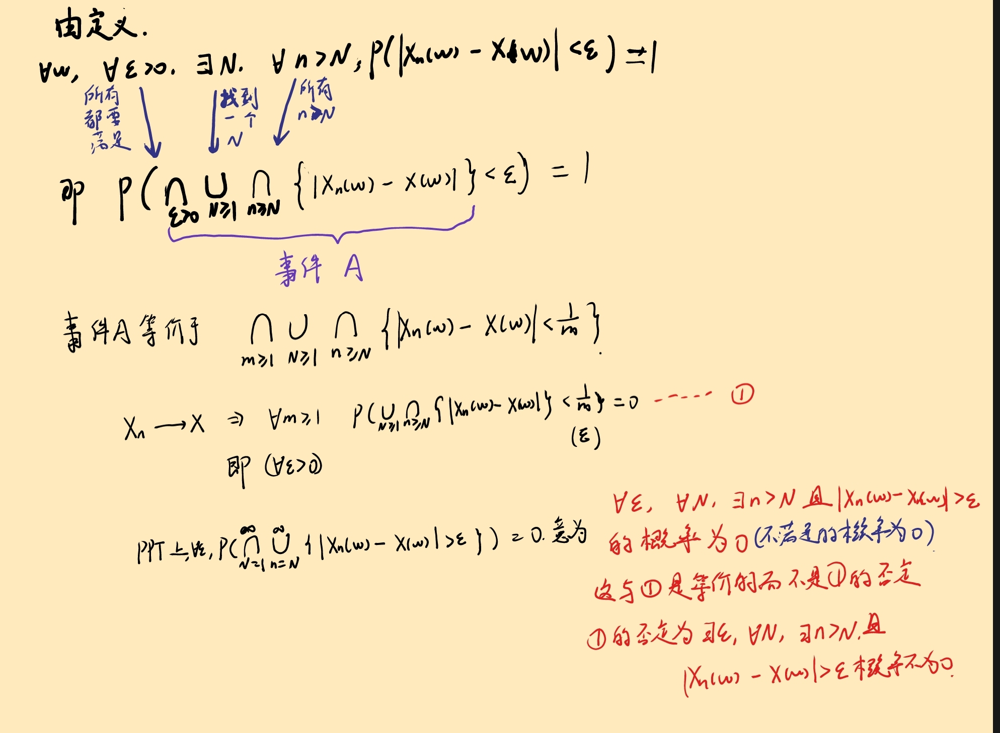

# 概率极限理论

## 伯努利大数定律

给定$p \in (0, 1)$，记$S_n \sim \text{Binomial}(n, p)$，则

\[
    P(w: \lvert \frac{S_n(w)}{n} - p \rvert \geqslant \epsilon) \to 0 \quad (n \to \infty)
\]

即频率与概率的偏差的概率随着试验次数的增加而趋近于0

## Possion 极限定理

令 \(0 < p_n < 1\)，假设 \(S_n \sim B(n, p_n)\)，如果 \(np_n \to \lambda\)，并且 \(0 < \lambda < 1\) 那么对任何 \(k = 0, 1, 2, \ldots\)

\[
P(S_n = k) \to \frac{\lambda^k e^{-\lambda}}{k!}, \quad n \to \infty
\]

证明：由于 \(S_n \sim B(n, p_n)\)

\[
P(S_n = k) = \frac{n!}{k!(n-k)!} p_n^k (1-p_n)^{n-k}
\]

\[
= \frac{1}{k!} \cdot \frac{n(n-1)\cdots(n-k+1)}{n^k} \cdot (np_n)^k \cdot \left(1 - \frac{\lambda}{n} + o\left(\frac{1}{n}\right)\right)^{n-k}
\]

\[
\to \frac{\lambda^k e^{-\lambda}}{k!}, \quad n \to \infty
\]

## Chebyshev 大数律

**Chebyshev 不等式**: 对任意随机变量 \(X\), \(EX\) 和 \(EX^2\) 存在有限, 那么对任意 \(\varepsilon > 0\)

\[
P(|X - EX| > \varepsilon) \leqslant \frac{Var(X)}{\varepsilon^2}
\]

!!!example "应用 Chebyshev 不等式证明 Bernoulli 大数律"
    \[
    P\left(\left|\frac{S_n}{n} - p\right| > \varepsilon\right) = P(|S_n - np| > n\varepsilon)
    \]

    \[
    \leqslant \frac{Var(S_n - np)}{n^2 \varepsilon^2}
    \]

    \[
    = \frac{np(1-p)}{n^2 \varepsilon^2} \to 0, \quad n \to \infty
    \]

**Chebyshev 大数律**

假设 \(\xi_k, k \geqslant 1\) 是一列随机变量，\(E\xi_k = \mu\)。记 \(S_n = \sum_{k=1}^{n} \xi_k\)，如果

\[
\frac{Var(S_n)}{n^2} \to 0, \quad n \to \infty
\]

那么

\[
\frac{S_n}{n} \to \mu, \quad n \to \infty
\]

更一般地，假设 \(\xi_k, k \geqslant 1\) 是一列随机变量，\(E\xi_k = \mu_k\)。如果

\[
\frac{Var(S_n)}{n^2} \to 0, \quad n \to \infty
\]

那么

\[
\frac{S_n}{n} - \frac{\sum_{k=1}^{n} \mu_k}{n} \to 0, \quad n \to \infty
\]

!!!Proof "Chebyshev 大数律的证明"
    对任意 \(\varepsilon > 0\),

    \[
    P\left(\left|\frac{S_n}{n} - \frac{\sum_{k=1}^{n} \mu_k}{n}\right| > \varepsilon\right) \leqslant \frac{Var(S_n)}{n^2 \varepsilon^2} \to 0
    \]
    
    这里$S_n$ 对应Chebyshev不等式中的$X$，$\sum_{k=1}^{n} \mu_k$ 对应Chebyshev不等式中的$\mu$

    $n\varepsilon$ 对应Chebyshev不等式中的$\varepsilon$

    Chebyshev 大数律的意义:
    1. 样本均值渐近逼近均值

    2. {==没有独立性要求==}
    
    3. Chebyshev 大数律的不足之处: {==要求方差存在==}

## Khinchin 大数律

假设 \(\xi_k, k \geqslant 1\) 是一列{==独立同分布==}的随机变量，且 \(E\xi_k = \mu\)，记 \(S_n = \sum_{k=1}^{n} \xi_k\)，那么

\[
\frac{S_n}{n} \to \mu, \quad n \to \infty
\]

## De Moivre-Laplace 中心极限定理

!!!quote "De Moivre公式"
    \[
        (\cos \theta + i \sin \theta)^n = \cos n\theta + i \sin n\theta
    \]

假设 \(S_n \sim B(n, p)\)，那么

\[ 
P\left( \frac{S_n - np}{\sqrt{np(1-p)}} \leqslant x \right) \approx \int_{-\infty}^{x} \frac{1}{\sqrt{2\pi}} e^{-\frac{t^2}{2}} \, dt 
\]

- 左边：规范化 \(\frac{S_n - np}{\sqrt{np(1-p)}}\) 随机变量的分布函数

- 右边：正态分布函数

\[
\Phi(x) = \int_{-\infty}^{x} \frac{1}{\sqrt{2\pi}} e^{-\frac{t^2}{2}} \, dt
\]

- 

\[
P(a \leqslant S_n \leqslant b) = P\left( \frac{a - np}{\sqrt{np(1-p)}} \leqslant \frac{S_n - np}{\sqrt{np(1-p)}} \leqslant \frac{b - np}{\sqrt{np(1-p)}} \right) 
\approx \Phi\left( \frac{b - np}{\sqrt{np(1-p)}} \right) - \Phi\left( \frac{a - np}{\sqrt{np(1-p)}} \right)
\]

!!!idea "利用De Moivre-Laplace定理证明"
    在伯努利试验中，若$p \in (0, 1)$，则不管$A$是多大的常数，总有

    \[
        P(\lvert \mu_n - np \rvert < A) \to 0, \quad n \to \infty
    \]

    将其化为标准形式，则

    \[
        P(\lvert \dfrac{\mu_n - np}{\sqrt{np(1-p)}} \rvert < \frac{A}{\sqrt{np(1-p)}})\to 0, \quad n \to \infty
    \]

    由De Moivre-Laplace定理，右边是趋向于0,所以原概率相当于
     
    \[
        P(|X|  <  0)  = 2  \Phi(0) - 1 = 0
    \]

    其中 $X$ 是标准正态分布

    **但是，这一结果是否与大数定律相矛盾呢，直观上理解有些困难，但是，我们将其化为大数定律的形式来看的话，就有**

    \[
        P(\lvert \dfrac{\mu_n}{n} - p \rvert < \dfrac{A}{n}) \to 0, \quad n \to \infty
    \]

    但是大数定律的结论是,对于任意给定的$\epsilon > 0$,总有

    \[
        P(\lvert \dfrac{\mu_n}{n} - p \rvert > \epsilon) \to 0, \quad n \to \infty
    \]

    那么结果就很明了了，大数定律需要$\epsilon$给定,但是这里的$\dfrac{A}{n}$是与$n$有关一直变化的，并不满足大数定律的条件，所以，大数定律与这个结论并不矛盾，关键就在于$A$是给定的常数导致它除以$n$后，$\epsilon$是变化的。
     

## 依概率收敛

\((\Omega, \mathcal{S}, P)\) 是一个概率空间，\(X, X_n, n \geqslant 1\) 是一列随机变量，如果对任意 \(\epsilon > 0\),

\[
P(\omega : |X_n(\omega) - X(\omega)| > \epsilon) \to 0, \quad n \to \infty
\]

称 \(X_n\) 依概率收敛到 \(X\)，记做 \(X_n \xrightarrow{P} X\)。

按此概念，Bernoulli 大数律可写成

\[
\frac{S_n}{n} \xrightarrow{P} p
\]

!!!Property "依概率收敛的性质"
    === "极限唯一性"
        如果 \(X_n \xrightarrow{P} X\) 且 \(X_n \xrightarrow{P} Y\)，那么 

        \[
            P(X=Y) = 1
        \]

        ???proof "证明"
            \[
            \text{证明: 只需证明 } P(X \neq Y) = 0. \text{ 注意到,}
            \]

            \[
            P(X \neq Y) = P(|X - Y| > 0) = P(\cup_{m=1}^{\infty}\{ |X - Y| > \frac{1}{m} \})
            \]

            因此, 需要证明对任意 \(\epsilon > 0\),

            \[
            P(|X - Y| > \epsilon) = 0
            \]

            给定 \(\epsilon > 0\), 对任意 \(n \geqslant 1\)

            \[
            P(|X - Y| > \epsilon) = P(|(X_n - X) - (X_n - Y)| > \epsilon)
            \]
            
            \[
            \leqslant P(|X_n - X| + |X_n - Y| > \epsilon)
            \]
            
            这里运用了三角不等式，小的发生，大的一定也发生；

            \[
            \leqslant P(|X_n - X| > \frac{\epsilon}{2}) + P(|X_n - Y| > \frac{\epsilon}{2})
            \]

            这里是因为

            \[
                \{a+b>c\} \subset \{a>\frac{c}{2}\} \cup \{b>\frac{c}{2}\}
            \]

            令 \(n \to \infty\),

            \[
            P(|X_n - X| > \frac{\epsilon}{2}) \to 0, \quad P(|X_n - Y| > \frac{\epsilon}{2}) \to 0
            \]

            因此

            \[
            P(|X - Y| > \epsilon) = 0
            \]
            
            \[
            \text{因此, } P(X = Y) = 1
            \]
    
    === "依概率收敛的判别法则"
        如果存在某 \(r > 0\), 成立

        \[
        E|X_n - X|^r \to 0, \quad n \to \infty
        \]

        那么

        \[
        X_n \xrightarrow{P} X
        \]

    
    === "运算性质"
        如果 \(X_n \xrightarrow{P} X, Y_n \xrightarrow{P} Y\), 那么

        (i) \(X_n \pm Y_n \xrightarrow{P} X \pm Y\)

        (ii) \(X_n \cdot Y_n \xrightarrow{P} X \cdot Y\)

        (iii) 如果 \(P(Y \neq 0) = 1\), 那么 \(\frac{X_n}{Y_n} \xrightarrow{P} \frac{X}{Y}\)
    

    === "连续映射保依概率收敛"

        假设 \(f: \mathbb{R} \mapsto \mathbb{R}\) 是连续映射，如果 \(X_n \xrightarrow{P} X\)，那么

        \[
        f(X_n) \xrightarrow{P} f(X)
        \]

        ???proof "证明"
            设 \(\epsilon' > 0\)，存在 \(M > 0\)，使得

            \[
            P(|\xi| \geqslant M) \leqslant  P(|\xi| \geqslant \frac{M}{2})  \leqslant \frac{\epsilon'}{4}
            \]

            由于 \(\xi_n \xrightarrow{P} \xi\)，故存在 \(N_1 \geqslant 1\)，当 \(n \geqslant N_1\) 时，\(P(|\xi_n - \xi| \geqslant \frac{M}{2}) \leqslant \frac{\epsilon'}{4}\)。因此

            \[
            P(|\xi_n| \geqslant M) \leqslant P(|\xi_n - \xi| \geqslant \frac{M}{2}) + P(|\xi| \geqslant \frac{M}{2}) \leqslant \frac{\epsilon'}{2}
            \]

            又因 \(f(x)\) 在 \((-\infty, \infty)\) 上连续，从而在 \([-M, M]\) 上一致连续。对给定的 \(\epsilon > 0\)，存在 \(\delta > 0\)，当 \(|x - y| < \delta\) 时，\(|f(x) - f(y)| < \epsilon\)。这样

            \[
            P(|f(\xi_n) - f(\xi)| \geqslant \epsilon) \leqslant P(|\xi_n - \xi| \geqslant \delta) + P(|\xi_n| \geqslant M) + P(|\xi| \geqslant M)
            \]

            对上述的 \(\delta\)，存在 \(N_2 \geqslant 1\)，当 \(n \geqslant N_2\) 时，

            \[
            P(|\xi_n - \xi| \geqslant \delta) \leqslant \frac{\epsilon'}{4}
            \]

            当 \(n \geqslant \max(N_1, N_2)\) 时，

            \[
            P(|f(\xi_n) - f(\xi)| \geqslant \epsilon) \leqslant \frac{\epsilon'}{4} + \frac{\epsilon'}{2} + \frac{\epsilon'}{4} = \epsilon'
            \]
                    

## 依分布收敛

假设 \((\Omega, \Sigma, P)\) 是概率空间，\(X, X_n, n \geqslant 1\) 是一列随机变量，\(F, F_n, n \geqslant 1\) 是一列相应的分布函数，如果对于 \(F\) 的任意连续点 \(x\),

\[
F_n(x) \to F(x), \quad n \to \infty
\]

称 \(F_n\) 依分布收敛于 \(F\)，记 \(F_n \xrightarrow{d} F\) 或者 \(X_n \xrightarrow{d} X\)。

按此概念，中心极限定理可写成

\[
\frac{S_n - np}{\sqrt{np(1-p)}} \xrightarrow{d} N(0, 1)
\]

!!!Tip
    - 如果 \( F \) 是在 \(\mathbb{R}\) 上连续, 那么 \( F_n \) 处处收敛到 \( F \)

    - 一般地,\( F \)不是连续函数(左极限存在，右连续的函数)

    - 既然 \(F\) 是单调有界函数，\(F\) 的不连续点集最多可数个：
    
    \[
      D_F = \{x : F(x) - F(x-) > 0\} = \bigcup_{n=1}^{\infty} \left\{x : F(x) - F(x-) \geqslant \frac{1}{n}\right\}
    \]
      
    - \(F\) 的连续性点集在 \(\mathbb{R}\) 上稠密。

!!!info "依概率收敛与依分布收敛的关系"
    === "依概率收敛意味着依分布收敛"
        如果 \( \xi_n \xrightarrow{P} \xi \)，那么 \( \xi_n \xrightarrow{d} \xi \)

        假设 \(F\) 和 \(F_n\) 分别是 \(\xi\) 和 \(\xi_n\) 的分布函数，那么对任意给定 \(\epsilon > 0\)，有

        \[
            (\xi \leqslant x - \epsilon) = (\xi \leqslant x - \epsilon, \xi_n \leqslant x) \cup (\xi \leqslant x - \epsilon, \xi_n > x) \subset (\xi_n \leqslant x) \cup (\xi_n - \xi > \epsilon)
        \]

        因此

        \[
            F(x - \epsilon) \leqslant F_n(x) + P(\xi_n - \xi > \epsilon)
        \]

        令 \(n \to \infty\)，由于 \(P(\xi_n - \xi > \epsilon) \to 0\)，所以

        \[
            F(x - \epsilon) \leqslant \inf_{n \to \infty} F_n(x) 
        \]

        同理

        \[
            (\xi_n \leqslant x) \subset (\xi \leqslant x + \epsilon) \cup (\xi - \xi_n < -\epsilon)
        \]

        从而

        \[
            F(x + \epsilon) \geqslant \sup_{n \to \infty} F_n(x)
        \]

        因此

        \[
            \lim_{n \to \infty} F_n(x) = F(x)
        \]

    === "依分布收敛并不意味着依概率收敛"

        但是如果 \(X_n \xrightarrow{d} C\)，那么 \(X_n \xrightarrow{P} C\)

        其中 \(C\) 是常数

        如果 \(\xi_n \xrightarrow{d} c\)，则

        \[
        \lim_{n \to \infty} F_n(x) = 
        \begin{cases} 
        0, & x < c, \\
        1, & x \geqslant c.
        \end{cases}
        \]

        因此对任意 \(\epsilon > 0\)，有

        \[
        P(|\xi_n - c| \geqslant \epsilon) = P(\xi_n \geqslant c + \epsilon) + P(\xi_n \leqslant c - \epsilon)
        \]

        \[
        = 1 - P(\xi_n < c + \epsilon) + P(\xi_n \leqslant c - \epsilon)
        \]

        \[
        = 1 - F_n(c + \epsilon - 0) + F_n(c - \epsilon) \to 0.
        \]

        定理证毕。
    
    === "依分布收敛的判别法则"

       - Levy 连续性定理:

          假设 \(X, X_n, n \geqslant 1\) 是一列随机变量，具有特征函数 \(\phi, \phi_n, n \geqslant 1\)。那么

        \[
          X_n \xrightarrow{d} X \iff \phi_n(t) \to \phi(t), \quad t \in \mathbb{R}
        \]

       - Levy 连续性定理的另一种形式:

          假设 \(X_n, n \geqslant 1\) 是一列随机变量，具有特征函数 \(\phi_n, n \geqslant 1\)。如果

        \[
          \phi_n(t) \to \phi(t), \quad t \in \mathbb{R}
        \]

          并且 \(\phi\) 在 0 处连续，那么 \(\phi\) 一定是特征函数。记与 \(\phi\) 相应的随机变量为 \(X\)，那么

        \[
          X_n \xrightarrow{d} X
        \]

运用Levy定理，如果要证明一列随机变量依分布收敛于某个随机变量，只需要证明这列随机变量的特征函数收敛于该随机变量的特征函数。

!!!example "应用"
    === "辛钦大数律证明"
        回忆 \(\xi_k, k \geqslant 1\) 独立同分布，\(E\xi_k = \mu\)，那么

        \[
        \frac{1}{n} \sum_{k=1}^{n} \xi_k \xrightarrow{p} \mu
        \]

        证明：只需证明

        \[
        X_n = \frac{1}{n} \sum_{k=1}^{n} \xi_k \xrightarrow{d} \mu
        \]

        \[
        \iff \quad \phi_n(t) = E e^{itX_n} \to e^{it\mu}
        \]

        在 0 处进行 Taylor 展开，

        \[
        E e^{it\xi_k} = 1 + it\mu + o\left(\frac{1}{n}\right), \quad n \to \infty
        \]

        所以，对每个 \(t \in \mathbb{R}\),

        \[
        \phi_n(t) = \left(1 + \frac{it\mu}{n} + o\left(\frac{1}{n}\right)\right)^n \to e^{it\mu}
        \]
    
    === "Levy-Feller中心极限定理证明"

        回忆 \(\xi_k, k \geqslant 1\) 独立同分布，\(E\xi_k = \mu, \operatorname{Var}(\xi_k) = \sigma^2\)，那么

        \[
        X_n = \frac{1}{\sigma \sqrt{n}} \sum_{k=1}^{n} (\xi_k - \mu) \xrightarrow{d} N(0, 1)
        \]

        证明：只需证明

        \[
        \phi_n(t) = E e^{itX_n} \to e^{-\frac{t^2}{2}}
        \]

        注意到

        \[
        E e^{itX_n} = \left[E e^{i\frac{t(\xi_k - \mu)}{\sigma \sqrt{n}}}\right]^n
        \]

        在 0 处进行 Taylor 展开，

        \[
        E e^{i\frac{t(\xi_k - \mu)}{\sigma \sqrt{n}}} = 1 - \frac{t^2}{2n} + o\left(\frac{1}{n}\right)
        \]

        所以，对任意 \(t\),

        \[
        E e^{itX_n} = \left[1 - \frac{t^2}{2n} + o\left(\frac{1}{n}\right)\right]^n \to e^{-\frac{t^2}{2}}
        \]

!!!Property "依分布收敛的性质"
    - 线性性:
          - 如果 \(X_n \xrightarrow{d} X\)，\(a_n,b_n \rightarrow a,b\)，那么 \(a_nX_n + b_n \xrightarrow{d} aX + b\)
           
          - 如果 \(X_n \xrightarrow{d} X\)，\(Y_n \xrightarrow{P} Y\)，那么 \(X_n Y_n \xrightarrow{d} X Y\)
    
    - 连续映射保依分布收敛:
          - 如果 \(X_n \xrightarrow{d} X\)，且 \(f: \mathbb{R} \mapsto \mathbb{R}\) 是连续映射，那么 \(f(X_n) \xrightarrow{d} f(X)\)

    !!!Proof "Helly引理"
        假设 \(F, F_n, n \geq 1\) 是一列分布函数，并且 \(F_n \xrightarrow{d} F\)，那么对任意有界连续函数 \(g\)

        \[
        \int g(x) dF_n(x) \to \int g(x) dF(x)
        \]

        这样，对任意 \(t \in \mathbb{R}\),

        \[
        E e^{itf(X_n)} = \int e^{itf(x)} dF_n(x)
        \]

        \[
        \to \int e^{itf(x)} dF(x)
        \]

        \[
        = E e^{itf(X)}
        \]

        结论成立

## Levy-Feller 中心极限定理

- Levy-Feller 中心极限定理

假设 \(\xi_k, k \geqslant 1\) 是一列独立同分布随机变量，\(E\xi_k = \mu, \operatorname{Var}(\xi_k) = \sigma^2\)。记 \(S_n = \sum_{k=1}^{n} \xi_k\)，那么对任意 \(x\),

\[
P\left( \frac{S_n - n\mu}{\sigma \sqrt{n}} \leqslant x \right) \to \Phi(x)
\]

即

\[
\frac{S_n - n\mu}{\sigma \sqrt{n}} \xrightarrow{d} N(0, 1)
\]

!!!Note "Levy-Feller 中心极限定理的意义"
    - 应用于一般随机变量，推广了 de Moivre-Laplace 中心极限定理。

    - 说明测量误差可用正态分布描述，即正态分布无处不在。

    假设测量值为 \(X_i\)，真值为 \(\mu\)。每次误差为 \(X_i - \mu\)，\(n\) 次观测所得误差叠加，记为 \(\sum_{i=1}^{n}(X_i - \mu)\)。那么

    \[
    \sum_{i=1}^{n}(X_i - \mu) \sim N(0, n\sigma^2), \quad n \gg 1
    \]

## Lyapunov 中心极限定理

假设 \(\xi_k, k \geqslant 1\) 是一列独立随机变量{==不一定同分布==}，\(E\xi_k = \mu_k\)，\(\operatorname{Var}(\xi_k) = \sigma_k^2\)。记 \(S_n = \sum_{k=1}^{n} \xi_k\)，\(B_n = \sum_{k=1}^{n} \sigma_k^2\)。如果

1. \(B_n \to \infty\)
2. \(E|\xi_k|^3 < \infty\)，且

\[
\frac{1}{B_n^{3/2}} \sum_{k=1}^{n} E|\xi_k - \mu_k|^3 \to 0, \quad n \to \infty
\]

那么对任意 \(x\)

\[
P\left(\frac{\sum_{k=1}^{n} (\xi_k - \mu_k)}{\sqrt{B_n}} \leqslant x\right) \to \Phi(x)
\]

即

\[
\frac{\sum_{k=1}^{n} (\xi_k - \mu_k)}{\sqrt{B_n}} \xrightarrow{d} N(0, 1)
\]

!!!Note "Lyapunov 中心极限定理的意义"
    - 推广了 Levy-Feller 中心极限定理。

    - 解决了不同分布的随机变量和的中心极限问题。

## 几乎处处收敛

!!!Definition "几乎处处收敛"
    - **处处收敛**: 假设 \((\Omega, \mathcal{A}, P)\) 是一个概率空间，\(X, X_n, n \geqslant 1\) 是一列随机变量，如果对每个 \(\omega \in \Omega\),

    \[
      X_n(\omega) \to X(\omega), \quad n \to \infty
    \]

      那么称 \(X_n\) 处处收敛于 \(X\)。

    - **几乎处处收敛**: 假设 \((\Omega, \mathcal{A}, P)\) 是一个概率空间，\(X, X_n, n \geqslant 1\) 是一列随机变量，如果存在 \(\Omega_0 \subset \Omega\) 使得

      (i) \(P(\Omega_0) = 0\)

      (ii) 对每个 \(\omega \in \Omega \setminus \Omega_0\),

    \[
      X_n(\omega) \to X(\omega), \quad n \to \infty
    \]

      那么称 \(X_n\) 几乎处处收敛于 \(X\)，记做 \(X_n \to X, a.s.\)。

    即除一个零概率事件外，\(X_n\) 处处收敛于 \(X\)。

!!!quote
    对于几乎处处收敛和依概率收敛，两者的区别是依概率收敛先计算概率，再要求概率为1，而几乎处处收敛要求每一个样本空间的点的映射都收敛。

    详情可以参考这篇文章[几乎处处收敛与依概率收敛的区别](https://zhuanlan.zhihu.com/p/439010146)

### 几乎处处收敛的判别法则

\(X_n \to X, \ a.s.\)

当且仅当对任意 \(\epsilon > 0\),

\[
P\left(\bigcap_{N=1}^{\infty} \bigcup_{n=N}^{\infty} \{|X_n(\omega) - X(\omega)| > \epsilon\}\right) = 0
\]

或者说

\[
P(\{|X_n(\omega) - X(\omega)| > \epsilon\}, \ i.o.) = 0(i.o.表示无限次)
\]

等价地, 对任意 \(\epsilon > 0\),

\[
\lim_{N \to \infty} P\left(\bigcup_{n=N}^{\infty} \{|X_n(\omega) - X(\omega)| > \epsilon\}\right) = 0
\]

由此, 也可看出几乎处处收敛比依概率收敛强。

这一部分的推导比较繁琐,这里就不敲上来了,直接附上我的手写版,勿怪

<figure markdown="span">

<figcaption>对于式子的理解</figcaption>
</figure>

### Borel-Cantelli 引理

- 假设 \(A_n, n \geqslant 1\) 是一列事件，如果

\[
\sum_{n=1}^{\infty} P(A_n) < \infty
\]

那么

\[
P(A_n, i.o.) = 0
\]

证明：

\[
P(A_n, i.o.) =P(\bigcap_{N=1}^{\infty} \bigcup_{n=N}^{\infty} A_n) =\lim_{N \to \infty} P\left(\bigcup_{n=N}^{\infty} A_n\right)(\text{连续性})
\]

\[
P\left(\bigcup_{n=N}^{\infty} A_n\right) \leqslant \sum_{n=N}^{\infty} P(A_n) \to 0(\text{次可加性加Cauchy收敛})
\]

- 假设 \(A_n, n \geqslant 1\) 是一列独立事件，如果

\[
\sum_{n=1}^{\infty} P(A_n) = \infty
\]

那么

\[
P(A_n, i.o.) = 1
\]

证明：由于 \(A_n, n \geqslant 1\) 是一列独立事件，那么

首先做如下转化

\[
P(A_n, i.o.) = P\left(\bigcap_{k=1}^{\infty} \bigcup_{n=k}^{\infty} A_n\right) = 1
\]

\[
\iff \lim_{k \to \infty} P\left(\bigcup_{n=k}^{\infty} A_n\right) = 1
\]

\[
\iff P\left(\bigcup_{n=k}^{\infty} A_n\right) = 1, \forall k \geqslant 1 \quad (\text{单调递减趋于1，只能为1})
\]

\[
\iff P\left(\bigcap_{n=k}^{\infty} A_n^c\right) = 0, \forall k \geqslant 1. \quad (\text{de Morgan})
\]

\[
P\left(\bigcap_{n=N}^{M} A_n^c\right) = \prod_{n=N}^{M} P(A_n^c) = \prod_{n=N}^{M} (1 - P(A_n))
\]

\[
\leqslant \prod_{n=N}^{M} e^{-P(A_n)} = e^{-\sum_{n=N}^{M} P(A_n)}
\]

\[
\lim_{N \to \infty} \lim_{M \to \infty} P\left(\bigcap_{n=N}^{M} A_n^c\right) = 0
\]

Borel-Cantelli 引理又称为零一定律，即如果事件发生的概率之和有限，那么事件发生的次数是有限的(有无限次不发生)，如果事件发生的概率之和无限，那么事件发生的次数是无限的。

### Borel大数定律

假设 \((\Omega, A, P)\) 是一个概率空间，\(\xi_k, k \geqslant 1\) 是一列独立同分布随机变量：

\[ 
P(\xi_k = 1) = p, \quad P(\xi_k = 0) = 1 - p 
\]

记 \(S_n = \sum_{k=1}^{n} \xi_k\)，那么 \(S_n/n \to p\)，a.s.

证明：对任意 \(\epsilon > 0\)

\[ 
P\left(\left|\frac{S_n}{n} - p\right| > \epsilon, i.o.\right) = 0 
\]

由 Borel-Cantelli 引理，只需证明

\[
\sum_{n=1}^{\infty} P\left(\left|\frac{S_n}{n} - p\right| > \epsilon\right) < \infty
\]

由 Markov 不等式，

\[
P\left(\left|\frac{S_n}{n} - p\right| > \epsilon\right) \leqslant \frac{E|S_n - np|^4}{n^4 \epsilon^4}
\]

容易计算得，

\[
E|S_n - np|^4 = np(1-p)[(1-p)^3 + (1-p)^2] + n(n-1)p^2(1-p)^2
\]

因此，

\[
\sum_{n=1}^{\infty} P\left(\left|\frac{S_n}{n} - p\right| > \epsilon\right) \leqslant K(\epsilon, p) \sum_{n=1}^{\infty} \frac{1}{n^2} < \infty
\]

### Kolmogorov 大数律

假设 \((\Omega, A, P)\) 是一个概率空间，\(\xi_k, k \geqslant 1\) 是一列独立同分布随机变量。如果 \(E\xi_k = \mu\)，那么

\[
\frac{S_n}{n} \to \mu, \quad a.s.
\]

1. Kolmogorov 强大数律推广了 Borel 强大数律
2. Kolmogorov 强大数律推广了 Khinchine 大数律

