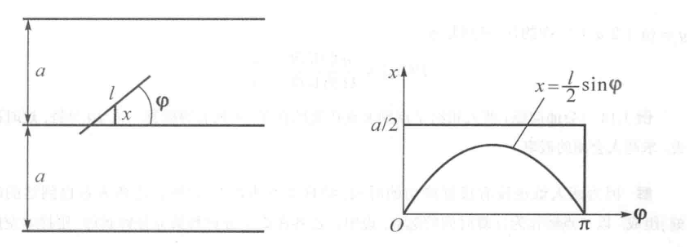

# 事件及其概率
!!! info " "浙江大学概率论(H)" 2024 秋冬学期个人笔记"

## 随机现象域统计规律性

### 随机现象

- 确定性现象:可以确定在一定条件下某种现象必定发生或者必定不会发生
    + 必然事件:一定会发生，例如太阳一定会东升西落
    + 不可能事件:一定不会发生，例如家猪会飞上天  

- 随机现象:在一定条件下，某种事件可能发生也可能不发生

- 随机试验(random experiment):对于随机现象，在基本相同的条件下，重复进行试验或者观察，可能出现不同的结果(但是结果的所有可能是知道的，不知道出现哪一种可能)

- 随机试验的结果称为随机事件(random event),简称事件

### 概率的统计定义

相同条件下重复$N$次试验,各次试验互不影响,事件$A$出现的次数(频数)$n$,称

$$ F_N(A)=\dfrac{n}{N} $$ 

为 $A$ 在 $N$ 次试验中出现的 **频率** (frequency)

$N$足够大时频率会趋向于一个常数，称为 **概率** (probability),记为$P(A)$,概率可以表示事件$A$在一次试验中发生的可能性的大小

!!! note "概率和频率的特性"

    1. 非负性：$\forall A\in \mathcal{F},P(A)\geqslant 0$

    2. 规范性：$P(\Omega)=1$

    2. 可列可加性：$A_i\cap A_j=\emptyset, i\neq j$ (即 $A_1,\cdots, A_n, \cdots$ 为两两不相容的事件)

    $$
        P\left(\sum_{n=1}^\infty A_n\right)=\sum_{n=1}^\infty P(A_n)
    $$

## 古典概型

### 样本空间和样本点

样本空间和样本点是概率论和统计学中的两个基本概念。

**样本空间(Sample Space)**

样本空间是指在一次试验或随机事件中，所有可能的结果的集合。用符号 \( S \) 或 \( \Omega \) 表示。例如：

- **掷一枚硬币**：样本空间是硬币的所有可能结果，记作 \( S = \{ \text{正面}, \text{反面} \} \) 或 \( S = \{H, T\} \)。
- **掷一颗骰子**：样本空间是骰子的所有可能结果，记作 \( S = \{1, 2, 3, 4, 5, 6\} \)。

**样本点(Sample Point)**

样本点是样本空间中的一个元素，表示一次试验的一个可能结果。样本点是样本空间的一个具体结果。例如：

- 在掷一枚硬币的试验中，样本空间为 \( S = \{H, T\} \)，其中 \( H \) 和 \( T \) 就是样本点。
- 在掷一颗骰子的试验中，样本空间为 \( S = \{1, 2, 3, 4, 5, 6\} \)，其中 \( 1, 2, 3, 4, 5, 6 \) 都是样本点。

- **样本空间** 是所有可能结果的集合。

- **样本点** 是样本空间中的一个单一结果。 

### 古典概型

!!! info "古典概型的特征"
    1. 样本空间中样本点有限，$\Omega=\{\omega_1,\omega_2, \cdots, \omega_n\}$
    2. 各基本事件等可能，即 $P(\omega)=\frac 1n$

古典概率(classical probability)的计算：

$$
    P(A)=\frac m n=\frac{A\text{ 包含的样本点数}}{\text{样本空间中样本点总数}}
$$

!!!Example
    有 \(n\) 个球，\(N\) 个格子 (\(n \leqslant N\))，球与格子都是可以区分的。每个球落在各格子的概率相同 (设格子足够大，可以容纳任意多个球)。将这 \(n\) 个球随机地放入 \(N\) 个格子，求：

    1. **指定的 \(n\) 格各有一球的概率；**
    2. **有 \(n\) 格各有一球的概率。**

    把球编号为 \(1 \sim n\)，\(n\) 个球的每一种放法是一个样本点，这属于古典概型。由于一个格子可容纳任意多球，样本点总数应该是从 \(N\) 个中取 \(n\) 个的重复排列数 \(N^n\)。

    3. 记 \(A = \{\text{指定的 } n \text{ 格各有一球}\}\)，它包含的样本点数是指定的 \(n\) 格中 \(n\) 个球的全排列数 \(n!\)，故：

    \[
    P(A) = \frac{n!}{N^n}.
    \]

    4. 记 \(B = \{\text{有 } n \text{ 格各有一球}\}\)，它所包含的样本点数是 \(N\) 格中任取 \(n\) 格的全排列数 \(P_{N}^{n}\)，故：

    \[
    P(B) = \frac{P_{N}^{n}}{N^n} = \frac{N(N-1) \cdots (N-n+1)}{N^n}
    = \left( 1 - \frac{1}{N} \right) \left( 1 - \frac{2}{N} \right) \cdots \left( 1 - \frac{n-1}{N} \right).
    \]

    注意到 \(\log(1 - x) = -x + O(x^2), , x \to 0\)。我们有：

    \[
    \log \left( 1 - \frac{1}{N} \right) + \log \left( 1 - \frac{2}{N} \right) + \cdots + \log \left( 1 - \frac{n-1}{N} \right)
    = \sum_{k=1}^{n-1} \log \left( 1 - \frac{k}{N} \right)
    = - \sum_{k=1}^{n-1} \frac{k}{N} + O \left( \frac{n^3}{N^2} \right).
    \]

    故当 \(N\) 比 \(n\) 大得多时，我们可以采用近似计算公式：

    \[
    P(B) \approx \exp \left\{ -\frac{n(n-1)}{2N} \right\}.
    \]

### 几何概型

!!! info "几何概型的特征"
    1. 样本空间中样本点无限
    2. 样本点落在等测度(长度、面积、体积...)区域的概率相等

几何概型的计算：

$$
    P(A_g)=\frac{g\text{ 的测度}}{\Omega\text{ 的测度}}
$$

$A_g=\{\text{任取样本点，位于区域 }g\in\Omega\text{ 的概率}\}$

!!!Example "蒲丰 (Buffon) 投针问题"
    平面上画很多平行线，间距为 \(a\)。向此平面投掷长为 \(l \, (l < a)\) 的针，求此针与任一平行线相交的概率

    以针的任一位置为样本点，它可以由两个参数决定：针的中点与最近的平行线之间的距离 \(x\)，针与平行线的夹角 \(\varphi\)。

    样本空间：

    \[
    \Omega = \{(\varphi, x) \mid 0 \leqslant \varphi \leqslant \pi, \, 0 \leqslant x \leqslant \frac{a}{2}\}
    \]

    为一矩形。针与平行线相交的区域是：

    \[
    g = \{(\varphi, x) \mid x \leqslant \frac{l}{2} \sin \varphi\} \quad (\text{见图}).
    \]

    

    所求概率是：

    \[
    P = \frac{g \, \text{的面积}}{\Omega \, \text{的面积}} = \frac{\int_0^{\pi} \frac{l}{2} \sin \varphi \, d\varphi}{\pi (a/2)} = \frac{2l}{a\pi}.
    \]

    \[
    \text{左图：} \quad a \, \text{为平行线间距，} \, l \, \text{为针长，} \, x \, \text{为距离，} \, \varphi \, \text{为角度}
    \]

    \[
    \text{右图：} \quad x = \frac{l}{2} \sin \varphi
    \]

    因为概率 \(P\) 可以用多次重复试验的频率来近似，所以可以得到它的近似值。方法是重复投针 \(N\) 次(或一次投针若干枚，总计 \(N\) 枚)，统计与平行线相交的枚数 \(n\)，则 \(P \approx n/N\)。

    又因为 \(l \leqslant a\) 且可精确测量，故从 \(2l/a\pi \approx n/N\) 可解得 \(\pi \approx 2lN/an\)。历史上有人不止一次做过这个试验，做得最好的一个投掷了 3408 次，算得 \(\pi \approx 3.1415929\)，其精确度已经达到小数点后第六位。

    设计一个随机试验，通过大量重复试验得到某种结果，以确定我们感兴趣的某个量，由此而发展的蒙特卡洛(Monte-Carlo)方法为这种计算提供了一种途径。随着电子计算机的发展，基于随机试验法的内容，得使这种方法变得非常有效。

## 概率的公理化定义

把样本空间看做全集，事件看作包含样本点的集合,可以采用集合论的方法来研究事件

有事件之间的中的

- 包含
- 相等
- 并(至少一个发生)
- 交(同时发生)
- 差($A \ B$,$A$发生但$B$不发生$A \ B = A\overline{B}$)
- 互不相容($A\cap B = \emptyset $)
- 互逆事件($A \cap B = \emptyset $ 且 $A \cup B = \Omega$)

!!!Note
    事件的关系与运算满足集合论中有关集合运算的一切性质(交换律，结合律，分配律，De Morgan律)

### 概率空间

第一个要素为样本空间 \(\Omega\)，是样本点 \(\omega\) 的全体，根据问题需要事先取定。

第二个要素为事件域 \(\mathrm{F}\)，是 \(\Omega\) 中某些满足下列条件的子集的全体所组成的集类：

1. \(\Omega \in \mathrm{F}\)；
2. 若 \(A \in \mathcal{F}\)，则 \(A^c \in \mathcal{F}\)；
3. 若 \(A_1, A_2, \ldots, A_n, \ldots \in \mathcal{F}\)，则 \(\bigcup_{n=1}^\infty A_n \in \mathcal{F}\)。

!!!key-point 
    总结为事件域中的运算是封闭的

满足这三个条件的 \(\mathcal{F}\) 称为 \(\Omega\) 上的 \(\sigma\)-代数或 \(\sigma\)-域。 \(\mathcal{F}\) 中的元素（\(\Omega\) 的子集）称为事件。

由这三个条件，可以推得事件域有下列性质：

1. \(\emptyset \in \mathcal{F}\) （因 \(\emptyset = \Omega^c\)）；

2. 若 \(A_1, \ldots, A_n, \ldots \in \mathcal{F}\)，则 \(\bigcap_{n=1}^\infty A_n \in \mathcal{F}\) （因 \(\bigcap_{n=1}^\infty A_n = \left( \bigcup_{n=1}^\infty A_n^c \right)^c\)）；

3. 若 \(A_1, \ldots, A_n \in \mathcal{F}\)，则 \(\bigcup_{k=1}^n A_k \in \mathcal{F}\)，\(\bigcap_{k=1}^n A_k \in \mathcal{F}\)。

事件域也可以根据问题选择。因为对同一个样本空间 $\Omega$，可以有很多 $\sigma$ -代数。例如最简单的是  

\[
\mathcal{F}_1 = \{ \emptyset, \Omega \}
\]  

复杂的如 

\[
\mathcal{F}_2 = \{ \Omega \text{的一切子集} \}+
\]  

也是$\sigma$-代数，所以要适当选择。特别地，若Ω为有限或可列个样本点组成，则常取Ω的一切子集所成的集类作为  

\[
\mathcal{F}
\]  

像在古典概率中那样。不难验证，\(\mathcal{F}\)是$\sigma$-代数。

若 $\Omega = \mathbf{R}$（一维实数全体），此时常取一切左开右闭有界区间和它们的（有限或可列）并、（有限或可列）交、逆所成的集的全体为\(\mathcal{F}\)（通常记为\(\mathcal{B}\)），称为一维波雷尔（Borel）$\sigma$-代数，其中的集称为一维波雷尔集，它是比全体区间大得多的一个集类。

若$\Omega = \mathbf{R}^{n}$n维实数全体），则常取一切左开右闭有界n维矩形和它们的（有限或可列）并、（有限或可列）交、逆所成的集的全体为\(\mathcal{F}\)（通常记为\(\mathcal{B}^n\)），它包含了我们感兴趣的所有情形，称为n维波雷尔$\sigma$-代数。

如果我们对Ω的某个子集类\(\mathcal{C}\)感兴趣，所选的事件域\(\mathcal{F}\)可以是包含\(\mathcal{C}\)的最小$\sigma$-代数，这种$\sigma$-代数是存在的，因为：

1. 至少有一个包含\(\mathcal{C}\)的$\sigma$-代数，即上述\(\mathcal{F}_2\)；
2. 若有很多包含\(\mathcal{C}\)的$\sigma$-代数，则它们的交也是$\sigma$-代数，且就是最小的。

特别地，如果我们只对Ω的一个子集A感兴趣，则包含A的最小$\sigma$-代数就是  

\[
\mathcal{F} = \{ \emptyset, A, A^c, \Omega \}.
\]

!!!Note 
    概率是$\mathcal{F}$上的实值集函数 $A(\in, \mathcal{F}) \rightarrow P(A)$,并且满足非负性，规范性，可列可加性三个条件(公理)
   
满足这些定义的概率测度 \(P\) 应满足的基本公式有以下式：

 - \(P(\emptyset) = 0\).

 - 若 \(A_i; A_j = \emptyset, \, i, j = 1, 2, \ldots, n, \, i \neq j\), 则

\[
P \left( \sum_{i=1}^{n} A_i \right) = \sum_{i=1}^{n} P(A_i).
\]

- \(P(A) = 1 - P(A^c)\).

- 若 \(B \subseteq A\), 则 \(P(A - B) = P(A) - P(B)\).

- \(P(A \cup B) = P(A) + P(B) - P(AB)\).

- $P(A \backslash  B)=P(A) - P(AB)$

- (多还少补定理，容斥原理)

\[
P(A_1 \cup A_2 \cup \ldots \cup A_n) = \sum_{i=1}^{n} P(A_i) - \sum_{1 \leqslant i < j \leqslant n} P(A_i A_j) + \ldots + (-1)^{n-1} P(A_1 A_2 \ldots A_n).
\]

!!!proof "证明-数学归纳法"

      
$$
P(A_1 \cup A_2 \cup \ldots \cup A_n) = \sum_{i=1}^{n} P(A_i) - \sum_{1 \leqslant i < j \leqslant n} P(A_i A_j) + \ldots + (-1)^{n-1} P(A_1 A_2 \ldots A_n)
$$

- 验证基例 \(n = 1\)
当 \(n = 1\) 时，定理变为：

$$
P(A_1) = P(A_1)
$$

显然这是正确的，所以基例成立。

- 归纳假设
假设对于 \(n = k\) 时，定理成立，即：

$$
P(A_1 \cup A_2 \cup \ldots \cup A_k) = \sum_{i=1}^{k} P(A_i) - \sum_{1 \leqslant i < j \leqslant k} P(A_i A_j) + \ldots + (-1)^{k-1} P(A_1 A_2 \ldots A_k)
$$

- 证明 \(n = k+1\) 时的情形
现在我们需要证明，当有 \(k+1\) 个事件 \(A_1, A_2, \ldots, A_{k+1}\) 时，定理同样成立。

首先考虑 \(P(A_1 \cup A_2 \cup \ldots \cup A_{k+1})\)：

$$
P(A_1 \cup A_2 \cup \ldots \cup A_{k+1}) = P((A_1 \cup A_2 \cup \ldots \cup A_k) \cup A_{k+1})
$$

利用概率的加法原理，有：

$$
P((A_1 \cup A_2 \cup \ldots \cup A_k) \cup A_{k+1}) = P(A_1 \cup A_2 \cup \ldots \cup A_k) + P(A_{k+1}) - P((A_1 \cup A_2 \cup \ldots \cup A_k) A_{k+1})
$$

根据归纳假设，\(P(A_1 \cup A_2 \cup \ldots \cup A_k)\) 可以展开为：

$$
P(A_1 \cup A_2 \cup \ldots \cup A_k) = \sum_{i=1}^{k} P(A_i) - \sum_{1 \leqslant i < j \leqslant k} P(A_i A_j) + \ldots + (-1)^{k-1} P(A_1 A_2 \ldots A_k)
$$

因此，原式变为：

$$
P(A_1 \cup A_2 \cup \ldots \cup A_{k+1}) = 
\\ \left(\sum_{i=1}^{k} P(A_i) - \sum_{1 \leqslant i < j \leqslant k} P(A_i A_j) + \ldots + (-1)^{k-1} P(A_1 A_2 \ldots A_k)\right)
+ P(A_{k+1}) - P((A_1 \cup A_2 \cup \ldots \cup A_k) A_{k+1})
$$

注意，\(P((A_1 \cup A_2 \cup \ldots \cup A_k) A_{k+1})\) 可以展开为：

$$
P((A_1 \cup A_2 \cup \ldots \cup A_k) A_{k+1}) = \sum_{i=1}^{k} P(A_i A_{k+1}) - \sum_{1 \leqslant i < j \leqslant k} P(A_i A_j A_{k+1}) + \ldots + (-1)^{k-1} P(A_1 A_2 \ldots A_k A_{k+1})
$$

将其代入之前的公式中，得到：

$$
P(A_1 \cup A_2 \cup \ldots \cup A_{k+1}) = \sum_{i=1}^{k+1} P(A_i) - \sum_{1 \leqslant i < j \leqslant k+1} P(A_i A_j) + \ldots + (-1)^{k} P(A_1 A_2 \ldots A_{k+1})
$$

这正是我们需要证明的 \(n = k+1\) 的情形。

- (次可加性)

\[
P(A_1 \cup A_2 \cup \ldots \cup A_n) \leqslant \sum_{i=1}^{n} P(A_i). 
\]

### 1.3.3 概率测度的连续性

给定一概率空间 \((\Omega, \mathcal{F}, P)\)，假设 \(A_1, A_2, \ldots\) 是一列单调增加的事件序列，即

\[
A_1 \subset A_2 \subset \cdots \subset A_n \subset \cdots
\]

记 \(A = \bigcup_{n=1}^{\infty} A_n\)，称 \(A\) 为 \(A_n\) 的极限。从公理化定义可以看出，\(A\) 仍然是一个事件。下面定理给出该事件的概率大小。

#### 定理 1.1

如果 \(A_1, A_2, \ldots\) 是一列单调增加的事件序列，具有极限 \(A\)，那么，

\[
P(A) = \lim_{n \to \infty} P(A_n) .
\]

### 事件的上极限和下极限

事件是样本点的集合，事件的上级限和下极限是事件的集合的极限。

对于一个集合序列，我们定义其上极限和下极限如下：

!!!Definition
    设 $\{ A_n \}_{n=1}^{\infty}$ 是一列事件序列，定义

    \[
    \limsup_{n \to \infty} A_n = \bigcap_{n=1}^{\infty} \bigcup_{k=n}^{\infty} A_k
    \]

    为事件 \(A_n\) 的上极限，而

    \[
    \liminf_{n \to \infty} A_n = \bigcup_{n=1}^{\infty} \bigcap_{k=n}^{\infty} A_k
    \]

    为事件 \(A_n\) 的下极限。
    
对于上极限，是事件的先并后交，相当于是所有并集的交集，**其中包含了无穷多个集合** 对于下极限，是事件的先交后并，相当于是所有交集的并集，**只有有限个集合包含下极限**。

!!!Example
    \begin{align*}
       A_1 &=\{1,2,3\} \\
       A_2 &=\{2,3,4\} \\
       A_3 &=\{3,4\} \\
       A_4 &=\{2，4\} \\
       A_k &=\{4\} \enspace k \geqslant 4 \\
    \end{align*}

    则有

    上极限：$\limsup_{n \to \infty} A_n = \{2,3,4\}$

    下极限：$\liminf_{n \to \infty} A_n = \{4\}$

## 条件概率和链式法则

!!! info "条件概率 $P(A|B)$"
    事件 $B$ 发生条件下事件 $A$ 发生的概率，称为事件 $A$ 关于事件 $B$ 的 **条件概率 (conditional probability)** 

有基本公式:

$$
    P(A|B)=\frac{P(AB)}{P(B)}
$$

也可以表示为 **链式法则(乘法公式)** 的形式：

$$
    P(AB)=P(A|B)P(B)
$$

???general "推广到 $n$ 个事件"
    推广到 $n$ 个事件，有链式法则：

    $$
        P\left(\prod_{i=i}^nA_i\right)=\prod_{i=1}^n P\left(A_i\bigg|\prod_{j=1}^{i-1}A_j\right)
    $$

    特别定义 $a>b$ 时，$\prod_{i=a}^bA_i$ 为必然事件。或者这样写可能更容易看懂：

    $$
        P\left(A_{1} A_{2} \cdots A_{n}\right) =
        P\left(A_{1}\right) \cdot P\left(A_{2} \mid A_{1}\right) \cdot P\left(A_{3} \mid A_{1} A_{2}\right) \cdots P\left(A_{n} \mid A_{1} A_{2} \cdots A_{n-1}\right)
    $$

## 全概率公式

!!! info "分割(完备事件组)"
    在概率空间 ($\Omega, \mathcal{F}, P$) 中，若事件 $\{A_1, A_2, \cdots, A_n\}$($n<\infty$ 或 $n=\infty$) 满足：

    1. $A_i$ 两两互不相容(不可能同时发生)，且 $P(A_i)>0$
    2. $$\sum_{i=1}^\infty A_i=\Omega$$

    则称 $\{A_1, A_2, \cdots, A_n\}$ 构成 $\Omega$ 的一个 **分割(完备事件组)**

!!! abstract "全概率 (total probability) 公式"

    在概率空间 ($\Omega, \mathcal{F}, P$) 中，若 $\{A_1, A_2, \cdots, A_n\}$($n<\infty$ 或 $n=\infty$) 构成 $\Omega$ 的一个 **分割(完备事件组)** ，
    
    则有 **全概率公式** 成立：$\forall B\in \mathcal{F}$，有

    $$
        P(B)=\sum_{i=1}^nP(A_i)P(B|A_i)
    $$

???Proof
    $$
    \begin{aligned}
        P(B)&=P(B\Omega)\\
        &=P\left(B\sum_{i=1}^nA_i\right)\\
        &=P\left(\sum_{i=1}^nBA_i\right)\\
        &=\sum_{i=1}^nP(BA_i)\\
        &=\sum_{i=1}^nP(A_i)P(B|A_i)
    \end{aligned}
    $$

## 贝叶斯公式

!!! abstract "贝叶斯 (Bayes) 公式"
    $$
    P(A_i|B)=\dfrac{P(A_i)P(B|A_i)}
    {\sum_{k=1}^\infty P(A_k)P(B|A_k)}
    $$

!!!proof
    $P(A_i|B)=\dfrac{P(A_iB)}{P(B)}$，分子用链式法则展开，分母用全概率公式展开。

!!! tip "深入了解条件概率的意义"
    $P(A_i)$：不知 $B$ 是否发生，称为 **先验 (priori) 概率**

    $P(A_i|B)$：以 $B$ 发生为已知条件，称为 **后验 (posteriori) 概率**

## 事件独立性

### 两个事件的独立性

!!! info "$A$ 与 $B$ 相互独立(统计独立)"
    称事件 $A$ 与事件 $B$ **相互独立(统计独立，statistical independence)**，如果满足

    $$
        P(AB)=P(A)\cdot P(B)
    $$

因为此时有

$$
    P(A|B)=\frac{P(AB)}{P(B)}=P(A)
$$

且

$$
    P(B|A)=\frac{P(AB)}{P(A)}=P(B)
$$

如果 $A$ 与 $B$ 不相互独立，也称为 **统计相依 (statistical dependence)**

### 多个事件的独立性

对于一组事件 $A_1,A_2,\cdots,A_n$，存在两两独立和整体的相互独立两种概念。

不妨先以三个事件 $A,B,C$ 为例进行研究。

- 两两独立：即 $A$ 与 $B$ 相互独立，$B$ 与 $C$ 相互独立，$C$ 与 $A$ 相互独立
    
    $$
    \left\{\begin{array}{l}
        P(A B)=P(A) \cdot P(B) \\
        P(A C)=P(A) \cdot P(C) \\
        P(B C)=P(B) \cdot P(C)
        \end{array}\right.
    $$

    但是有可能

    $$
    P(ABC) \neq P(A)\cdot P(B)\cdot P(C)
    $$

- 整体相互独立：即满足

    $$
    P(ABC)=P(A)\cdot P(B)\cdot P(C)
    $$

同时满足两两独立和整体的相互独立，才能说 $A, B, C$ 相互独立。
且A与BC的并，交，差等也是独立的。

??? general "推广到 $n$ 个事件"
    推广到 $n$ 个事件，$A_1,A_2,\cdots,A_n$ 相互独立需要满足：$\forall r<n$，$A_1,A_2,\cdots,A_n$ 中任意 $r$ 个事件都相互独立，且

    $$
        P\left(\prod_{i=1}^nA_i\right)=\prod_{i=1}^n P(A_i)
    $$

    或者可以直接这么定义：$A_1,A_2,\cdots,A_n$ 相互独立，如果

    $$\forall r \leqslant n (r\in \mathbf{N_+}),\;
    P \left( \prod_{i=1}^r A_{n_i} \right) = \prod_{i=1}^r P(A_{n_i}),\;
    1 \leqslant n_1 < n_2 < \cdots <n_r \leqslant n$$

## 伯努利试验

伯努利概型（Bernoulli trial）是概率论中的一个基本概念，它描述了只有两个可能结果的随机试验，通常称为“成功”和“失败”。每次试验都是独立的，并且每次成功的概率都是相同的，记作 \( p \)，而失败的概率则为 \( 1-p \)。

伯努利概型的特点包括：

1. **只有两个结果**：每次试验的结果只能是成功或失败。
2. **独立性**：每次试验的结果不会影响其他试验。
3. **固定的成功概率**：每次试验中成功的概率 \( p \) 是不变的。

伯努利概型常用于建模各种现实情况，比如抛硬币、调查投票等。在多个伯努利试验的基础上，有二项分布

二项分布(Binomial distribution)是n重伯努利试验成功次数的离散概率分布，记作$B(n,p)$。

\[
P(X = k) = \binom{n}{k} p^k (1-p)^{n-k}
\]

其中，\( \binom{n}{k} \) 是组合数，表示从 \( n \) 次试验中选择 \( k \) 次成功的方式总数。二项分布适用于描述在 \( n \) 次独立的伯努利试验中，成功发生的次数。

!!!Example
    一枚硬币抛 10 次，求恰好 3 次正面朝上的概率。

    这是一个二项分布问题，其中 \( n = 10 \)，\( k = 3 \)，\( p = 0.5 \)。代入公式，有：

    \[
    P(B_3) = \binom{10}{3} \times 0.5^3 \times 0.5^{10-3} = 0.1172.
    \]

    所以恰好 3 次正面朝上的概率是 0.1172。

## 乘积概率空间

!!! definition "乘积概率空间"
    设有两个概率空间 $(\Omega_1, \mathcal{F}_1, P_1)$ 和 $(\Omega_2, \mathcal{F}_2, P_2)$,对应试验为 $E_1$ 和 $E_2$,独立地做两个试验，记录其结果为 $(\omega_1, \omega_2)$,则称 $(\Omega_1 \times \Omega_2, \mathcal{F}_1 \times \mathcal{F}_2, P_1 \times P_2)$ 为 $(\Omega_1, \mathcal{F}_1, P_1)$ 和 $(\Omega_2, \mathcal{F}_2, P_2)$ 的 **乘积概率空间**。

     其中事件事件 $A$

    \[
        A=\{(\omega_1, \omega_2) \mid \omega_1 \in A_1, \omega_2 \in A_2\}
    \]

    其概率

    \[
        P(A)=P(A_1)P(A_2)
    \]

!!!Note
    两个试验的乘积概率空间可以在二维平面上表示

???info "Simpson 悖论"
    \[
        ad>bc;eh>fg;\\
        (a+e)(d+h)<(b+f)(c+g)
    \]

    约束条件为

    \[
        a+b+c+d+e+f+g+h=1\\
        a,b,c,d,e,f,g,h>0
    \]