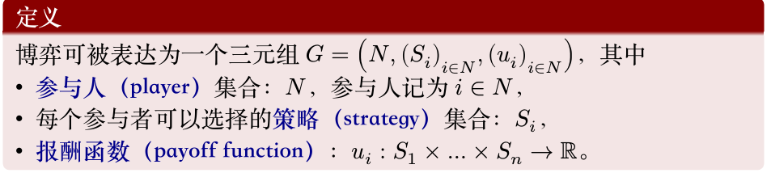
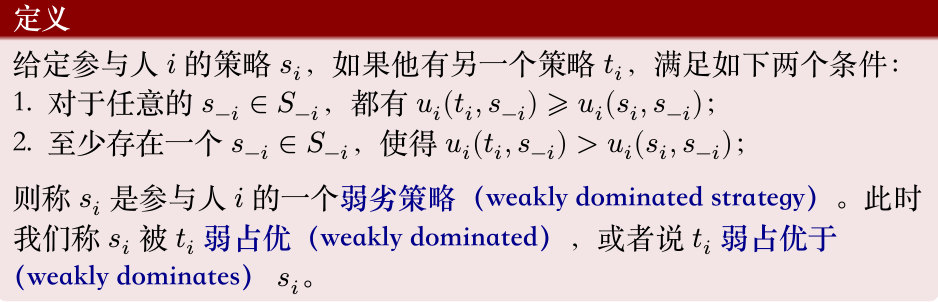

# LEC 3-4

## 社会福利

<figure markdown="span">
    
    <figcaption>社会福利</figcaption>
</figure>

## 策略式博弈表达

<figure markdown="span">
    
    <figcaption>策略式博弈</figcaption>
</figure>

## 伯川德竞争 (Bertrand Competition)

!!!definition "伯川德竞争"
    伯川德竞争是一种寡头市场模型，假设企业之间通过 **价格** 进行竞争。在这个模型中，企业生产同质产品，并且它们同时设定各自产品的价格。消费者将从价格最低的厂商购买。如果价格相同，消费者则平均分配到这些厂商。

    <figure markdown="span">
        
        <figcaption>伯川德竞争</figcaption>
    </figure>

**核心假设：**

-  **同质产品：** 市场上的所有产品在消费者看来是完全相同的，没有品牌忠诚度或质量差异。
-  **价格竞争：** 企业选择价格作为竞争变量，而非产量。
-  **同时定价：** 各企业同时做出定价决策，且相互独立。
-  **无进入壁垒：** (有时会假设)
-  **边际成本为常数：** 通常假设各企业的边际成本相同且为常数。

!!!Note "伯川德均衡（纳什均衡）"
    * **均衡结果：** 在伯川德竞争中，如果产品同质且边际成本相同，那么纳什均衡结果是所有企业的定价都等于其 **边际成本 (P = MC)**。
    * **“伯川德悖论”：** 即使市场只有两家企业（双头垄断），只要它们进行价格竞争且产品同质，最终价格也会被压低到边际成本水平，就像完全竞争市场一样，企业获得零经济利润。这被称为“伯川德悖论”，因为它表明即使只有少数几家企业，市场竞争也可能非常激烈。
    * 伯川德均衡不是占优均衡

---

## 古诺竞争 (Cournot Competition)

!!!definition "古诺竞争"
    古诺竞争是另一种寡头市场模型，假设企业之间通过 **产量** 进行竞争。在这个模型中，企业同时决定各自的产量，然后市场价格由总产量和市场需求曲线决定。

**核心假设：**

-  **同质产品：** 市场上的所有产品是同质的。
-  **产量竞争：** 企业选择产量作为竞争变量，而非价格。
-  **同时决策：** 各企业同时决定产量，且相互独立。
-  **市场需求曲线：** 市场价格是总产量的递减函数。
-  **边际成本为常数：** 通常假设各企业的边际成本相同且为常数。

!!!Note "古诺均衡（纳什均衡）"
    * **均衡结果：** 在古诺竞争的纳什均衡中，每个企业根据其他企业预期的产量来最大化自己的利润。最终均衡时的市场价格会介于垄断价格和边际成本之间，且高于边际成本。

* **企业数量的影响：**
    * 当企业数量 $J=1$ 时（垄断），古诺均衡退化为垄断产量和价格。
    * 当企业数量 $J$ 趋近于无穷大时，古诺均衡下的市场价格趋近于边际成本，总产量趋近于完全竞争下的总产量。这表明古诺模型是一个能够桥接垄断和完全竞争的统一框架。

---

## 占优策略均衡 (Dominant Strategy Equilibrium)

!!!definition "占优策略均衡"
    占优策略均衡是纳什均衡的一种特殊且更强的形式。如果一个博弈中，每个参与者都有一个 **占优策略**，那么这些占优策略组成的策略组合就是占优策略均衡。

<figure markdown="span">
     { width=50% }
    <figcaption>占优策略</figcaption>
</figure>

* **占优策略 (Dominant Strategy)：** 一个策略如果无论其他参与者选择什么策略，它都能为该参与者带来最佳（或至少不差于任何其他策略）的收益，那么它就是该参与者的占优策略。
    * **严格占优策略 (Strictly Dominant Strategy)：** 如果无论其他参与者选择什么策略，它都能为该参与者带来 **严格更高** 的收益，那么它是严格占优策略。
    * **弱占优策略 (Weakly Dominant Strategy)：** 如果无论其他参与者选择什么策略，它都能为该参与者带来 **至少同样高**的收益，并且在某些情况下能带来严格更高的收益，那么它是弱占优策略。

**特点：**

1.  **易于预测：** 如果存在占优策略均衡，那么博弈的最终结果很容易被预测，因为每个理性参与者都应该选择其占优策略。
2.  **与纳什均衡的关系：**
    * 如果一个博弈存在占优策略均衡，那么它一定是纳什均衡。
    * 如果一个博弈存在**严格占优策略均衡**，那么这个均衡是**唯一**的纳什均衡。
    * 然而，纳什均衡不一定要求存在占优策略，许多博弈有纳什均衡但没有占优策略均衡（例如剪刀石头布）。

!!!info "颤抖的手原则"
    在博弈论中，颤抖的手原则（Shaky Hand Principle）是指在某些情况下，参与者在博弈中可能会犯错误；
    <figure markdown="span">
        
        <figcaption>颤抖的手原则</figcaption>
    </figure>

    $B$ 弱占优 $T$

    考虑列参与人分别以 $x$ 和 $1-x$ 的概率选择 $L$ 和 $R$（$0<x<1$），那么行参与人会选择 $B$，因为 $T$ 的期望效用是 $x + 2(1-x) = 2-x$，而 $B$ 的期望效用是 $2$。

可以在表格中反复剔除劣策略找到博弈的解。

!!!example "囚徒困境"
    <figure markdown="span">
        
        <figcaption>囚徒困境</figcaption>
    </figure>
    这是一个经典的占优策略均衡的例子。无论对方坦白还是抵赖，对个人而言，坦白都是严格占优策略。因此，双方都坦白是严格占优策略均衡，也是唯一的纳什均衡。

!!!example "剪刀石头布"
    剪刀石头布（Rock-Paper-Scissors）这个游戏**有纳什均衡**，但它是一个**混合策略纳什均衡（Mixed Strategy Nash Equilibrium）**。

    在剪刀石头布中，**没有纯策略纳什均衡**。这意味着你无法找到一个单一的、确定的策略（比如“我只出剪刀”），使得在已知对方策略的情况下，你没有动机改变。

    让我们来分析一下：

    * 如果你总是出剪刀，那么你的对手就会知道这一点，并且总是出石头来赢你。
    * 如果你总是出石头，你的对手就会出布来赢你。
    * 如果你总是出布，你的对手就会出剪刀来赢你。

    所以，任何纯策略都不是纳什均衡，因为总是存在一个对手可以通过选择另一个策略来打败你的策略。

    **混合策略纳什均衡**

    在剪刀石头布中，唯一的纳什均衡是每个玩家都以 **1/3 的概率** 随机选择剪刀、石头和布。

    **为什么这是纳什均衡？**

    如果你的对手以 1/3 的概率随机出剪刀、石头和布：
    * 你出剪刀的期望收益是：(1/3) * (平局) + (1/3) * (输) + (1/3) * (赢) = 0 (假设赢+1，输-1，平0)
    * 你出石头的期望收益是：(1/3) * (赢) + (1/3) * (平局) + (1/3) * (输) = 0
    * 你出布的期望收益是：(1/3) * (输) + (1/3) * (赢) + (1/3) * (平局) = 0

    无论你选择哪个纯策略，你的期望收益都是0。因此，你没有动机偏离随机选择的策略，因为你无法通过单方面改变策略来获得更高的期望收益。同理，对手也没有动机偏离。

!!!Example "公地悲剧"
    有一块公共牧场（这就是“公地”）。村里的每个农民都可以自由地在这块牧场上放牧自己的奶牛。假设放牧的奶牛越多，牧场的草地资源就越紧张，每头奶牛能吃到的草就越少，因此每头奶牛产奶量（收益）就会下降。

    农民的个体理性决策：

    每个农民在决定是否多养一头奶牛时，都会进行如下思考：

    收益： 如果我多养一头奶牛，这头奶牛带来的产奶收益几乎全部归我所有。

    成本： 这头奶牛会额外消耗牧场的草，导致所有奶牛（包括我自己的和其他农民的）的产奶量略有下降。但这个下降的成本是分散到所有奶牛身上的，对我自己的那头新奶牛而言，它分摊的成本只是一小部分。而养这头牛的直接成本（比如买牛的钱）是我自己承担的。

    由于每增加一头奶牛所带来的收益（几乎全部归己）大于其边际成本（特别是对公共草地造成的外部性被分散了），所以每个农民都有激励去尽可能多地增加自己的奶牛数量，直到他认为增加一头奶牛的私人收益不再大于私人成本。

    集体的非理性结果（悲剧）：

    当所有农民都进行这种个体理性决策时，结果是：

    奶牛数量过多： 牧场上的奶牛总数远远超过了牧场的承载能力。

    草地退化： 牧场被过度放牧，草地资源枯竭，变得贫瘠。

    所有农民的损失： 最终，每头奶牛的产奶量都大幅下降，甚至无法维持生存。整个牧场遭到破坏，所有农民的收益都受到严重损害，甚至可能完全消失。这个公共资源被“悲剧性”地耗尽了。

---

## 纳什均衡 (Nash Equilibrium)

!!!definition "纳什均衡"
    纳什均衡是博弈论中最核心的均衡概念之一。一个策略组合如果满足以下条件，就是纳什均衡：在给定其他所有参与者策略的情况下，没有任何一个参与者可以通过单方面改变自己的策略来获得更高的收益。

    <figure markdown="span">
        
        <figcaption>纳什均衡</figcaption>
    </figure>

    对于一个策略组合 $s^* = (s_1^*, s_2^*, \dots, s_n^*)$，如果对于每个参与人 $i$ 和其所有可能的替代策略 $s_i'$，都有 $u_i(s_i^*, s_{-i}^*) \geqslant u_i(s_i', s_{-i}^*)$，那么 $s^*$ 就是一个纳什均衡。其中 $u_i$ 是参与人 $i$ 的支付函数，$s_{-i}^*$ 是除参与人 $i$ 之外所有其他参与人选择的策略。

-  **存在性：** 纳什均衡可能存在一个、多个或不存在（在纯策略纳什均衡中）。约翰·纳什证明了在有限参与者和有限策略的博弈中，至少存在一个混合策略纳什均衡。
-  **不一定是社会最优：** 纳什均衡的结果可能是效率低下的。例如，在囚徒困境中，双方都坦白是纳什均衡，但它不是社会总福利最大化的结果（社会最优是双方都抵赖）。
-  **理性假设：** 纳什均衡的推导基于所有参与者都是理性的，并且知道其他参与者也是理性的。

!!!Note "寻找纳什均衡的方法"
    如果有表格，则先固定看行，对于每一列，求出列参与者的最优策略，再看列，求出对于每一行列参与者的最优策略，则交叉点即为纳什均衡。

---